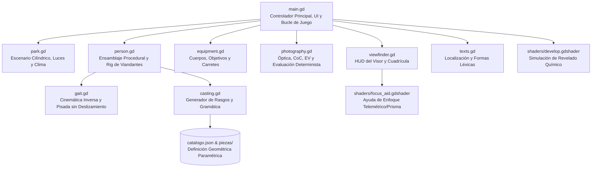
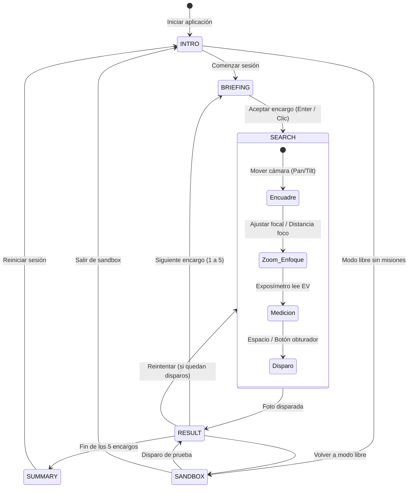

# Arquitectura Global del Sistema — Proyecto Paparazzi

Este documento describe la arquitectura modular, el flujo de datos, la máquina de estados y el pipeline de renderizado de **Proyecto Paparazzi**.

---

## 1. Visión General y Filosofía de Diseño

Proyecto Paparazzi es un simulador fotográfico 3D desarrollado en **Godot 4** que combina mecánicas de búsqueda visual con una simulación fotográfica matemáticamente determinista basada en las leyes reales de la óptica geométrica, fotometría analógica y cinemática de locomoción.

### Principios Fundamentales
- **Cero texturas de personajes**: Toda la multitud y el parque se renderizan mediante **colores de vértice** (`Mesh.ARRAY_COLOR`), eliminando transferencias de texturas y reduciendo drásticamente la memoria de vídeo (VRAM < 60 MiB).
- **Malla combinada de superficie única**: Cada personaje y el parque estático constan de una única superficie (`Mesh.ARRAY_VERTEX`, etc.), minimizando los *draw calls*.
- **Evaluación determinista e inmutable**: La fotografía tomada genera un expediente numérico cerrado (`evidence`). Dados los mismos parámetros de entrada, el algoritmo de puntuación en `photography.gd` produce exactamente el mismo resultado matemático.
- **Mundo cilíndrico centrado en el jugador**: El escenario se modela en coordenadas cilíndricas $(r, \theta, y)$ con la cámara del jugador situada permanentemente en el origen $(0, 1.60\text{ m}, 0)$.

---

## 2. Mapa de Módulos y Dependencias

El código está estructurado en módulos desacoplados sin dependencias circulares:



### Responsabilidades por Módulo

| Módulo | Archivo | Responsabilidad Principal |
|---|---|---|
| **Controlador** | [scripts/main.gd](file:///home/ganso/codigo/afotando/scripts/main.gd) | Máquina de estados, bucle principal, navegación 2D de viandantes, interacción ratón/táctil y gestión de interfaz de usuario. |
| **Escenario** | [scripts/park.gd](file:///home/ganso/codigo/afotando/scripts/park.gd) | Geometría procedural del parque, plazas, carriles concéntricos, farolas con sombras, ciclo día/noche y nubes procedurales. |
| **Viandantes** | [scripts/person.gd](file:///home/ganso/codigo/afotando/scripts/person.gd) | Ensamblado de piezas anatómicas, rig universal de 20 huesos, pesaje rígido y combinación en una sola superficie con colores de vértice. |
| **Locomoción** | [scripts/gait.gd](file:///home/ganso/codigo/afotando/scripts/gait.gd) | Cinemática analítica de marcha y carrera, cálculo de altura de cadera, orientación de suela y pisada con deslizamiento cero (`drift = 0`). |
| **Casting** | [scripts/casting.gd](file:///home/ganso/codigo/afotando/scripts/casting.gd) | Generación aleatoria de rasgos de vestimenta, asignación de encargos y concordancia morfológica estricta de género y número en español. |
| **Óptica y Foto** | [scripts/photography.gd](file:///home/ganso/codigo/afotando/scripts/photography.gd) | Fórmulas ópticas reales: CoC, profundidad de campo, triángulo de exposición, desenfoque por velocidad de obturación y calificación determinista. |
| **Equipo** | [scripts/equipment.gd](file:///home/ganso/codigo/afotando/scripts/equipment.gd) | Catálogo de cuerpos (compacta, telemétrica, réflex), objetivos fotográficos (28 mm a 135 mm), pasos de diafragma y carretes analógicos. |
| **Visor HUD** | [scripts/viewfinder.gd](file:///home/ganso/codigo/afotando/scripts/viewfinder.gd) | Dibujo analógico del visor réflex/telemétrico: 9 colimadores AF, cuadrícula de tercios, exposímetro analógico y microprisma. |
| **Localización** | [scripts/texts.gd](file:///home/ganso/codigo/afotando/scripts/texts.gd) | Resolución de claves localizadas desde `data/textos.es.json` con interpolación de variables. |

---

## 3. Máquina de Estados del Juego

El flujo del juego se gestiona en `main.gd` a través de la variable `mode`:



### Detalle de Estados

1. **`INTRO`**: Pantalla inicial con título, selección de modo (misión estándar o sandbox libre) y controles informativos.
2. **`BRIEFING`**: Pantalla de encargo previo. Presenta al sujeto objetivo con un retrato 3D estático (`brief_preview`), sus rasgos morfológicos descriptivos, y congela la iluminación del parque.
3. **`SEARCH`**: Fase activa de juego. Los viandantes caminan o corren en sus carriles cilíndricos; el jugador mueve la cámara en $360^\circ$, enfoca manual o automáticamente, selecciona apertura/velocidad/ISO y encuadra.
4. **`RESULT`**: Pantalla de revelado químico tras la captura. Muestra la imagen procesada por el shader de revelado (`develop.gdshader`), el desglose numérico de la puntuación determinista (0 a 100 créditos) y permite reintentar o pasar al siguiente encargo.
5. **`SUMMARY`**: Pantalla final tras completar los 5 encargos. Resume la puntuación global, créditos obtenidos y galería de las mejores fotografías.
6. **`SANDBOX`**: Modo de exploración y pruebas fotográficas sin límite de carrete, sin tiempo y con opción de pausar el movimiento de los personajes para estudiar el desenfoque óptico.

---

## 4. Pipeline de Fotograma y Renderizado

El proyecto utiliza el renderizador **`gl_compatibility`** de Godot 4 (basado en OpenGL Core Profile / WebGL), garantizando compatibilidad multiplataforma y ejecución fluida en hardware de baja potencia.

```
+-------------------------------------------------------------------+
|                        BUCLE DE FOTOGRAMA                         |
+-------------------------------------------------------------------+
  1. _process(dt):
     a) Actualización de entrada (arrastre ratón / deslizamiento táctil).
     b) Giro angular de cámara: angle (yaw) y pitch (tilt).
     c) Park: actualización de nubes, posición solar y lectura de EV.
     d) Main: actualización de los 21 viandantes (update_person).
        - Steering espacial 2D y evasión de obstáculos.
        - Transición diagonal entre carriles si corresponde.
        - Sincronización de locomoción con gait.gd (pisada sin deslizamiento).
     e) Viewfinder: dibujo vectorial HUD del visor (puntos AF, exposímetro).
  
  2. Disparo fotográfico (take_photo):
     a) Captura de expediente determinista (posiciones, CoC, EV, trepidación).
     b) Evaluación de 5 rayos de oclusión física contra geometría real.
     c) Captura del Viewport en Image.
     d) Procesamiento en develop.gdshader (desenfoque CoC, grano, trepidación).
     e) Calificación matemática (0 - 100) en photography.gd.
```

---

## 5. Proporción de Pantalla y Ancho de Sensor Fijo

- **Relación de aspecto fija**: **16:9** bloqueada en `project.godot` (`1280x720` nativo, override `1440x810`).
- **Modo de cámara**: `camera.keep_aspect = Camera3D.KEEP_WIDTH`.
- **Sensor de referencia**: Formato completo **36 × 24 mm** (ancho de sensor fijo en 36 mm). Al fijar el ancho con `KEEP_WIDTH`, el campo de visión horizontal ($\text{HFOV}$) se calcula directamente a partir de la distancia focal $f$:
  $$\text{HFOV} = 2 \cdot \arctan\left(\frac{36\text{ mm}}{2 \cdot f}\right)$$
  Esto asegura que cambiar la relación de la ventana nunca distorsione las fórmulas fotográficas ni la magnificación del sujeto.

---

## 6. Documentos de Referencia Relacionados
- [docs/NAVEGACION_Y_COLISIONES.md](file:///home/ganso/codigo/afotando/docs/NAVEGACION_Y_COLISIONES.md): Algoritmos 2D de navegación, carriles y evasión.
- [docs/PERSONAJES_Y_CINEMATICA.md](file:///home/ganso/codigo/afotando/docs/PERSONAJES_Y_CINEMATICA.md): Modelado procedural, rig de 20 huesos y marcha analítica.
- [docs/SIMULACION_FOTOGRAFICA.md](file:///home/ganso/codigo/afotando/docs/SIMULACION_FOTOGRAFICA.md): Fórmulas ópticas, CoC, fotometría y calificación.
- [docs/EQUIPAMIENTO_Y_OPTICAS.md](file:///home/ganso/codigo/afotando/docs/EQUIPAMIENTO_Y_OPTICAS.md): Cámaras, objetivos y visor.
- [docs/ESCENARIO_Y_RENDIMIENTO.md](file:///home/ganso/codigo/afotando/docs/ESCENARIO_Y_RENDIMIENTO.md): Parque cilíndrico, iluminación y presupuestos.
- [docs/TESTS_Y_VERIFICACION.md](file:///home/ganso/codigo/afotando/docs/TESTS_Y_VERIFICACION.md): Suites de pruebas y verificación de calidad.
