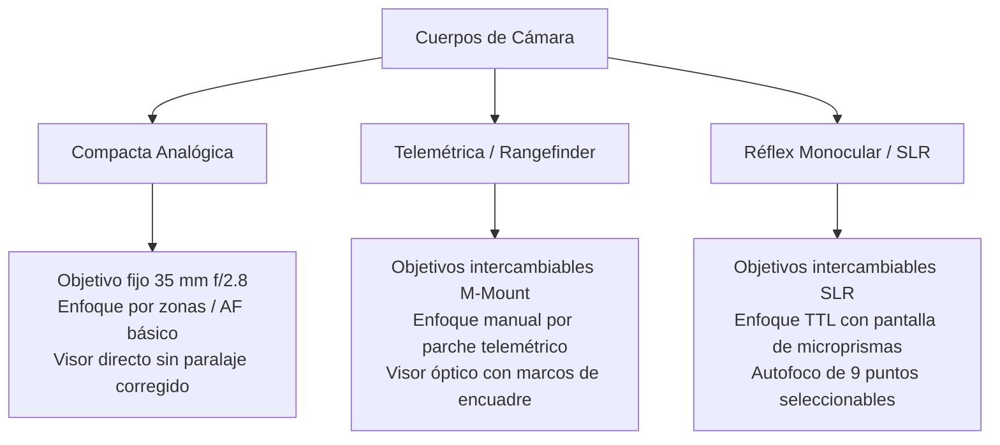

# Equipamiento, Ópticas e Instrumentación — Proyecto Paparazzi

Este documento detalla los cuerpos de cámara, el catálogo de objetivos, el sistema de película analógica y la instrumentación del visor HUD definidos en [scripts/equipment.gd](file:///home/ganso/codigo/afotando/scripts/equipment.gd) y [scripts/viewfinder.gd](file:///home/ganso/codigo/afotando/scripts/viewfinder.gd).

---

## 1. Cuerpos de Cámara

El simulador cuenta con 3 tipologías de cámara fotográfica clásica con comportamientos mecánicos y ópticos diferenciados:



### Tabla Comparativa de Cuerpos

| Característica | Compacta | Telemétrica | Réflex (SLR) |
|---|:---:|:---:|:---:|
| **Visor** | Óptico directo | Óptico directo con marcos colimados | Réflex a través de la lente (TTL) |
| **Ayuda de Enfoque** | Confirmación LED básica | Parche de doble imagen coincidente | Prisma partido central y anillo microprisma |
| **Modos de Foco** | AF / Zonas fijas | Exclusivamente Manual (MF) | AF (9 puntos) y Manual (MF) |
| **Objetivos** | Fijo incorporado | Intercambiables | Intercambiables |
| **Fotómetro** | Célula exterior | Ponderado central con aguja | Matricial / Ponderado TTL |

---

## 2. Catálogo de Objetivos Fotográficos

Todos los objetivos modelan distancias focales y números f reales:

| Objetivo | Rango Focal | Apertura Máxima | Apertura Mínima | Ángulo de Visión ($\text{HFOV}$) | Uso Recomendado |
|---|:---:|:---:|:---:|:---:|---|
| **28 mm f/2.8** | $28\text{ mm}$ (Fijo) | $f/2.8$ | $f/22$ | $65.5^\circ$ | Paisaje urbano, tomas abiertas con gran profundidad de campo. |
| **50 mm f/1.8** | $50\text{ mm}$ (Fijo) | $f/1.8$ | $f/16$ | $39.6^\circ$ | Perspectiva natural idéntica al ojo humano, alta luminosidad nocturna. |
| **105 mm f/2.8** | $105\text{ mm}$ (Fijo) | $f/2.8$ | $f/32$ | $19.5^\circ$ | Retrato clásico, separación suave del sujeto y compresión de fondo. |
| **135 mm f/3.5** | $135\text{ mm}$ (Fijo) | $f/3.5$ | $f/32$ | $15.2^\circ$ | Tomas lejanas (Carril 3), desenfoque bokeh acusado. |
| **35–70 mm f/3.5–4.5** | $35 - 70\text{ mm}$ (Zoom) | $f/3.5 - 4.5$ (Variable) | $f/22$ | $54.4^\circ - 28.8^\circ$ | Zoom versátil polivalente para encuadres rápidos. |

---

## 3. Escalas de Parámetros Fotográficos

### 3.1 Aperturas de Diafragma
Escala estándar de pasos completos y medios:
$$f/1.4 \;\cdot\; f/1.8 \;\cdot\; f/2.0 \;\cdot\; f/2.8 \;\cdot\; f/4.0 \;\cdot\; f/5.6 \;\cdot\; f/8.0 \;\cdot\; f/11 \;\cdot\; f/16 \;\cdot\; f/22 \;\cdot\; f/32$$

### 3.2 Tiempos de Obturación (`Photo.DENOMINATORS`)
Tiempos discretos en fracciones de segundo:
$$\frac{1}{1000}\text{ s} \;\cdot\; \frac{1}{500}\text{ s} \;\cdot\; \frac{1}{250}\text{ s} \;\cdot\; \frac{1}{125}\text{ s} \;\cdot\; \frac{1}{60}\text{ s} \;\cdot\; \frac{1}{30}\text{ s} \;\cdot\; \frac{1}{15}\text{ s} \;\cdot\; \frac{1}{8}\text{ s}$$

### 3.3 Sensibilidad ISO y Carretes Analógicos (`Photo.ISOS`)
Valores disponibles:
$$\text{ISO } 100 \;\cdot\; \text{ISO } 200 \;\cdot\; \text{ISO } 400 \;\cdot\; \text{ISO } 800 \;\cdot\; \text{ISO } 1600$$

- **Modo Carrete Activo (`equipment.film = true`)**:
  - Al cargar un carrete físico de una sensibilidad determinada (`film_iso_index`), la opción manual de ISO se **bloquea** en la cámara:
    ```gdscript
    game.iso_button.disabled = true
    ```
  - La exposición automática y manual debe ajustarse exclusivamente mediante apertura y velocidad de obturación, emulando la realidad analógica.

---

## 4. Instrumentación del Visor HUD (`viewfinder.gd`)

El visor proyecta una interfaz analógica que varía según el cuerpo seleccionado:

```
+-------------------------------------------------------------------+
| [16:9 MASK]                                          [16:9 MASK]  |
|                                                                   |
|         +-----------+-----------+-----------+                     |
|         |           |           |           |                     |
|         |    [·]    |    [·]    |    [·]    |  <- Fila Sup. AF    |
|         |           |           |           |                     |
|         +-----------+-( ( / ) )-+-----------+                     |
|         |    [·]    |  PRISMA   |    [·]    |  <- Fila Med. AF    |
|         |           |  PARTIDO  |           |                     |
|         +-----------+-----------+-----------+                     |
|         |    [·]    |    [·]    |    [·]    |  <- Fila Inf. AF    |
|         |           |           |           |                     |
|         +-----------+-----------+-----------+                     |
|                                                                   |
| [ 50mm ] [ f/2.8 ] [ 1/250s ] [ ISO 400 ] [ -2..-1..0..+1..+2 ]   |
+-------------------------------------------------------------------+
```

### Elementos Gráficos del Visor
1. **9 Colimadores de Autofoco (AF)**:
   - Cuadrícula de 3×3 puntos. El colimador activo se ilumina en rojo al confirmar el enfoque.
   - Enfoque por pulsación directa o selección del punto central.
2. **Cuadrícula de la Regla de los Tercios**:
   - Líneas finas colimadas para facilitar la composición estética y el cálculo de la puntuación en `Photo.evaluate()`.
3. **Escala de Exposición / Exposímetro Analógico**:
   - Barra graduada de $-2\text{ EV}$ a $+2\text{ EV}$ con índice móvil. Indica en tiempo real si la combinación actual subexpone o sobreexpone la escena.
4. **Prisma de Imagen Partida y Corona de Microprismas**:
   - Activos en modo manual (MF) y cuerpo réflex, permitiendo evaluar la nitidez del sujeto sin depender de confirmaciones electrónicas.

---

## 5. Verificación Automatizada

```bash
# Verificación de cuerpos, ópticas, modos AF/MF, lectura de EV y oclusión física (543 checks)
godot-4 --headless --path . --script tests/test_equipment.gd
```
