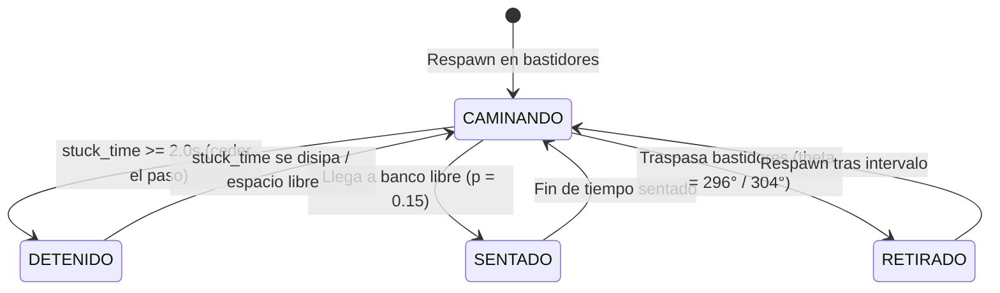

# Navegación 2D, Carriles y Prevención de Colisiones — Proyecto Paparazzi

Este documento detalla el modelo de desplazamiento bidimensional, el trazado de carriles concéntricos, el sistema de dirección anticipatoria (*steering*), la resolución de colisiones y los mecanismos deterministas anti-bloqueo (*anti-deadlock*) implementados en **Proyecto Paparazzi**.

---

## 1. Modelo de Desplazamiento y Coordenadas Cilíndricas

Dado que todos los viandantes caminan a nivel constante de suelo ($y = 0$), el movimiento se modela sobre el **plano horizontal 2D $(x, z)$** expresado en **coordenadas cilíndricas** $(r, \theta)$ con origen en el jugador:

$$\begin{cases}
x = r \cdot \sin(\theta) \\
z = -r \cdot \cos(\theta)
\end{cases}$$

La función de conversión en `park.gd` es:
```gdscript
func polar(theta: float, radius: float) -> Vector3:
    return Vector3(sin(deg_to_rad(theta))*radius, 0, -cos(deg_to_rad(theta))*radius)
```

La velocidad lineal $v$ se traduce en **velocidad angular** $\omega$:
$$\omega = \frac{v}{r} \quad (\text{rad/s}) \implies \Delta\theta = \text{rad\_to\_deg}\left(\frac{v}{r}\right) \cdot \Delta t \cdot \text{direction}$$

---

## 2. Estructura de Carriles y Capacidad de Aforo

El parque cuenta con **4 calzadas peatonales circulares concéntricas** donde circulan los **21 viandantes**:

| Carril | Radio Nominal ($r$) | Sub-offset ($\pm$) | Límites Físicos (`LANE_BOUNDS`) | Población | Aforo Máx. (`LANE_CAPACITIES`) | Función en el Juego |
|:---:|:---:|:---:|:---:|:---:|:---:|---|
| **0** | $1.8\text{ m}$ | $0.33\text{ m}$ | $[1.20, 2.40]\text{ m}$ (ancho: $1.20\text{ m}$) | 3 | 3 | Primer plano de oclusión dinámica |
| **1** | $4.0\text{ m}$ | $0.35\text{ m}$ | $[2.90, 4.85]\text{ m}$ (ancho: $1.95\text{ m}$) | 7 | 7 | Plaza central / Sujeto principal |
| **2** | $7.0\text{ m}$ | $0.35\text{ m}$ | $[6.10, 7.90]\text{ m}$ (ancho: $1.80\text{ m}$) | 6 | 7 | Tránsito intermedio y encargos secundarios |
| **3** | $11.5\text{ m}$ | $0.35\text{ m}$ | $[10.60, 12.40]\text{ m}$ (ancho: $1.80\text{ m}$) | 5 | 6 | Tránsito perimetral lejano |

### Despeje de Calzadas y Obstáculos Físicos
Para asegurar que la calzada del carril 1 mantenga más de $1.9\text{ m}$ de paso continuo sin barreras:
- **Bancos reducidos a 4**: Desplazados al borde exterior a **$r = 4.85\text{ m}$** y orientados hacia el centro a $90^\circ$ ($\theta = 35^\circ, 125^\circ, 215^\circ, 305^\circ$).
- **Farolas interiores**: Reubicadas a **$r = 0.8\text{ m}$** (dentro del alcorque central) para no invadir el Carril 0 ($r = 1.8\text{ m}$).

---

## 3. Navegación Continua 2D y Dirección Sensible al Espacio

En cada fotograma, `update_person(p, dt)` calcula la trayectoria de avance anticipando obstáculos mediante tres fuerzas combinadas:

### 3.1 Sub-carriles por Sentido de Marcha
Los viandantes en sentido horario (`direction = 1`) tienden a su sub-radio exterior ($r_{\text{nom}} + \text{offset}$), mientras que los de sentido antihorario (`direction = -1`) tienden al interior ($r_{\text{nom}} - \text{offset}$).
Esto proporciona una **separación natural de $\ge 0.70\text{ m}$**, permitiendo que dos viandantes en sentidos opuestos se crucen sin rozarse.

### 3.2 Detección Frontal y Evasión Lateral Sensible al Espacio
El viandante analiza un arco de $2.2\text{ m}$ por delante. Si detecta a otro personaje u objeto que interrumpe su radio:
1. **Cálculo de espacio disponible a ambos lados**:
   ```gdscript
   var space_out = bounds.y - other.radius
   var space_in = other.radius - bounds.x
   ```
2. **Decisión de desvío**:
   - **Cruces opuestos**: El viandante se inclina hacia su propio sub-carril por defecto, pero si queda menos de $0.65\text{ m}$ contra el borde de la calzada, toma el lado con mayor amplitud libre.
   - **Adelantamientos (mismo sentido)**: El viandante más veloz elige el lado (`space_out` vs. `space_in`) que ofrece mayor holgura libre para rebasar sin frenar.

### 3.3 Transición Diagonal entre Carriles
Cuando un viandante cambia de carril (`destination_lane >= 0`):
- Avanza **diagonalmente en 2D**, combinando desplazamiento radial hacia el nuevo carril (`dt * p.speed * 0.7`) y desplazamiento tangencial (`dt * p.direction * 0.5`).
- El viandante nunca se detiene en seco para girar $90^\circ$, evitando formar cuellos de botella tras de sí.

### 3.4 Control de Aforo (`LANE_CAPACITIES`)
Antes de permitir un cambio de carril, `try_change_lane()` contabiliza cuántos viandantes ocupan o se dirigen al carril destino:
```gdscript
if in_lane >= LANE_CAPACITIES[lane]: continue
```
Esto previene que el Carril 0 (de solo 11.3 m de perímetro) reciba demasiados viandantes y se congestione.

---

## 4. Algoritmo de Despeje Físico (`travel_clear`)

La función `travel_clear(p, from, to)` valida si un segmento de desplazamiento es seguro antes de comprometer la nueva posición del personaje:

```gdscript
func travel_clear(p: Pedestrian, from: Vector3, to: Vector3) -> bool:
```

### Componentes de Validación
1. **Barrido de cápsula 3D (`CapsuleShape3D`) contra el mundo estático**:
   - Radio: $0.30\text{ m}$, altura: altura anatómica del personaje.
   - Consulta de intersección y `cast_motion` en `collision_mask = 2` (árboles, bancos, papeleras, farolas).
2. **Distancia mínima entre personajes ($0.58\text{ m}$)**:
   - Se obtiene el punto más cercano del segmento de avance respecto a los demás viandantes (`Geometry3D.get_closest_point_to_segment`).
   - **Desbloqueo de pasos de separación**: Si la distancia final $d_{to}$ es mayor o igual que la distancia inicial $d_{from} - 0.005\text{ m}$, el paso se autoriza aunque los personajes estén cerca. Esto permite que los viandantes se separen libremente sin bloquearse mutuamente.

---

## 5. Máquina de Estados de Viandantes y Anti-Deadlock



### Escalado Anti-Deadlock
Si dos viandantes se encuentran en una situación de bloqueo mutuo:
1. **$t_{\text{stuck}} \ge 0.8\text{ s}$**: El viandante busca un carril adyacente despejado con `try_change_lane()`.
2. **$t_{\text{stuck}} \ge 2.0\text{ s}$**: Pasa temporalmente a estado `DETENIDO` durante $1.5\text{ s}$, cediendo el derecho de paso al otro viandante para romper la simetría.
3. **$t_{\text{stuck}} \ge 4.0\text{ s}$**: Invierte su sentido de marcha (`direction *= -1`), garantizando matemáticamente la disolución de cualquier congestión.

### Puntos de Interés (POI) sin Congestión
- Cuando un viandante decide sentarse en un banco o admirar una jardinera, el sistema verifica que no haya otro viandante en el mismo POI dentro de un arco angular de $12^\circ$ en el mismo carril.

---

## 6. Verificación Determinista de Navegación

El sistema de navegación se valida de forma continua mediante dos suites de prueba:

```bash
# 1. Simulación autónoma de 20 segundos sin jugador (400 pasos a dt = 0.05 s)
godot-4 --path . --script tests/simulate_jams.gd
# Resultado esperado: 0 viandantes en deadlock (stuck_time > 0.8s)

# 2. Pruebas unitarias de adelantamiento, cruces opuestos y evasión lateral
godot-4 --path . --script tests/test_navigation.gd
# Resultado esperado: 10/10 checks superados
```
