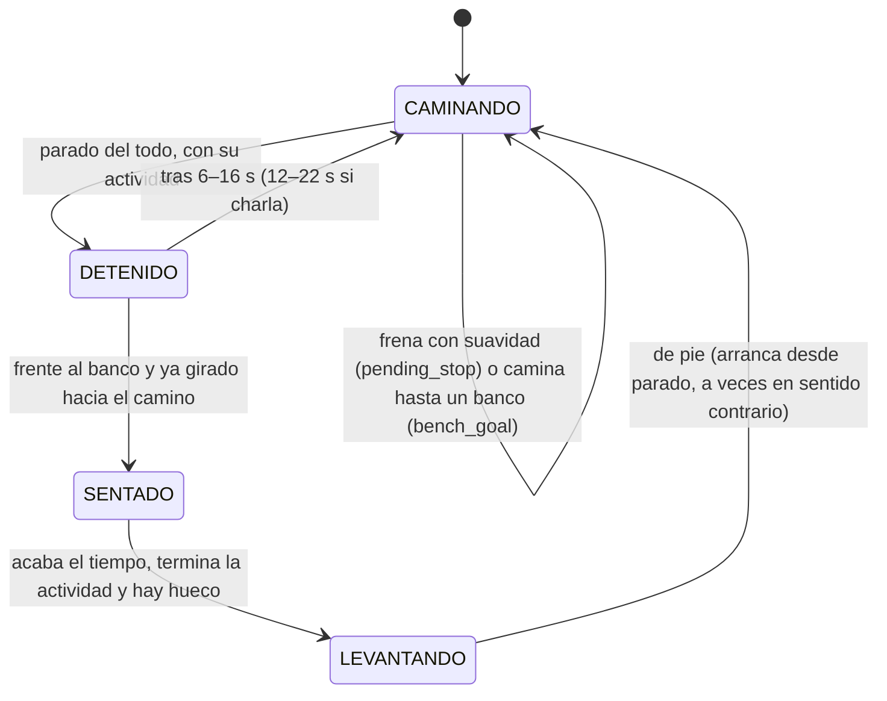

# Navegación 2D, Carriles y Prevención de Colisiones — Proyecto Paparazzi

Este documento detalla el modelo de desplazamiento bidimensional, el trazado de carriles concéntricos, el sistema de dirección anticipatoria (*steering*), la resolución de colisiones y los mecanismos deterministas anti-bloqueo (*anti-deadlock*) implementados en **Proyecto Paparazzi**.

---

## 1. Modelo de Desplazamiento y Coordenadas Cilíndricas

Dado que todos los viandantes caminan a nivel constante de suelo ($y = 0$), el movimiento se modela sobre el **plano horizontal 2D $(x, z)$** expresado en **coordenadas cilíndricas** $(r, \theta)$ con origen en el jugador:

$$\begin{cases}
x = r \cdot \sin(\theta) \\
z = -r \cdot \cos(\theta)
\end{cases}$$

La función de conversión en `park.gd` es:
```gdscript
func polar(theta: float, radius: float) -> Vector3:
    return Vector3(sin(deg_to_rad(theta))*radius, 0, -cos(deg_to_rad(theta))*radius)
```

La velocidad lineal $v$ se traduce en **velocidad angular** $\omega$:
$$\omega = \frac{v}{r} \quad (\text{rad/s}) \implies \Delta\theta = \text{rad\_to\_deg}\left(\frac{v}{r}\right) \cdot \Delta t \cdot \text{direction}$$

---

## 2. Estructura de Carriles y Capacidad de Aforo

El parque cuenta con **4 calzadas peatonales circulares concéntricas** donde circulan los **21 viandantes**:

| Carril | Radio Nominal ($r$) | Sub-offset ($\pm$) | Límites Físicos (`LANE_BOUNDS`) | Población | Aforo Máx. (`LANE_CAPACITIES`) | Función en el Juego |
|:---:|:---:|:---:|:---:|:---:|:---:|---|
| **0** | $1.8\text{ m}$ | $0.33\text{ m}$ | $[1.05, 2.70]\text{ m}$ (ancho: $1.65\text{ m}$) | 3 | 3 | Primer plano de oclusión dinámica |
| **1** | $4.0\text{ m}$ | $0.35\text{ m}$ | $[2.90, 4.85]\text{ m}$ (ancho: $1.95\text{ m}$) | 7 | 7 | Plaza central / Sujeto principal |
| **2** | $7.0\text{ m}$ | $0.35\text{ m}$ | $[6.10, 7.90]\text{ m}$ (ancho: $1.80\text{ m}$) | 6 | 7 | Tránsito intermedio y encargos secundarios |
| **3** | $11.5\text{ m}$ | $0.35\text{ m}$ | $[10.60, 12.40]\text{ m}$ (ancho: $1.80\text{ m}$) | 5 | 6 | Tránsito perimetral lejano |

**Población** es el reparto inicial de `populate()` (`counts = [3, 7, 6, 5]`, 21 en total); **aforo** es el máximo que `try_change_lane()` admite tras los cambios de carril (`LANE_CAPACITIES = [3, 7, 7, 6]`).

El carril 0 se ensanchó el 30-09-2026 de $[1.20, 2.40]$ a $[1.05, 2.70]\text{ m}$ (sigue sobre las losas de la plaza, que llegan a $2.8\text{ m}$): con los márgenes de $0.28\text{ m}$ de la marcha suave, el ancho antiguo dejaba $0.64\text{ m}$ útiles, menos que el espacio personal de $0.72\text{ m}$, y dos viandantes nunca podían cruzarse.

### Despeje de Calzadas y Obstáculos Físicos
Para asegurar que la calzada del carril 1 mantenga más de $1.9\text{ m}$ de paso continuo sin barreras:
- **Bancos reducidos a 4**: Desplazados al borde exterior a **$r = 4.85\text{ m}$** y orientados hacia el centro a $90^\circ$ ($\theta = 35^\circ, 125^\circ, 215^\circ, 305^\circ$).
- **Farolas interiores**: Reubicadas a **$r = 0.8\text{ m}$** (dentro del alcorque central) para no invadir el Carril 0 ($r = 1.8\text{ m}$).

---

## 3. Marcha Suave: Navegación Continua 2D sin Temblequeo

Desde el 30-09-2026 la marcha por carril vive en `main.gd::walk_step(p, dt)` y busca que todo ocurra **más despacio pero con naturalidad**: nadie da bandazos, nadie se para en seco, nadie tiembla al cruzarse. La versión anterior probaba pasos alternativos de golpe en cada fotograma y recalculaba la orientación desde cero, y de ahí salía el temblequeo cuando dos personas se encontraban.

### 3.1 Velocidades con aceleración limitada
Cada viandante guarda una velocidad de avance `v_fwd` y una radial `v_rad` que solo cambian con aceleración acotada:

| Constante | Valor | Uso |
|---|---|---|
| `WALK_ACCEL` | $0.55\text{ m/s}^2$ ($\times 2.5$ en corredores) | arrancar y recuperar el paso |
| `WALK_BRAKE` | $1.6\text{ m/s}^2$ | frenar ante alguien |
| `LATERAL_MAX` | $0.32\text{ m/s}$ ($\times 1.9$ en corredores) | desplazamiento lateral máximo |
| `PERSONAL_SPACE` | $0.72\text{ m}$ | distancia entre centros al cruzarse o adelantar |
| `FOLLOW_GAP` | $1.3\text{ m}$ | distancia al seguir a alguien más lento |

`v_rad` persigue $(r_{\text{des}} - r)\cdot 1.4$, acotada a `LATERAL_MAX`, con una aceleración lateral de $1.2\text{ m/s}^2$. La velocidad configurada (caminantes $0.55$–$0.85$, corredores $2.6$–$3.0\text{ m/s}$) no cambia; lo que cambia es cómo se llega a ella.

### 3.2 Radio deseado y sub-carriles por sentido
El radio deseado parte del sub-carril por sentido de marcha (`LANES[lane] + LANE_OFFSETS[lane]·direction`, es decir, cada uno por su derecha) acotado a `LANE_BOUNDS` con un margen de $0.28\text{ m}$. Junto a los bancos del carril 1 el borde exterior baja a $r = 4.43\text{ m}$, para que la cápsula de $0.30\text{ m}$ no roce sus patas.

### 3.3 Lado de paso fijado y adelantamientos
Para cada viandante visible entre $0.9\text{ m}$ por detrás y $4.0\text{ m}$ por delante, con $|\Delta r| < 1.1\text{ m}$:
- **A la par** (ya se están cruzando): solo se mantiene el lado de paso hasta dejarlo atrás.
- **Sin acercamiento** (va igual o más rápido en el mismo sentido): se ignora.
- **Se acercará a menos del espacio personal**: se elige **una vez** un lado de paso (`pass_side`) y se mantiene al menos $3\text{ s}$ (`pass_timer`). Quien viene de frente siempre se aparta por su derecha, aunque tuviera otro lado fijado de antes: así los dos eligen lados opuestos y nunca se imitan hasta bloquearse. En un adelantamiento se va hacia el lado con más hueco. El radio deseado se mezcla con el del lado de paso según la distancia (del todo a $1.5\text{ m}$).
- Si el lado fijado queda tapiado (borde del carril, banco) por alguien **parado** y el otro lado cabe, cambia de lado, como mucho una vez cada $2.5\text{ s}$ (`side_flip_cd`). Antes se quedaba esperando detrás, como en una cola.
- Si no cabe por ningún lado, **sigue** a la otra persona a `FOLLOW_GAP`, y afloja el paso con antelación si tiene delante a alguien que camina más despacio (a los parados los rodea).
- Quien va hacia un banco no esquiva a quien ya está sentado en él: se acerca por el camino y solo se arrima al banco en el último medio metro.

### 3.4 Pasos de reserva, orientación y atascos
- Si el paso completo no es válido (`travel_clear`), prueba solo el lateral mientras frena; si tampoco, frena del todo y acumula `stuck_time`.
- La **orientación** (`turn_heading`) sigue a la velocidad real cuando supera $0.12\text{ m/s}$, girando como mucho $75^\circ/\text{s}$ ($120^\circ/\text{s}$ los corredores). Parado, conserva la orientación y gira despacio ($70^\circ/\text{s}$) hacia lo que mira.
- Con `stuck_time` $> 2\text{ s}$ prueba el otro lado (como mucho una vez cada $1.5\text{ s}$); con $> 3\text{ s}$ intenta cambiar de carril; con $> 5\text{ s}$ da media vuelta con suavidad.

### 3.5 Transición Diagonal entre Carriles
Cuando un viandante cambia de carril (`destination_lane >= 0`):
- Avanza **diagonalmente**: el avance frena con suavidad hasta $0.55 \cdot v$ y el radio se acerca al sub-carril destino a $\min(0.6 \cdot v,\ 0.45)$ m/s.
- Si el paso diagonal no es válido prueba solo el radial y luego solo el tangencial. Se considera llegado a menos de $0.15\text{ m}$ del radio destino.
- Si lleva más de $1.2\text{ s}$ bloqueado (`lane_change_blocked`), cancela el cambio y adopta el carril nominal más cercano a su radio actual.
- Además, cada $25 - 60\text{ s}$ (`lane_timer`) intenta un cambio de carril espontáneo o, con probabilidad $0.3$, saca el móvil y camina mirándolo durante $8 - 18\text{ s}$ (al $80\ \%$ de su velocidad).

### 3.6 Control de Aforo (`LANE_CAPACITIES`)
Antes de permitir un cambio de carril, `try_change_lane()` contabiliza cuántos viandantes ocupan o se dirigen al carril destino:
```gdscript
if in_lane >= LANE_CAPACITIES[lane]: continue
```
Esto previene que el Carril 0 (de solo 11.3 m de perímetro) reciba demasiados viandantes y se congestione.

---

## 4. Algoritmo de Despeje Físico (`travel_clear`)

La función `travel_clear(p, from, to)` valida si un segmento de desplazamiento es seguro antes de comprometer la nueva posición del personaje:

```gdscript
func travel_clear(p: Pedestrian, from: Vector3, to: Vector3, static_check = true) -> bool:
```

`static_check = false` omite el barrido contra el mundo estático en dos casos: el último tramo hasta un banco elegido (hay que meterse entre sus patas) y cuando alguien está fuera de la franja transitable (al levantarse del banco), para que pueda volver a ella.

### Componentes de Validación
1. **Barrido de cápsula 3D (`CapsuleShape3D`) contra el mundo estático**:
   - Radio: $0.30\text{ m}$, altura: altura anatómica del personaje.
   - Consulta de intersección y `cast_motion` en `collision_mask = 2` (árboles, bancos, papeleras, farolas).
2. **Distancia mínima entre personajes ($0.58\text{ m}$)**:
   - Se obtiene el punto más cercano del segmento de avance respecto a los demás viandantes (`Geometry3D.get_closest_point_to_segment`).
   - **Desbloqueo de pasos de separación**: Si la distancia final $d_{to}$ es mayor o igual que la distancia inicial $d_{from} - 0.0005\text{ m}$, el paso se autoriza aunque los personajes estén cerca. Esto permite que los viandantes se separen libremente sin bloquearse mutuamente. La tolerancia era de $5\text{ mm}$ y con la marcha suave dejaba que dos personas lentas (menos de $0.15\text{ m/s}$) se fueran metiendo la una en la otra.
3. **Figurantes, palomas y objetos de mano** no intervienen: no tienen colisionadores. El perro tiene uno en la capa 1 (fotos), fuera de la máscara 2 de la navegación.

---

## 5. Máquina de Estados de Viandantes, Bancos y Actividades

El estado vive en `person.gd::state` y se actualiza en `main.gd::update_person()` (andando) y `update_still()` (parado):


```mermaid
stateDiagram-v2
    [*] --> CAMINANDO
    CAMINANDO --> CAMINANDO: frena con suavidad (pending_stop) o camina hasta un banco (bench_goal)
    CAMINANDO --> DETENIDO: parado del todo, con su actividad
    DETENIDO --> SENTADO: frente al banco y ya girado hacia el camino
    SENTADO --> LEVANTANDO: acaba el tiempo, termina la actividad y hay hueco
    LEVANTANDO --> CAMINANDO: de pie (arranca desde parado, a veces en sentido contrario)
    DETENIDO --> CAMINANDO: tras 6–16 s (12–22 s si charla)
```

- **Paradas**: al entrar en un sector nuevo de $30^\circ$ ($\theta < 240^\circ$) un caminante se para con probabilidad $0.12$ si no hay nadie parado a menos de $12^\circ$ en su carril. `plan_stop()` fija una parada pendiente (`pending_stop`): frena con la deceleración normal y, al pararse, empieza su **actividad** (`mirar`, `movil`, `foto` o `cafe`) mirando hacia el paisaje. Si viene de frente otro caminante a $1.4$–$3.6\text{ m}$, con probabilidad $0.55$ **se paran los dos a charlar**, frente a frente (`partner`). Los corredores se paran con probabilidad $0.05$ por sector a estirar (`estirar`, 6–10 s).
- **Bancos** (carril 1): cada banco tiene **dos plazas**, a $0.42\text{ m}$ a cada lado de su centro (`seat_theta()`, `bench.seats`). Cuando un banco con alguna plaza libre queda a $2.5$–$3.2\text{ m}$ por delante, se decide una sola vez si sentarse (probabilidad $0.4$, o $0.55$ si ya hay alguien). Reserva la plaza, camina por el camino ($r \le 4.2\text{ m}$, lejos de los pies de quien ya está sentado), se arrima al borde del banco ($r = 4.60\text{ m}$) en el último medio metro frenando hasta pararse enfrente de su plaza, gira hacia el camino y se sienta en $1.3\text{ s}$: la cadera retrocede hasta el centro del asiento mientras los pies se quedan quietos (`gait.gd::sit`, §6 de [PERSONAJES_Y_CINEMATICA.md](PERSONAJES_Y_CINEMATICA.md)). Sentado $25$–$70\text{ s}$ lee el periódico, mira el móvil, toma café, echa migas a las palomas o descansa. Si se sienta junto a alguien, con probabilidad $0.7$ **charlan sentados**, girando la cabeza el uno hacia el otro (`look_yaw`). Para levantarse espera a que no haya nadie de pie a menos de $0.9\text{ m}$ de su sitio. Si se pasa del banco o se atasca, renuncia y lo libera.
- **RETIRADO**: `update_person()` y el sorteo de objetivos contemplan este estado (reaparición en $\theta = 296^\circ / 304^\circ$, detrás del jugador), pero **ningún código lo asigna actualmente**; la rama es inalcanzable en el juego.
- Las actividades y sus posturas se describen en [futuro/19_VIDA_EN_EL_PARQUE.md](futuro/19_VIDA_EN_EL_PARQUE.md).

### Escalado Anti-Deadlock
Ver §3.4: otro lado de paso a los $2\text{ s}$, cambio de carril a los $3\text{ s}$ y media vuelta a los $5\text{ s}$ de `stuck_time`. Esperar detrás de alguien no cuenta como atasco.

---

## 6. Verificación Determinista de Navegación

Suites `tests/simulate_jams.gd`, `tests/test_navigation.gd`, `tests/test_crowd.gd` (60 s de multitud: giro $\le 125^\circ/\text{s}$, sin inversiones laterales rápidas, sin solapes, ningún atasco de más de $5.5\text{ s}$ y al menos un $60\ \%$ del tiempo caminando) y `tests/test_park_life.gd` (ciclo del banco sin teletransportes y charla frente a frente). Todas requieren display. Comandos y criterios en [TESTS_Y_VERIFICACION.md](TESTS_Y_VERIFICACION.md).
