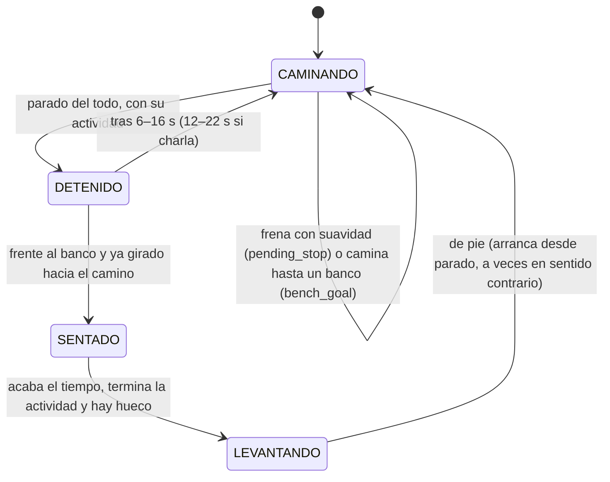

# Navegación 2D, Carriles y Prevención de Colisiones — PhotoHacks

Este documento detalla el modelo de desplazamiento bidimensional, el trazado de carriles concéntricos, el sistema de dirección anticipatoria (*steering*), la resolución de colisiones y los mecanismos deterministas anti-bloqueo (*anti-deadlock*) implementados en **PhotoHacks**.

---

## 1. Modelo de Desplazamiento y Coordenadas Cilíndricas

Dado que todos los viandantes caminan a nivel constante de suelo ($y = 0$), el movimiento se modela sobre el **plano horizontal 2D $(x, z)$** expresado en **coordenadas cilíndricas** $(r, \theta)$ con origen en el jugador:

$$\begin{cases}
x = r \cdot \sin(\theta) \\
z = -r \cdot \cos(\theta)
\end{cases}$$

La función de conversión en `park.gd` es:
```gdscript
func polar(theta: float, radius: float) -> Vector3:
    return Vector3(sin(deg_to_rad(theta))*radius, 0, -cos(deg_to_rad(theta))*radius)
```

La velocidad lineal $v$ se traduce en **velocidad angular** $\omega$:
$$\omega = \frac{v}{r} \quad (\text{rad/s}) \implies \Delta\theta = \text{rad\_to\_deg}\left(\frac{v}{r}\right) \cdot \Delta t \cdot \text{direction}$$

---

## 2. Estructura de Carriles y Capacidad de Aforo

El parque cuenta con **4 calzadas peatonales circulares concéntricas** donde circulan los **21 viandantes**. Cada calzada se reparte en **tres líneas** (§3): la del borde interior, la del centro y la del borde exterior.

| Carril | Radio nominal | Límites físicos (`LANE_BOUNDS`) | Líneas interior · centro · exterior (`LANE_LINES`) | Población | Aforo máx. | Quién lo usa |
|:---:|:---:|:---:|:---:|:---:|:---:|---|
| **0** | $1.8\text{ m}$ | $[1.05, 2.70]\text{ m}$ | $1.33$ · — · $2.12\text{ m}$ (dos filas, sin centro) | 3 | 3 | Paseantes; primer plano de oclusión |
| **1** | $4.0\text{ m}$ | $[2.90, 4.85]\text{ m}$ | $3.07$ · $3.82$ · $4.57\text{ m}$ ($4.30$ junto a los bancos) | 7 | 7 | Paseantes y bancos; sujeto principal |
| **2** | $7.0\text{ m}$ | $[6.10, 7.90]\text{ m}$ | $6.38$ · $7.00$ · $7.62\text{ m}$ | 6 | 7 | Paseantes y **un corredor** |
| **3** | $11.5\text{ m}$ | $[10.60, 12.40]\text{ m}$ | $10.80$ · $11.42$ · $12.04\text{ m}$ | 5 | 6 | Paseantes y **dos corredores** |

**Población** es el reparto inicial de `populate()` (`counts = [3, 7, 6, 5]`, 21 en total); **aforo** es el máximo que `try_change_lane()` admite tras los cambios de carril (`LANE_CAPACITIES = [3, 7, 7, 6]`).

Las líneas de `LANE_LINES` están comprobadas con un barrido del cuerpo (cápsula de $0.30\text{ m}$) contra todo lo fijo, grado a grado (`tools/measure_flow.gd -- --edges` y `tests/test_navigation.gd`):
- **Carril 0**: la línea exterior se queda en $2.12\text{ m}$ porque a $2.6\text{ m}$ hay cuatro farolas ($\theta = 8^\circ, 98^\circ, 188^\circ, 278^\circ$). A $2.42\text{ m}$, como estaba, quien caminaba por ella se quedaba clavado contra la base de cada farola hasta dar media vuelta. Quedan dos filas a $0.79\text{ m}$, sin línea central.
- **Carril 1**: la fila interior camina a $0.17\text{ m}$ del bordillo interior, porque quien se sienta en un banco ocupa parte del lado exterior (sus pies llegan a $r \approx 4.5\text{ m}$): junto a un banco la línea exterior baja a $4.30\text{ m}$ (`BENCH_CLEAR`) y siguen cabiendo tres líneas.
- **Carril 3**: desplazado $6\text{–}8\text{ cm}$ hacia dentro, libre de los arbustos de detrás del bordillo exterior.

**Corredores** (`RUNNER_PLACES`): los tres corren por los caminos exteriores (uno en el carril 2 y dos en el 3), **todos en el mismo sentido**, como en cualquier pista: nunca se encuentran de frente. No cambian de carril ni dan media vuelta. Antes había uno en cada uno de los carriles 0, 1 y 2: el del carril 0 daba una vuelta al fotógrafo cada cuatro segundos y el del carril 1 corría por el camino más corto y concurrido.

### Despeje de Calzadas y Obstáculos Físicos
Para asegurar que la calzada del carril 1 mantenga más de $1.9\text{ m}$ de paso continuo sin barreras:
- **Bancos reducidos a 4**: Desplazados al borde exterior a **$r = 4.85\text{ m}$** y orientados hacia el centro a $90^\circ$ ($\theta = 35^\circ, 125^\circ, 215^\circ, 305^\circ$).
- **Farolas interiores**: Reubicadas a **$r = 0.8\text{ m}$** (dentro del alcorque central) para no invadir el Carril 0 ($r = 1.8\text{ m}$).

---

## 3. Marcha Suave: Navegación Continua 2D sin Temblequeo

Desde el 30-09-2026 la marcha por carril vive en `main.gd::walk_step(p, dt)` y busca que todo ocurra **más despacio pero con naturalidad**: nadie da bandazos, nadie se para en seco, nadie tiembla al cruzarse. La versión anterior probaba pasos alternativos de golpe en cada fotograma y recalculaba la orientación desde cero, y de ahí salía el temblequeo cuando dos personas se encontraban.

**Temblor contra otro (01-10-2026).** Quien se queda bloqueado por alguien a ratos (un fotograma avanza, el siguiente no) hacía que la animación mezclara las piernas entre «andando» y «quieto» en cada fotograma, y eso se veía como un temblor. Ahora `gait.gd::pose()` solo apaga la marcha tras **0,6 s sin moverse** (`idle_time`). `tests/test_crowd.gd` mide ese vaivén de la mezcla (como mucho una parada y arranque en 2 s; antes llegaba a 8 cambios).

### 3.1 Velocidades con aceleración limitada
Cada viandante guarda una velocidad de avance `v_fwd` y una radial `v_rad` que solo cambian con aceleración acotada:

| Constante | Valor | Uso |
|---|---|---|
| `WALK_ACCEL` | $0.55\text{ m/s}^2$ ($\times 2.5$ en corredores) | arrancar y recuperar el paso |
| `WALK_BRAKE` | $1.6\text{ m/s}^2$ | frenar ante alguien |
| `LATERAL_MAX` | $0.32\text{ m/s}$ ($\times 1.9$ en corredores) | desplazamiento lateral máximo |
| `PASS_SPACE` | $0.62\text{ m}$ | distancia entre líneas contiguas (entre centros, al cruzarse o adelantar) |
| `HARD_SPACE` | $0.52\text{ m}$ | distancia mínima entre centros que admite `travel_clear()` |
| `FOLLOW_GAP` | $1.3\text{ m}$ | distancia al seguir a alguien más lento |

`v_rad` persigue $(r_{\text{des}} - r)\cdot 1.4$ (con un mínimo de $0.1\text{ m/s}$ para que los últimos centímetros hasta la línea no sean un arrastre interminable), acotada a `LATERAL_MAX`, con una aceleración lateral de $1.2\text{ m/s}^2$ ($2.6$ los corredores). La velocidad configurada (caminantes $0.55$–$0.85$, corredores $2.6$–$3.0\text{ m/s}$) no cambia; lo que cambia es cómo se llega a ella.

### 3.2 Tres líneas por camino (03-10-2026)

**El problema que resuelve.** Un camino da para dos o tres personas a la par. Hasta ahora las dos filas de paseantes (una por sentido, a $\pm 0.35\text{ m}$ del centro) ocupaban los dos sitios que había, y adelantar exigía meterse en la fila contraria, que casi nunca estaba libre. Medido en 5 minutos de parque: el corredor objetivo de un nivel iba a su velocidad el **10 %** del tiempo y pasaba el **88 %** retenido detrás de alguien, y un atasco se resolvía dando media vuelta casi cien veces.

**El reparto.** Cada paseante camina por **el borde de su derecha** (`home_radius()`: la línea exterior si va en sentido $+1$, la interior si va en $-1$) y **el centro queda libre**: es por donde se adelanta a quien está parado o va más despacio, y por donde **corren los corredores**. Las líneas están a $0.62\text{ m}$ entre sí (`PASS_SPACE`); dos personas nunca se acercan a menos de $0.52\text{ m}$ entre centros (`HARD_SPACE`, lo que comprueba `travel_clear()`).

**La regla de paso** (`main.gd::walk_step()`, `free_time()`, `pass_need()`). Nadie entra en una línea si no va a estar libre el tiempo que dura la maniobra:
- `free_time(p, c)` da los segundos que la línea de radio $c$ seguirá libre para $p$: quien está delante en ella cuenta según la velocidad a la que $p$ se le acerca; quien está al lado, de inmediato; quien viene por detrás solo si $p$ se metería en su línea (o si es un corredor: **tienen preferencia**). Para cruzar a una línea tampoco puede haber nadie al lado por el camino.
- `pass_need()` da los segundos que $p$ necesita fuera de su línea para rebasar a quien le estorba (infinito si el otro camina igual de rápido: entonces le sigue).
- Con la línea propia libre al menos $4\text{ s}$ (`HOME_CLEAR`) se queda en ella. Si no, busca la línea más cercana a la suya que cumpla `free_time > pass_need + margen` (margen de $2.5\text{ s}$ los paseantes, que además solo usan la línea contigua a la suya, y $0.5\text{ s}$ los corredores) y **se compromete con ella** (`pass_r`) hasta rebasar: no hay cambios de idea fotograma a fotograma. Si ninguna sirve, sigue a quien tiene delante a `FOLLOW_GAP`.
- En la práctica: un paseante retenido detrás de alguien parado **espera a que pase el corredor** y entonces rodea por el centro; un paseante solo adelanta a otro que camina si le sobra tiempo (en los caminos con corredor, casi nunca: le sigue); el corredor pasa entre las dos filas sin tocar el freno y, si encuentra a alguien en el centro, usa un borde si está libre o afloja.
- Quien se va a parar (a mirar, al móvil, a charlar) lo hace **en su borde**, no en mitad del camino, y espera a estar en él para quedarse quieto. Los corredores estiran en el borde exterior.

**Velocidad.** Con alguien en medio de su paso ahora mismo (a menos de `HARD_SPACE` de lado): si va en su mismo sentido o está parado, le sigue a distancia; si viene de frente, frena antes de llegar. Dos personas frente a frente y las dos esperando no son una cola sino un atasco en ciernes: cuenta como `stuck_time` y una de las dos cede.

### 3.3 Fuera del camino y bancos

- Quien queda **fuera de su camino** (un cruce entre carriles cancelado a medias, al levantarse de un banco) vuelve andando, sin comprobar lo fijo. Antes el radio se recortaba de golpe al camino, un salto de medio metro que nunca pasaba el barrido de colisión: la persona se quedaba en el césped dando media vuelta cada cinco segundos, indefinidamente.
- **Bancos**: quien llega a un banco toma la plaza que alcanza primero; la del fondo, solo si quien tiene la cercana ya está sentado (`choose_bench()`). Antes, dos personas que iban al mismo banco desde lados opuestos tenían que cruzarse justo delante de él y se quedaban frente a frente esperándose.
- Quien va hacia un banco no esquiva a quien ya está sentado en él.
- Nadie empieza a cruzar a otro carril si un corredor de ese carril llega en menos de $7\text{ s}$ (`runner_due()`).

### 3.4 Pasos de reserva, orientación y atascos
- Si el paso completo no es válido (`travel_clear`), prueba solo el lateral mientras frena, luego solo el avance en su línea; si tampoco, frena del todo y acumula `stuck_time`.
- La **orientación** (`turn_heading`) sigue a la velocidad real cuando supera $0.12\text{ m/s}$, girando como mucho $75^\circ/\text{s}$ ($120^\circ/\text{s}$ los corredores). Parado, conserva la orientación y gira despacio ($70^\circ/\text{s}$) hacia lo que mira.
- **Red de seguridad** (el plan del §3.2 no debería llegar aquí): con `stuck_time` $> 2\text{ s}$ se aparta de quien tiene más cerca delante, hacia el lado con sitio; con $> 3\text{ s}$ intenta cambiar de carril; con $> 5\text{ s}$ da media vuelta (los corredores, nunca). Cada media vuelta por atasco se cuenta en `main.jam_turns`.

### 3.5 Transición Diagonal entre Carriles
Cuando un viandante cambia de carril (`destination_lane >= 0`):
- Avanza **diagonalmente**: el avance frena con suavidad hasta $0.55 \cdot v$ y el radio se acerca al sub-carril destino a $\min(0.6 \cdot v,\ 0.45)$ m/s.
- Si el paso diagonal no es válido prueba solo el radial y luego solo el tangencial. Se considera llegado a menos de $0.15\text{ m}$ del radio destino.
- Si lleva más de $1.2\text{ s}$ bloqueado (`lane_change_blocked`), cancela el cambio y adopta el carril nominal más cercano a su radio actual.
- Además, cada $25 - 60\text{ s}$ (`lane_timer`) intenta un cambio de carril espontáneo o, con probabilidad $0.3$, saca el móvil y camina mirándolo durante $8 - 18\text{ s}$ (al $80\ \%$ de su velocidad).

### 3.6 Control de Aforo (`LANE_CAPACITIES`)
Antes de permitir un cambio de carril, `try_change_lane()` contabiliza cuántos viandantes ocupan o se dirigen al carril destino:
```gdscript
if in_lane >= LANE_CAPACITIES[lane]: continue
```
Esto previene que el Carril 0 (de solo 11.3 m de perímetro) reciba demasiados viandantes y se congestione.

---

## 4. Algoritmo de Despeje Físico (`travel_clear`)

La función `travel_clear(p, from, to)` valida si un segmento de desplazamiento es seguro antes de comprometer la nueva posición del personaje:

```gdscript
func travel_clear(p: Pedestrian, from: Vector3, to: Vector3, static_check = true) -> bool:
```

`static_check = false` omite el barrido contra el mundo estático en dos casos: el último tramo hasta un banco elegido (hay que meterse entre sus patas) y cuando alguien está fuera de la franja transitable (al levantarse del banco), para que pueda volver a ella.

### Componentes de Validación
1. **Barrido de cápsula 3D (`CapsuleShape3D`) contra el mundo estático**:
   - Radio: $0.30\text{ m}$, altura: altura anatómica del personaje.
   - Consulta de intersección y `cast_motion` en `collision_mask = 2` (árboles, bancos, papeleras, farolas).
2. **Distancia mínima entre personajes ($0.52\text{ m}$, `HARD_SPACE`)**:
   - Se obtiene el punto más cercano del segmento de avance respecto a los demás viandantes (`Geometry3D.get_closest_point_to_segment`).
   - **Desbloqueo de pasos de separación**: Si la distancia final $d_{to}$ es mayor o igual que la distancia inicial $d_{from} - 0.0005\text{ m}$, el paso se autoriza aunque los personajes estén cerca. Esto permite que los viandantes se separen libremente sin bloquearse mutuamente. La tolerancia era de $5\text{ mm}$ y con la marcha suave dejaba que dos personas lentas (menos de $0.15\text{ m/s}$) se fueran metiendo la una en la otra.
3. **Figurantes, palomas y objetos de mano** no intervienen: no tienen colisionadores. El perro tiene uno en la capa 1 (fotos), fuera de la máscara 2 de la navegación.

---

## 5. Máquina de Estados de Viandantes, Bancos y Actividades

El estado vive en `person.gd::state` y se actualiza en `main.gd::update_person()` (andando) y `update_still()` (parado):


```mermaid
stateDiagram-v2
    [*] --> CAMINANDO
    CAMINANDO --> CAMINANDO: frena con suavidad (pending_stop) o camina hasta un banco (bench_goal)
    CAMINANDO --> DETENIDO: parado del todo, con su actividad
    DETENIDO --> SENTADO: frente al banco y ya girado hacia el camino
    SENTADO --> LEVANTANDO: acaba el tiempo, termina la actividad y hay hueco
    LEVANTANDO --> CAMINANDO: de pie (arranca desde parado, a veces en sentido contrario)
    DETENIDO --> CAMINANDO: tras 6–16 s (12–22 s si charla)
```

- **Paradas**: al entrar en un sector nuevo de $30^\circ$ ($\theta < 240^\circ$) un caminante se para con probabilidad $0.12$ si no hay nadie parado a menos de $12^\circ$ en su carril. `plan_stop()` fija una parada pendiente (`pending_stop`): frena con la deceleración normal y, al pararse, empieza su **actividad** (`mirar`, `movil`, `foto` o `cafe`) mirando hacia el paisaje. Si viene de frente otro caminante a $1.4$–$3.6\text{ m}$, con probabilidad $0.55$ **se paran los dos a charlar**, frente a frente (`partner`). Los corredores se paran con probabilidad $0.05$ por sector a estirar (`estirar`, 6–10 s).
- **Bancos** (carril 1): cada banco tiene **dos plazas**, a $0.42\text{ m}$ a cada lado de su centro (`seat_theta()`, `bench.seats`). Cuando un banco con alguna plaza libre queda a $2.5$–$3.2\text{ m}$ por delante, se decide una sola vez si sentarse (probabilidad $0.4$, o $0.55$ si ya hay alguien). Reserva la plaza, camina por el camino ($r \le 4.2\text{ m}$, lejos de los pies de quien ya está sentado), se arrima al borde del banco ($r = 4.60\text{ m}$) en el último medio metro frenando hasta pararse enfrente de su plaza, gira hacia el camino y se sienta en $1.3\text{ s}$: la cadera retrocede hasta el centro del asiento mientras los pies se quedan quietos (`gait.gd::sit`, §6 de [PERSONAJES_Y_CINEMATICA.md](PERSONAJES_Y_CINEMATICA.md)). Sentado $25$–$70\text{ s}$ lee el periódico, mira el móvil, toma café, echa migas a las palomas o descansa. Si se sienta junto a alguien, con probabilidad $0.7$ **charlan sentados**, girando la cabeza el uno hacia el otro (`look_yaw`). Para levantarse espera a que no haya nadie de pie a menos de $0.9\text{ m}$ de su sitio. Si se pasa del banco o se atasca, renuncia y lo libera.
- **RETIRADO**: `update_person()` y el sorteo de objetivos contemplan este estado (reaparición en $\theta = 296^\circ / 304^\circ$, detrás del jugador), pero **ningún código lo asigna actualmente**; la rama es inalcanzable en el juego.
- Las actividades y sus posturas se describen en [futuro/19_VIDA_EN_EL_PARQUE.md](futuro/19_VIDA_EN_EL_PARQUE.md).

### Escalado Anti-Deadlock
Ver §3.4: otro lado de paso a los $2\text{ s}$, cambio de carril a los $3\text{ s}$ y media vuelta a los $5\text{ s}$ de `stuck_time`. Esperar detrás de alguien no cuenta como atasco; quedarse frente a frente con otro que también espera, sí.

---

## 6. Verificación Determinista de Navegación

Suites `tests/simulate_jams.gd`, `tests/test_navigation.gd`, `tests/test_crowd.gd` (60 s de multitud: giro $\le 125^\circ/\text{s}$, sin inversiones laterales rápidas, sin solapes, ningún atasco de más de $5.5\text{ s}$ y al menos un $60\ \%$ del tiempo caminando) y `tests/test_park_life.gd` (ciclo del banco sin teletransportes y charla frente a frente). Todas requieren display. Comandos y criterios en [TESTS_Y_VERIFICACION.md](TESTS_Y_VERIFICACION.md).

### 6.1 Medida de la fluidez (`tools/measure_flow.gd`)

`~/bin/godot-4-fp --path . --disable-vsync --script tools/measure_flow.gd [-- --seconds=300 --level=10 --edges --debug]` simula varios minutos de parque y dice, para cada corredor y para los paseantes, qué parte del tiempo van a su velocidad, cuánto pasan retenidos y cuántos atascos acaban en media vuelta. `--level=N` mide con el corredor objetivo de ese nivel, `--edges` comprueba que las líneas de cada camino están libres de obstáculos fijos y `--debug` enseña quién dio media vuelta y quién tenía alrededor. **Hay que pasarla antes y después de tocar `walk_step()`.**

| Medida (5 min de parque clásico) | Antes (02-10-2026) | Con tres líneas (03-10-2026) |
|---|:---:|:---:|
| Corredores a su velocidad (≥ 80 %) | 36 % del tiempo (el peor, 21 %) | **98 %** (el peor, 96 %) |
| Corredor objetivo de un nivel (`--level=10`) | **10 %** del tiempo; retenido el 88 % | **96 %**; retenido el 1 % |
| Paseantes a su velocidad | 82 % | 94 % |
| Paseantes retenidos (< 40 % de su velocidad) | 15 % | 4 % |
| Medias vueltas (atascos y salidas de banco) | 98 | 16 en 10 min, todas al levantarse de un banco |
| Atascos resueltos con media vuelta | casi todas las anteriores | **0** en 15 min |
| `test_crowd.gd`: mayor `stuck_time` en 60 s | hasta 5 s | 0,0 s |

## Coste de `travel_clear()` y pasos a medio ritmo (05-10-2026)

`main.gd::travel_clear()` se llama una o dos veces por viandante y fotograma. Creaba una forma, una consulta y una lista de gente nuevas cada vez y medía a todos contra el paso. Ahora reutiliza forma y consulta (solo cambia la altura), toma la lista de `everybody()` (una por fotograma) y salta a quien está más lejos que `HARD_SPACE` más la longitud del paso. Además, un primer cribado sobre la posición con que cada uno empezó la ronda (`everybody_at`, con 1 m de margen: nadie se mueve tanto en un paso) evita leer la posición de quien está lejos; lo usa también el bucle de vecinos de `crowd_graph.gd::walk()`. Por construcción no cambia ninguna respuesta (las comprobaciones exactas siguen detrás del cribado). `tools/measure_flow.gd` da cifras equivalentes antes y después (corredores al 98 %, paseantes al 90–93 %, 0–1 atascos resueltos dando la vuelta), pero **ojo: esa herramienta no es determinista**, de una pasada a otra con el mismo código los frenazos de los paseantes van de 93 a 118 en 300 s, así que solo sirve para ver cambios mayores que eso. Parque grande en el PC con el renderizador de Android, sin el ahorro del móvil: de 9,7 a 7,4 ms por fotograma.

Solo en móvil y navegador (`lean_poses`; `-- --lean` en el PC): fuera de cuadro cada viandante da su paso un fotograma de cada dos, con el tiempo de los dos (`step_person()`, tope de 0,08 s), y se dobla la mitad de esas veces (`pose_person()`). `tools/measure_flow.gd -- --lean` y las suites de navegación con `-- --lean` pasan igual. Nada de esto se aplica mientras se dispara ni a quien está en cuadro, así que la foto y la nota no cambian.

