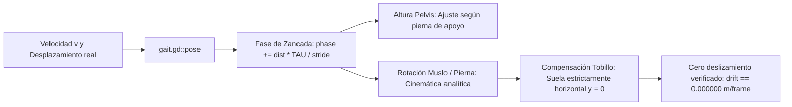

# Personajes, Rigging y Cinemática de Marcha — Proyecto Paparazzi

Este documento describe el modelado procedural de personajes, la jerarquía de huesos, el pesaje rígido, la optimización de superficie única y la cinemática inversa analítica implementada en **Proyecto Paparazzi**.

---

## 1. Perfiles Anatómicos Paramétricos

La población se genera proceduralmente a partir de **4 complexiones anatómicas** declaradas en `data/catalogo.json`:

| Perfil | Altura ($h$) | Hombros | Relación Cabeza | Radio Articular ($j$) | Zancada Base |
|---|:---:|:---:|:---:|:---:|:---:|
| **0. Adulto Estándar** | $1.75\text{ m}$ | $0.42\text{ m}$ | $1 : 7.5$ | $0.045\text{ m}$ | $0.80\text{ m}$ |
| **1. Adulto Delgado** | $1.80\text{ m}$ | $0.36\text{ m}$ | $1 : 8.0$ | $0.038\text{ m}$ | $0.85\text{ m}$ |
| **2. Adulto Robusto** | $1.70\text{ m}$ | $0.52\text{ m}$ | $1 : 6.8$ | $0.055\text{ m}$ | $0.78\text{ m}$ |
| **3. Niño / Niña** | $1.15\text{ m}$ | $0.28\text{ m}$ | $1 : 4.8$ | $0.032\text{ m}$ | $0.55\text{ m}$ |

### Escalado Anatómico por Base del Cráneo ($NZ$)
Para que las extremidades de los menores no se deformen ni requieran tablas ad-hoc, las alturas articulares se calculan en función de $NZ$ (altura sin cabeza):
$$NZ = h - \frac{h}{\text{relación\_cabeza}}$$

- **Altura de cadera (entrepierna)**: $y_{\text{hip}} = NZ \cdot 0.542$
- **Rodilla**: $y_{\text{knee}} = NZ \cdot 0.323$
- **Tobillo**: $y_{\text{ankle}} = NZ \cdot 0.030$
- **Cintura**: $y_{\text{waist}} = NZ \cdot 0.692$

---

## 2. Esqueleto Universal de 20 Huesos y Rigging Rígido

Todos los viandantes comparten una **única estructura jerárquica de 20 huesos** en un nodo `Skeleton3D`:

```
raiz (0)
└── caderas (1)
    ├── lumbar (2)
    │   └── torax (3)
    │       ├── cuello (4)
    │       │   └── cabeza (5)
    │       ├── brazo.I (6) ── antebrazo.I (7) ── mano.I (8)
    │       └── brazo.D (9) ── antebrazo.D (10) ── mano.D (11)
    ├── muslo.I (12) ── pierna.I (13) ── pie.I (14) ── punta.I (15)
    └── muslo.D (16) ── pierna.D (17) ── pie.D (18) ── punta.D (19)
```

### Invariante de Pesaje Rígido (Single Bone Weight)
- Cada vértice de la malla de un personaje pertenece **única y exclusivamente a 1 hueso con peso 1.0**:
  - `ARRAY_WEIGHTS`: `weights[0] = 1.0`, `weights[1..3] = 0.0`.
  - `ARRAY_BONES`: `bones[0] = bone_index`, `bones[1..3] = 0`.
- **Beneficio técnico**: El hardware gráfico no necesita calcular matrices de deformación interpoladas multihueso (*dual quaternion* o *linear blend skinning*). En el método `gl_compatibility` (OpenGL / WebGL), esto reduce el coste del vertex shader a una simple transformación afín rígida, permitiendo animar multitudes de personajes fluidamente a 60 FPS.

---

## 3. Ensamblaje en Malla de Superficie Única y Colores de Vértice

Cada personaje combina múltiples prendas (torso, pantalones/falda, peinado, calzado, bufanda/sombrero):

1. **Piezas Paramétricas (`data/piezas/`)**:
   - Geometrías compactas definidas en JSON: cajas, cilindros, conos truncados y elipsoides de bajo número de polígonos.
2. **Superficie Única Combinada**:
   - En lugar de crear múltiples nodos `MeshInstance3D`, `person.gd` concatena los vértices, normales, índices y pesos de todas las piezas en un único arreglo para llamar a `Mesh.add_surface_from_arrays()`.
   - **Resultado**: Exactamente **1 draw call por personaje**.
3. **Coloreado por Vértice (`Mesh.ARRAY_COLOR`)**:
   - Los colores de piel, ropa superior, ropa inferior, pelo y accesorios se asignan como atributo de color en cada vértice (`ARRAY_COLOR`), sin requerir texturas PNG ni materiales individuales en GPU.
4. **Presupuesto Geométrico**:
   - Límite máximo: **1.900 triángulos por viandante** (`test_art.gd`).
   - Media real del catálogo: **~1.550 triángulos**.

---

## 4. Cinemática Inversa y Locomoción Analítica (`gait.gd`)

El archivo [scripts/gait.gd](file:///home/ganso/codigo/afotando/scripts/gait.gd) implementa un modelo de cinemática analítica en tiempo real para las extremidades inferiores.



### 4.1 Frecuencia y Zancada
La fase de locomoción $\phi \in [0, 2\pi)$ avanza en función de la distancia real recorrida en cada fotograma:
$$\Delta \phi = \frac{\Delta \text{distancia} \cdot 2\pi}{\text{zancada}}$$

Al alimentar $\Delta \text{distancia} = \|\mathbf{p}_{t} - \mathbf{p}_{t-1}\|$, la animación de los pies se desacopla del framerate y se sincroniza con exactitud milimétrica al avance físico.

### 4.2 Orientación de Suela Horizontal y Cabeceo de Pelvis
- **Suela paralela al suelo**: El ángulo del hueso `pie` compensa en cada instante la suma de rotaciones del muslo y la pantorrilla, asegurando que la suela permanezca estrictamente horizontal en contacto con el suelo ($y = 0$).
- **Cabeceo de cadera**: La posición vertical de la pelvis desciende en el contacto inicial (~6 cm) y se eleva en la posición de paso medio (~1 cm), emulando el movimiento biomecánico natural.

### 4.3 Diferenciación Marcha vs. Carrera
- **Caminantes** ($v \in [0.55, 0.85]\text{ m/s}$): Zancada base $0.80\text{ m} \times 0.8$; braceo suave de brazos; siempre hay al menos un pie en contacto con el suelo.
- **Corredores** ($v \in [2.6, 3.0]\text{ m/s}$):
  - Ropa deportiva exclusiva (accesorios sueltos desactivados).
  - Zancada ampliada ($1.4 \times$).
  - Codos flexionados en ángulo pronunciado ($> 60^\circ$).
  - Fase aérea balística: periodo del ciclo donde ambos pies están en el aire simultáneamente.

---

## 5. Reglas Éticas de Casting y Concordancia Gramatical

El generador de personajes en [scripts/casting.gd](file:///home/ganso/codigo/afotando/scripts/casting.gd) respeta las siguientes reglas de diseño:

1. **Principio Ético Invariable**:
   - El **tono de piel nunca se utiliza para identificar al objetivo**, ni forma parte de las descripciones o predicados de los encargos.
2. **Concordancia Gramatical Estricta en Español**:
   - Cada prenda en `catalogo.json` declara su género y número morfológico:
     - `pantalones`: masculino plural (`"los pantalones verdes"`).
     - `falda`: femenino singular (`"la falda plisada"`).
     - `chaqueta`: femenino singular (`"una chaqueta roja"`).
   - El sistema de concordancia en `casting.gd` ajusta artículos y adjetivos cromáticos para garantizar descripciones naturales y gramaticalmente impecables en español.

---

## 6. Comandos de Verificación Automatizada

```bash
# 1. Validación de mallas, presupuestos y pesaje rígido (2.880 ensamblajes)
godot-4 --headless --path . --script tests/test_art.gd

# 2. Validación de cinemática inversa y deriva cero de pie (8.840 checks)
godot-4 --headless --path . --script tests/test_gait.gd
```
