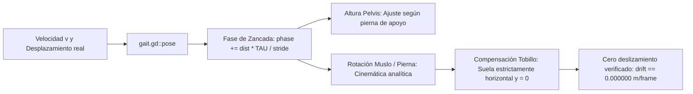

# Personajes, Rigging y Cinemática de Marcha — PhotoHacks

Este documento describe el modelado procedural de personajes, la jerarquía de huesos, el pesaje rígido, la optimización de superficie única y la cinemática inversa analítica implementada en **PhotoHacks**.

---

## 1. Perfiles Anatómicos Paramétricos

La población se genera proceduralmente a partir de **4 complexiones anatómicas** declaradas en `data/catalogo.json`:

| Perfil | Altura ($h$) | Hombros | Relación Cabeza | Radio Articular ($j$) | Zancada Base (`zancada`) |
|---|:---:|:---:|:---:|:---:|:---:|
| **0. Adulto Estándar** | $1.75\text{ m}$ | $0.42\text{ m}$ | $1 : 7.0$ | $0.045\text{ m}$ | $1.446\text{ m}$ |
| **1. Adulto Delgado** | $1.80\text{ m}$ | $0.36\text{ m}$ | $1 : 7.5$ | $0.038\text{ m}$ | $1.503\text{ m}$ |
| **2. Adulto Robusto** | $1.70\text{ m}$ | $0.52\text{ m}$ | $1 : 6.4$ | $0.055\text{ m}$ | $1.382\text{ m}$ |
| **3. Niño / Niña** | $1.15\text{ m}$ | $0.28\text{ m}$ | $1 : 4.5$ | $0.032\text{ m}$ | $0.862\text{ m}$ |

La zancada es la longitud de un **ciclo completo** (dos pasos) y es la base de `gait.gd`; `person.gd` la multiplica por $0.8$ en caminantes y por $1.4$ en corredores. En los cuatro perfiles vale $\approx 0.9637 \cdot NZ$ (proporcional a la longitud de pierna): si se cambia `altura` o `relacion_cabeza` en `catalogo.json`, hay que recalcularla con esa regla.

Las cabezas son algo mayores que las de una figura realista (p. ej. 1:7 en el adulto estándar) para que peinados y tocados, que forman parte de los encargos, se lean a distancia. Las extremidades se engrosaron en la misma revisión; los brazos, menos que las piernas, porque a la altura de la cintura ya rozan el torso y de frente se fundirían con él.

### Escalado Anatómico por Base del Cráneo ($NZ$)
Para que las extremidades de los menores no se deformen ni requieran tablas ad-hoc, las alturas articulares se calculan en función de $NZ$ (altura sin cabeza):
$$NZ = h - \frac{h}{\text{relación\_cabeza}}$$

- **Altura de cadera (entrepierna)**: $y_{\text{hip}} = NZ \cdot 0.542$
- **Rodilla**: $y_{\text{knee}} = NZ \cdot 0.323$
- **Tobillo**: $y_{\text{ankle}} = NZ \cdot 0.030$
- **Cintura**: $y_{\text{waist}} = NZ \cdot 0.692$

---

## 2. Esqueleto Universal de 20 Huesos y Rigging Rígido

Todos los viandantes comparten una **única estructura jerárquica de 20 huesos** en un nodo `Skeleton3D`:

```
raiz (0)
└── caderas (1)
    ├── lumbar (2)
    │   └── torax (3)
    │       ├── cuello (4)
    │       │   └── cabeza (5)
    │       ├── brazo.I (6) ── antebrazo.I (7) ── mano.I (8)
    │       └── brazo.D (9) ── antebrazo.D (10) ── mano.D (11)
    ├── muslo.I (12) ── pierna.I (13) ── pie.I (14) ── punta.I (15)
    └── muslo.D (16) ── pierna.D (17) ── pie.D (18) ── punta.D (19)
```

### Invariante de Pesaje Rígido (Single Bone Weight)
- Cada vértice de la malla de un personaje pertenece **única y exclusivamente a 1 hueso con peso 1.0**:
  - `ARRAY_WEIGHTS`: `weights[0] = 1.0`, `weights[1..3] = 0.0`.
  - `ARRAY_BONES`: `bones[0] = bone_index`, `bones[1..3] = 0`.
- **Beneficio técnico**: El hardware gráfico no necesita calcular matrices de deformación interpoladas multihueso (*dual quaternion* o *linear blend skinning*). En el método `gl_compatibility` (OpenGL / WebGL), esto reduce el coste del vertex shader a una simple transformación afín rígida, permitiendo animar multitudes de personajes fluidamente a 60 FPS.

---

## 3. Ensamblaje en Malla de Superficie Única y Colores de Vértice

Cada personaje combina múltiples prendas (torso, pantalones/falda, peinado, calzado, bufanda/sombrero):

1. **Piezas Paramétricas (`data/piezas/`)**:
   - Geometrías compactas definidas en JSON y generadas por `tools/build_catalog.py`: secciones elípticas unidas (*lofts*) con normales suaves, más algunos elipsoides, cajas y paneles planos (solapas, cremalleras).
   - Tras editar el generador hay que regenerar con `python3 tools/build_catalog.py`. Aviso: el generador produce diferencias de coma flotante del orden de $10^{-16}$ en piezas no modificadas (según la versión de Python); conviene no incluir esos ficheros en el commit.
2. **Superficie Única Combinada**:
   - En lugar de crear múltiples nodos `MeshInstance3D`, `person.gd` concatena los vértices, normales, índices y pesos de todas las piezas en un único arreglo para llamar a `Mesh.add_surface_from_arrays()`.
   - **Resultado**: una única superficie por personaje, dibujada en **2 draw calls** (pase toon + pase de contorno `next_pass`).
3. **Coloreado por Vértice (`Mesh.ARRAY_COLOR`)**:
   - Los colores se asignan como atributo de color en cada vértice (`ARRAY_COLOR`), sin texturas PNG ni materiales individuales en GPU. Cada forma de una pieza declara una **zona de color** que `person.gd::setup()` resuelve:

     | Zona | Origen del color |
     |---|---|
     | `piel` | Madera: `tonos_madera[madera_por_tono[t.skin]]` (arce, haya, roble o nogal) |
     | `pelo` | `tonos_pelo[t.hair_color]` |
     | `tela_a` / `tela_b` | `tonos_ropa` de la prenda superior / inferior |
     | `accesorio` | `tonos_ropa[t.accessory_color]` |
     | `acento` | Blanco roto fijo (zapatillas y franjas deportivas) |
     | `calzado` | `tonos_calzado` (negro, marrón, blanco, gris) |

   - **Estilo maniquí** (subfases 2.1 y 2.2 de [futuro/02](futuro/02_ESTILO_VISUAL_Y_POLIGONOS.md)):
     - Material único compartido (`Person.mannequin_material()`) con [`cel_shading.gdshader`](../shaders/cel_shading.gdshader), luz en 3 bandas (iluminada 0,85, media 0,5 y sombra), lustre especular de barniz satinado (micro-resalte Blinn-Phong clearcoat) y halo de recorte (rim light de estudio para separación de figuras respecto al fondo vegetal), y como `next_pass` [`cel_outline.gdshader`](../shaders/cel_outline.gdshader), un contorno de tinta por casco invertido de 1,6 px (máx. 12 mm) con modulación armónica por color de vértice (`tint_strength = 0.45` para un acabado ilustrado orgánico sobre madera y prendas), atenuación cúbica suave entre 6,5 y 17,5 m y sesgo de profundidad en espacio de cámara (`depth_bias = 0.0015`) para prevenir perforaciones o cortes de línea en juntas esféricas. El contorno vuelve a dibujar los triángulos de cada viandante: el número de triángulos de la malla no cambia, pero el trabajo de rasterizado de los personajes se duplica.
     - Los paneles de doble cara (solapas, cremalleras, bolsillos, franjas deportivas) llevan `outline: false` en su JSON; `person.gd` les pone alfa 0 en los vértices y el shader de contorno los colapsa, porque si no el casco los cubría de negro. El alfa no se usa para transparencia.
     - Rótulas visibles: esferas un 22 % más oscuras y más gruesas que el miembro en codos, rodillas y muñecas cuando no hay ropa encima, y en la base del cuello.
     - El contorno nunca baja de un píxel (`cel_outline.gdshader::min_width_px = 1`), para que no se rompa en trazos a distancia; el visor aplica además FXAA salvo en el perfil Bajo.
   - **Oclusión ambiental precalculada** (`person.gd::occlusion()`): al combinar la malla, cada vértice oscurece el color de su zona hasta un 40 % según tres términos: caras que miran hacia abajo, caras interiores de brazos y muslos (que miran al eje del cuerpo) y cercanía al suelo. Da volumen a las zonas de color planas sin coste de render ni texturas.
   - **Calzado**: el color se deriva de los rasgos con un hash (`Person.shoe_color()`), **sin consumir el generador aleatorio**, para no alterar el reparto de encargos ni la navegación, y para que el retrato del encargo coincida con el viandante. El pantalón de vestir solo lleva negro o marrón. No forma parte de los predicados de los encargos.
4. **Uniones sin huecos** (verificado en `test_art.gd`, "GARMENT CHECKS"):
   - **Cadera**: el asiento del pantalón (`caderas`) tiene aberturas laterales elevadas para las piernas; en pantalones y shorts el muslo continúa $0.075 \cdot NZ$ por encima de la articulación para rellenarlas. En falda no se prolonga (asomaría por la cintura) y la falda es más ancha arriba para cubrir los muslos.
   - **Hombros**: la esfera del hombro no es más ancha que la manga y usa 3 anillos (`person.gd::ellipsoid()`), para que no forme una hombrera ni un pico.
   - **Cabeza**: el casquete del pelo es un *loft* de 10 segmentos (antes se generaba con 8 mientras el código de la línea frontal y del recorte suponía 10, lo que dejaba picos dentados). La gorra tiene copa propia cerrada y una visera curva que solo sale hacia delante (`visor_mesh()` en `build_catalog.py`); antes era un aro que atravesaba la cabeza y de frente parecía un halo.
   - La falda es más ancha que los muslos a la altura de la cadera (`test_art.gd` lo mide) para que no asomen por los lados.
   - Comparativas antes/después de estas correcciones: [general](evidencias/comparativas/uniones_calzado_1_general.png), [cadera](evidencias/comparativas/uniones_calzado_2_cadera.png), [en movimiento](evidencias/comparativas/uniones_calzado_3_movimiento.png), [hombros](evidencias/comparativas/uniones_calzado_4_hombros.png) y [calzado](evidencias/comparativas/uniones_calzado_5_calzado.png). Cabeza y proporciones: [gorra](evidencias/comparativas/cabeza_1_gorra.png), [pelo](evidencias/comparativas/cabeza_2_pelo.png), [proporciones](evidencias/comparativas/proporciones_1_general.png) y [proporciones en movimiento](evidencias/comparativas/proporciones_2_movimiento.png). Sombreado y revisión: [oclusión](evidencias/comparativas/sombreado_1_oclusion.png), [lineup](evidencias/comparativas/revision_1_lineup.png) y [hoja de prendas](evidencias/comparativas/revision_2_prendas.png). Estilo maniquí: [general](evidencias/comparativas/maniqui_1_general.png), [lineup](evidencias/comparativas/maniqui_2_lineup.png), [parque](evidencias/comparativas/maniqui_3_parque.png) y [vistas](evidencias/comparativas/maniqui_4_vistas.png).
5. **Presupuesto Geométrico**:
   - Límite máximo: **2.000 triángulos por viandante** (1.900 hasta el 05-10-2026; se amplió un 5 % por la gabardina, con permiso del usuario de llegar al 10 %) (`test_art.gd`) en los perfiles Bajo y Medio. Alto y Ultra podrán usar mallas de más lados (4.000 y 8.000) con el mismo rig y los mismos pesos ([futuro/02 §10.5](futuro/02_ESTILO_VISUAL_Y_POLIGONOS.md)).
   - Valor medido actual (máximo del catálogo): ver [TESTS_Y_VERIFICACION.md §5](TESTS_Y_VERIFICACION.md).

---

## 3.bis Maniquíes Realistas: Nivel de Detalle `hd` y Texturas Procedurales

Añadido en el salto gráfico ([futuro/17](futuro/17_SALTO_GRAFICO_ULTRA.md), fase 5). **Sustituye al estilo toon con contorno** de las secciones anteriores: desde el 30-09-2026 todos los perfiles usan `shaders/mannequin_pbr.gdshader` sin contorno de tinta (`Person.OUTLINE = false`; `cel_shading.gdshader` y `cel_outline.gdshader` se conservan, sin uso). En escritorio (Forward+) la malla es `hd` (`Person.detail = "hd"`); en Android, la base.

- **Malla**: `data/piezas_hd/`, modelada por script en Blender (`tools/blender/build_characters.py`; detalle completo en [futuro/18](futuro/18_PERSONAJES_BLENDER.md) y en §3.ter). Mismos 20 huesos, zonas de color y rasgos con nombre que las piezas base. Máximo en escena: ~41.000 triángulos por maniquí (límite: 60.000). `build_catalog.py --lod hd` queda desactivado para no sobrescribirla.
- **Colisionadores**: `Person.setup()` hace dos pasadas. `collision` construye los colisionadores con las piezas base y `visual` dibuja las `hd` sin colisionador. Los rayos de oclusión, el AF y la puntuación son idénticos en todos los perfiles.
- **Sombreado realista** (`shaders/mannequin_pbr.gdshader`, decisión del usuario del 30-09-2026): iluminación física estándar (sombras, iluminación global y reflejos como el resto de la escena). La madera lleva barniz (`CLEARCOAT`) y la tela es mate con un brillo de borde (`RIM`) que imita la pelusa. Sin contorno: su casco invertido producía píxeles NaN que el glow convertía en destellos ([futuro/17 §2.5](futuro/17_SALTO_GRAFICO_ULTRA.md)).
- **Texturas procedurales** (`shaders/mannequin_patterns.gdshaderinc`; activas en todos los perfiles salvo Bajo):
  - Cada vértice lleva su posición en el espacio de su hueso (`UV`, `UV2.x`) y `UV2.y = zona × 100 + hueso`: el dibujo va pegado a la pieza al andar y cambia de pieza a pieza.
  - **Madera** (zona `piel`): anillos de crecimiento alrededor del eje del miembro, deformados por ruido, y fibras finas. Aspecto torneado.
  - **Punto** (`tela_a`: camisetas y chaquetas): bucles de ~3 mm con pelusa y moteado.
  - **Sarga** (`tela_b`: pantalones y faldas): costillas diagonales tipo vaquero con desgaste.
  - **Pelo**: mechones que caen desde la coronilla.
  - El dibujo **solo tiñe el albedo**: una primera versión inclinaba la normal para dar relieve y producía destellos (píxeles que saltaban de banda o captaban el brillo de un fotograma a otro). Cada zona desvanece por separado sus rasgos gruesos y finos antes de que un píxel cubra medio periodo, así que nada más fino que unos dos píxeles llega a dibujarse.
- **Color**: los colores de vértice se leen como sRGB y el glow solo actúa por encima de 2,2 (farolas y bombillas; antes encendía los pequeños brillos del barniz de forma intermitente).
- **Ética**: las texturas no añaden rasgos nombrables; el acabado de madera sigue fuera de los predicados.
- **Vista previa**: `~/bin/godot-4-fp --path . --rendering-method forward_plus --script tools/preview_people.gd -- --hd --zoom=1.1 --output=/tmp/maniquies.png`.

## 3.ter Maniquíes, Ropa y Pelucas de Blender (escritorio)

Rediseño completo del [paso 3](futuro/18_PERSONAJES_BLENDER.md) (30-09-2026). Solo el cuerpo es de madera; el pelo es una peluca y la ropa es tela.

- **Maniquí**: pelvis, abdomen y pecho torneados con cintura articulada, bíceps y gemelos, manos con pulgar, rótulas encajadas, cuello grueso y barbilla por delante del cuello. Rígido: cada pieza con peso 1,0 en su hueso.
- **Formas `"skinned"`** (`person.gd::build_skinned_mesh()`): vértices en espacio de modelo, normales suaves y hasta 4 huesos por vértice. La ropa y el pelo reparten el peso entre huesos (**pesos suaves**) y se doblan en codos, rodillas y caderas:
  - tronco de las prendas solo con huesos del torso (`TOP_BONES`) y cada manga con los de su brazo (`ARM_BONES`): con los brazos colgando, el bajo quedaba más cerca del antebrazo y se estiraba al balancearlos;
  - perneras con `pants_weights()`: cada una sigue a su pierna y solo se funde con la pelvis en la cadera y la entrepierna.
- **`"hides"`**: cada prenda declara las partes del cuerpo que tapa y `person.gd` no las dibuja (la madera rígida atravesaría la tela que se dobla). El brazo solo se oculta si la manga lo cubre entero.
- **Huesos secundarios y muelles**: pelo, falda, bufanda y bolso declaran `"chains"`; `add_secondary_chains()` añade sus huesos después de los 20 universales (`primary_bone_count`) y `build_spring_simulator()` los mueve con `SpringBoneSimulator3D` (inercia, rigidez, arrastre, gravedad y cápsulas de colisión en muslos, piernas, tórax y cabeza). La marcha y la puntuación no los ven.
  - Falda: 8 cadenas colgadas de los muslos (se balancea al andar, ondea al pararse y cubre el regazo al sentarse), con caída previa simulada en Blender (evasé con godets).
  - Melena: 7 cadenas desde las orejas; coleta: 1; bufanda: 2 colas; bandolera: el bolso.
- **Bandolera**: tote fino en el costado derecho y brazo derecho algo separado del cuerpo (`arm_out`, 0,2 rad, aplicado en `gait.gd`); con falda se usa la variante `_falda`, con el bolso a la altura de la cintura. La correa va pegada al cuerpo y puede rozar las prendas holgadas (preferencia del usuario frente a una correa que flota).
- **Arrugas modeladas**: pliegue del codo, tela sobre el puño, pliegue tras la rodilla, quiebre del pantalón sobre el zapato y tela sobre el cinturón (`wrinkles()`).
- **Pelucas**: base ajustada al cráneo con línea del pelo continua y mechones en cinta (`wig()`); flequillo con puntas, melena recta, coleta con goma. Tocados: fedora, gorra con visera con grosor, gorro con vuelta de canalé y pompón.
- **Evidencias**: `tools/capture_characters.gd` (hojas en `docs/evidencias/personajes_modelado/`; el catálogo anterior está en `antes/`).

---

## 4. Cinemática Inversa y Locomoción Analítica (`gait.gd`)

El archivo [scripts/gait.gd](../scripts/gait.gd) implementa un modelo de cinemática analítica en tiempo real para las extremidades inferiores.


```mermaid
graph LR
    A[Velocidad v y Desplazamiento real] --> B[gait.gd::pose]
    B --> C[Fase de Zancada: phase += dist * TAU / stride]
    C --> D[Altura Pelvis: Ajuste según pierna de apoyo]
    C --> E[Rotación Muslo / Pierna: Cinemática analítica]
    E --> F[Compensación Tobillo: Suela estrictamente horizontal y = 0]
    F --> G[Cero deslizamiento verificado: drift == 0.000000 m/frame]
```

### 4.1 Frecuencia y Zancada
La fase de locomoción $\phi \in [0, 2\pi)$ avanza en función de la distancia real recorrida en cada fotograma:
$$\Delta \phi = \frac{\Delta \text{distancia} \cdot 2\pi}{\text{zancada}}$$

Al alimentar $\Delta \text{distancia} = \|\mathbf{p}_{t} - \mathbf{p}_{t-1}\|$, la animación de los pies se desacopla del framerate y se sincroniza con exactitud milimétrica al avance físico.

### 4.2 Orientación de Suela Horizontal y Cabeceo de Pelvis
- **Suela paralela al suelo**: El ángulo del hueso `pie` compensa en cada instante la suma de rotaciones del muslo y la pantorrilla, asegurando que la suela permanezca estrictamente horizontal en contacto con el suelo ($y = 0$).
- **Cabeceo de cadera**: La posición vertical de la pelvis desciende en el contacto inicial (~6 cm) y se eleva en la posición de paso medio (~1 cm), emulando el movimiento biomecánico natural.

### 4.3 Diferenciación Marcha vs. Carrera
- **Caminantes** ($v \in [0.55, 0.85]\text{ m/s}$): Zancada base del perfil $\times 0.8$ (p. ej. $1.446 \times 0.8 \approx 1.16\text{ m}$ en el adulto estándar); braceo suave de brazos; siempre hay al menos un pie en contacto con el suelo.
- **Corredores** ($v \in [2.6, 3.0]\text{ m/s}$):
  - Ropa deportiva exclusiva (accesorios sueltos desactivados).
  - Zancada base del perfil $\times 1.4$.
  - Codos flexionados en ángulo pronunciado ($> 60^\circ$).
  - Fase aérea balística: periodo del ciclo donde ambos pies están en el aire simultáneamente.

### 4.4 Paradas sin frenazo y orientación
- Al detenerse, el peso de la marcha baja en $\approx 0.17\text{ s}$ (`weight`, $\times 6$ por segundo) y los pies se quedan apoyados; la velocidad ya llega casi a cero gracias a la frenada suave de `walk_step()` ([NAVEGACION_Y_COLISIONES.md §3](NAVEGACION_Y_COLISIONES.md)).
- La orientación no se recalcula en cada fotograma: `turn_heading()` gira como mucho $75^\circ/\text{s}$ ($120^\circ/\text{s}$ los corredores) y, parado, $70^\circ/\text{s}$ hacia lo que mira (`face_target`).

---

## 4.bis Sentarse, Actividades y Objetos de Mano

Añadido el 30-09-2026 con la vida en el parque ([futuro/19_VIDA_EN_EL_PARQUE.md](futuro/19_VIDA_EN_EL_PARQUE.md)).

### 4.bis.1 Sentarse y levantarse (`gait.gd::sit`)
`p.seat` pasa de 0 a 1 en $1.3\text{ s}$ mientras el estado es `SENTADO` (y vuelve a 0 en `LEVANTANDO`). La postura se resuelve con la misma cinemática inversa de la marcha (`solve_leg`): la cadera baja de su altura de pie a la del asiento (`max(0.47, b + suela)`) y los pies se quedan donde estaban, mientras `main.gd` lleva la raíz hacia atrás la longitud del muslo, del borde del banco ($r = 4.60\text{ m}$) al centro del asiento. El tronco se inclina hacia delante al bajar y al subir ($-0.38\cdot\sin(\pi e)$) y queda erguido una vez sentado. Las piernas cortas (el perfil infantil) no llegan al suelo: el muslo descansa en el asiento y la espinilla cuelga.

**Falda sentada**: las cadenas de la falda son hijas de los muslos; mientras dura la postura, `person.gd::update_skirt_springs()` relaja su rigidez (2,6 → 0,25) y sube su gravedad (0,15 → 2,5), y la tela cae entre las rodillas en vez de quedarse tiesa sobre los muslos.

**Sentado en el suelo** (`seat_kind = "suelo"`, figurantes de la pradera): la cadera baja a $0.075\cdot nz$, las piernas se estiran hacia delante con las rodillas algo levantadas y los brazos se apoyan detrás.

### 4.bis.2 Capa de actividades (`gait.gd::activity`)
Sobre la marcha, la postura de pie o la sentada se mezcla una capa de tren superior con peso `p.act_w` (sube y baja a $1.2$ por segundo). Solo toca brazos, antebrazos y cuello; las piernas nunca. `arm(lado, cabeceo, aducción, codo, peso)` y `head(cabeceo, giro, peso)` componen las rotaciones.

| Actividad | Postura | Objeto | Dónde |
|---|---|---|---|
| `movil` | antebrazo derecho alzado, cabeza baja; parado, la otra mano también | teléfono con pantalla emisiva y luz | de pie, sentado o **andando** (más lento) |
| `leer` | los dos brazos al frente, cabeza baja, leve vaivén | periódico abierto entre las manos | sentado |
| `foto` | sube la cámara al ojo cada 7 s y mira alrededor entre tomas | cámara | parado |
| `cafe` | vaso a la altura del pecho, sorbo cada 9 s | vaso de papel con funda y tapa | parado o sentado |
| `charla` | saluda con la mano los dos primeros segundos; luego gestos de la mano derecha y asentimientos; sentados, giran la cabeza hacia el otro (`look_yaw`) | — | parado frente a su pareja o sentado a su lado |
| `estirar` | brazos por encima de la cabeza, flexión lateral del tronco | — | corredores parados junto al camino |
| `mirar` | brazos cruzados, la cabeza barre el paisaje | — | parado |
| `palomas` | echa migas cada 3,6 s | bolsa de pan en la izquierda | sentado |

Quien pasea al perro lleva siempre la correa en la mano izquierda (`has_dog`).

### 4.bis.3 Objetos de mano (`person.gd::make_prop`)
Se construyen la primera vez que hacen falta, con primitivas y materiales compartidos, en un `BoneAttachment3D` de `mano.D` (la bolsa, de `mano.I`). El periódico se coloca cada fotograma entre las dos manos, de cara al lector. Se ven solo con `act_w > 0.3`. **No tienen colisionadores**: la puntuación no los ve.

El **móvil** tiene una pantalla emisiva y una `OmniLight3D` de $0.5\text{ m}$, sin sombras, que ilumina la cara desde abajo; su intensidad sigue a `Pedestrian.screen_glow`, que fija `park.set_time_of_day()` (0 de día, 0,45 en la hora dorada, 1 de noche).

---

## 5. Reglas Éticas de Casting y Concordancia Gramatical

El generador de personajes en [scripts/casting.gd](../scripts/casting.gd) respeta las siguientes reglas de diseño:

1. **Principio Ético Invariable**:
   - El **tono de piel nunca se utiliza para identificar al objetivo**, ni forma parte de las descripciones o predicados de los encargos.
   - Los cuerpos son **maniquíes de madera** (arce, haya, roble o nogal). El rasgo interno sigue llamándose `skin` y conserva sus claves (`clara`, `media`, `morena`, `oscura`) para no alterar el sorteo de `casting.gd`; solo se usa para elegir el acabado de madera (`madera_por_tono`), y `test_art.gd` comprueba que ningún vértice conserva un tono de piel.
2. **Concordancia Gramatical Estricta en Español**:
   - Cada prenda en `catalogo.json` declara su género y número morfológico:
     - `pantalones`: masculino plural (`"los pantalones verdes"`).
     - `falda`: femenino singular (`"la falda plisada"`).
     - `chaqueta`: femenino singular (`"una chaqueta roja"`).
   - El sistema de concordancia en `casting.gd` ajusta artículos y adjetivos cromáticos para garantizar descripciones naturales y gramaticalmente impecables en español.

---

## 6. Verificación Automatizada

Suites `tests/test_art.gd` y `tests/test_gait.gd` (headless; incluye la postura sentada) y `tests/test_park_life.gd` (con display: sentarse sin teletransportes, objetos de mano). Hoja de evidencias `docs/evidencias/personajes_modelado/10_actividades.png` (`tools/capture_characters.gd -- --only=actividades`). Comandos, volumen y criterios en [TESTS_Y_VERIFICACION.md](TESTS_Y_VERIFICACION.md).

> **Estilo de paso (02-10-2026)**: cada viandante bracea, lleva los codos, balancea los hombros e inclina el torso a su manera (`person.gd::style`, [futuro/15 P4](futuro/15_VARIEDAD_PROCEDURAL.md)). No afecta a piernas ni a pies apoyados.
> **Cadera sin rebote (02-10-2026)**: la altura de la pelvis al andar es una onda suave (`gait.gd::walk_hip()`), no los arcos con pico de un compás; pasos más cortos y cadencia propia por persona. Detalle en [futuro/15 P4](futuro/15_VARIEDAD_PROCEDURAL.md).

## 7. Vestuario ampliado (05-10-2026)

Encargo del usuario: dos prendas nuevas, dos peinados, un tocado nuevo y los tres accesorios pendientes, más la gorra hacia atrás y las gafas en ranura propia. Cada pieza existe en las dos versiones (ligera en `tools/build_catalog.py`, de Blender en `tools/blender/build_characters.py`) y para los cuatro cuerpos.

| Ranura | Pieza (`style`) | Cómo es | Reglas |
|---|---|---|---|
| Torso | **Gabardina** (`coat`) | Cuerpo de americana con cinturón, hebilla, charreteras y faldones hasta medio muslo, abiertos por delante en A para que las piernas pasen por el hueco | Solo adultos; nunca con falda ni con bandolera; quien la lleva no se sienta en los bancos; los brazos cuelgan algo más abiertos |
| Torso | **Camiseta de tirantes** (`tank`) | El paño acaba bajo los brazos; hombros, brazos y lo alto del pecho son madera a la vista, con un tirante por hombro | — |
| Cabeza | **Moño** (`bun`) | Pelo tirante hacia atrás, recogido en una bola alta con su goma | — |
| Cabeza | **Pelo rizado** (`curly`) | Casquete con volumen y una capa de rizos por anillos: el único peinado más ancho que la cabeza | — |
| Cabeza | **Boina** (`beret`) | Banda ceñida, plato ancho y plano algo ladeado y rabillo | Toma el color de la prenda de abajo, como los demás tocados |
| Cabeza | **Gorra hacia atrás** (`cap_back`) | La gorra con la visera sobre la nuca | Se describe «gorra roja hacia atrás» (`etiqueta_color`) |
| Accesorio | **Mochila** (`backpack`) | Saco a la espalda con bolsillo, asa y un tirante por hombro que vuelve por la axila | Quien la lleva no se sienta |
| Accesorio | **Paraguas** (`umbrella`) | Cerrado, llevado por el mango en la mano izquierda con la punta hacia abajo | Mano ocupada: no usa móvil, café, periódico ni cámara; sin colisionador; es el accesorio más raro (peso 1) |
| **Gafas** (ranura nueva) | **Gafas** (`glasses`) y **gafas de sol** (`sunglasses`) | Montura redonda oscura, puente y patillas; las de sol llevan además el cristal oscuro, las otras dejan ver la madera (cristal transparente) | Se combinan con cualquier accesorio, peinado o tocado; una de cada tres personas lleva unas u otras |

- **Ranura `gafas`**: quinta ranura del catálogo (`catalogo.json::piezas.gafas`), rasgo `glasses` del reparto y zonas de color propias `montura` y `cristal` (`tonos_gafas`; iguales para todos, sin color en la descripción). La descripción del encargo une gafas y accesorio: «· con gafas de sol y mochila roja» (`casting.gd::accessory_description()`, texto `rasgo_y`).
- **Reparto por pesos** (`casting.gd::weighted()`, campo `peso`): accesorios y gafas ya no salen a partes iguales. Los figurantes de la pradera, que se sientan y usan las dos manos, se sortean hasta que pueden (`free_to_sit()`).
- **Banderas del catálogo** que lee el juego: `solo_adultos`, `sin_falda`, `sin_accesorios`, `no_se_sienta` (`Person.never_sits`), `mano_ocupada` (`Person.hand_busy`, `BUSY_ACTIVITY`).
- **Presupuesto**: la combinación más cargada del nivel ligero pasa de 1.690 a 1.980 triángulos, y el tope sube de 1.900 a **2.000** (un 5 %; el usuario admitía hasta un 10 %). Lo que lo llena son los faldones de la gabardina, que necesitan lados suficientes para que la cadera no asome por sus caras planas. En escritorio el máximo por viandante sigue lejos de los 60.000.
- **Nada atraviesa la gabardina**: `tools/capture_characters.gd -- --only=gabardina` la saca en los tres cuerpos adultos, en cuatro momentos del paso y desde cuatro lados, en las dos versiones (añadir `--lo` para la ligera). Los faldones ligeros son más anchos que el asiento del pantalón a cualquier altura y solo su banda inferior tiene dos caras.
- **Evidencias**: `-- --only=nuevas` (hoja `11_piezas_nuevas`), `--only=nuevas_marcha` (mochila, paraguas y tirantes andando; gafas bajo cada tocado), `--only=gafas`, y el vídeo de giros `./tools/capture_wardrobe_video.sh` (cada pieza da una vuelta de 360°, escritorio a la izquierda y versión ligera a la derecha).
- **La herramienta de capturas recorta, no estira**: el escritorio no siempre respeta `--resolution 800x1000`, y al estirar la ventana real a la celda de 4:5 los maniquíes salían el doble de altos de lo que son. `grab()` recorta el centro.
- Los 25 niveles del arcade se siguen superando con el reparto nuevo (`tools/arcade_solver.gd`: 25 de 25) y la Academia jugada pasa entera.
