# Galería Visual y Banco de Evidencias Gráficas

Este documento reúne las evidencias gráficas generadas de forma 100% automatizada y determinista por la suite `tools/capture_evidence.gd` y `tools/build_sheets.py`.
Todos los recursos se encuentran aislados del motor Godot mediante `.gdignore` para garantizar **cero polución de `.import` y cero consumo innecesario de VRAM**.

---

## 1. Estados Principales del Juego

Secuencia de momentos clave que recorre el ciclo de juego desde la interfaz inicial vectorial hasta el revelado químico de la fotografía.

| Estado | Captura | Descripción Técnica y Demostración |
|---|---|---|
| **01. Inicio / Intro** | 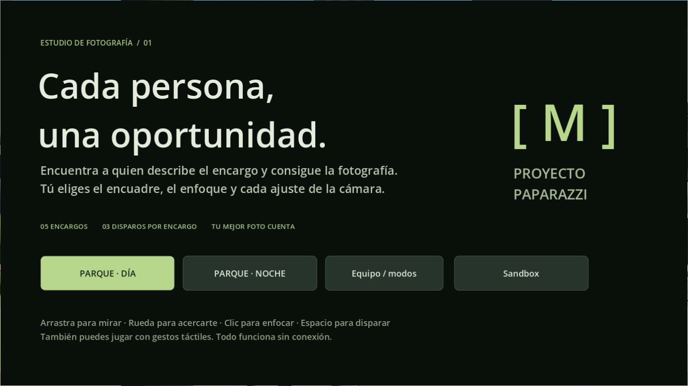 | Menú principal vectorial, tipografía de palo seco antialiased procedural y paleta de diseño editorial sobrio. |
| **02. Briefing del Objetivo** | 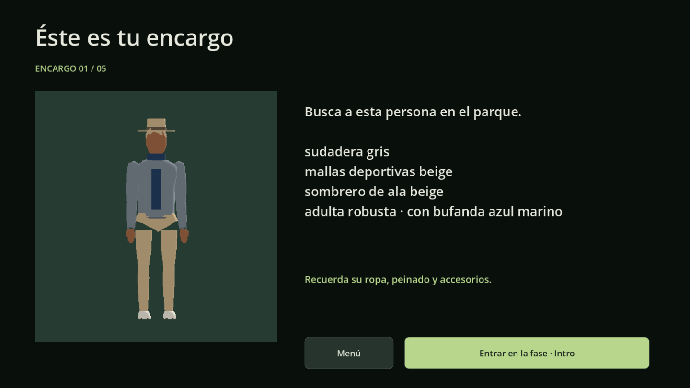 | Retrato 3D del objetivo con iluminación de estudio, descriptor morfológico y prendas de vestimenta asignadas. |
| **03. Visor Réflex** | 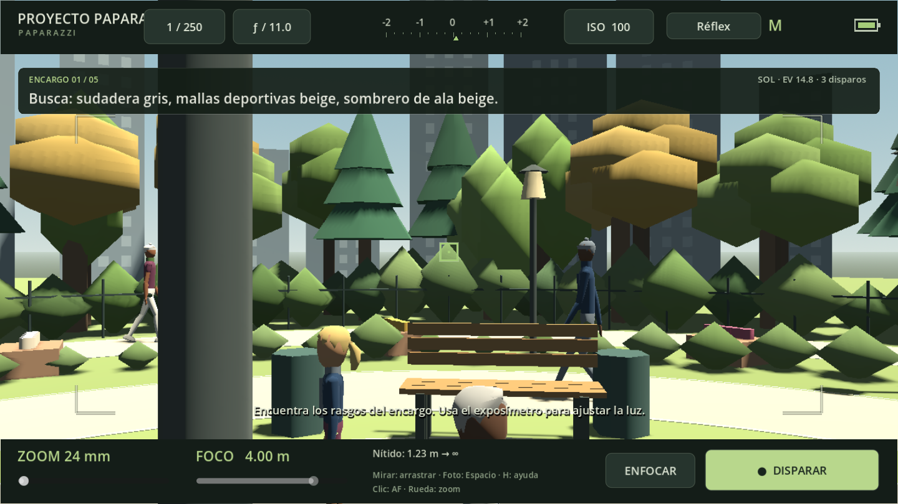 | Visor óptico clásico con cuadrícula áurea, 9 colimadores AF, prisma esmerilado y aguja del exposímetro analógico. |
| **04. Parque en Día Despejado** | 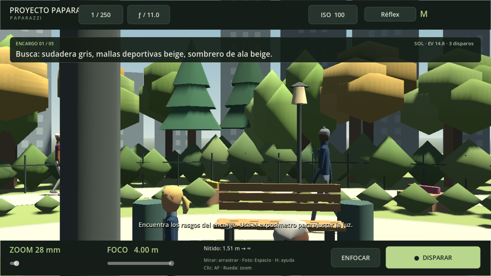 | Plaza central abierta a $28\text{ mm}$, 21 viandantes simultáneos y fondo vegetal denso sin caídas de frame. |
| **05. Atenuación Lumínica por Nubes** | 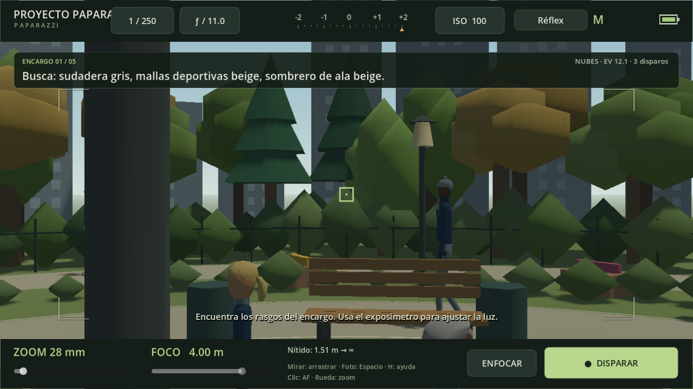 | Nube procedural ocultando el sol con atenuación de 3 EV, modificando el exposímetro y la exposición requerida. |
| **06. Parque en Modo Nocturno** | 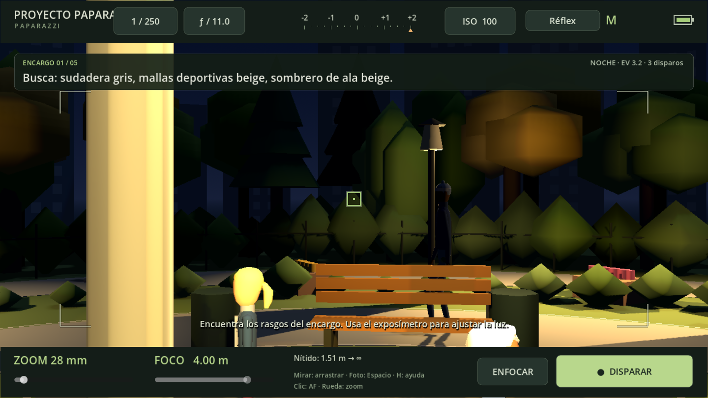 | Encendido crepuscular de farolas cálidas, iluminación omnidireccional y sombras proyectadas en tiempo real. |
| **07. Pantalla de Revelado** | 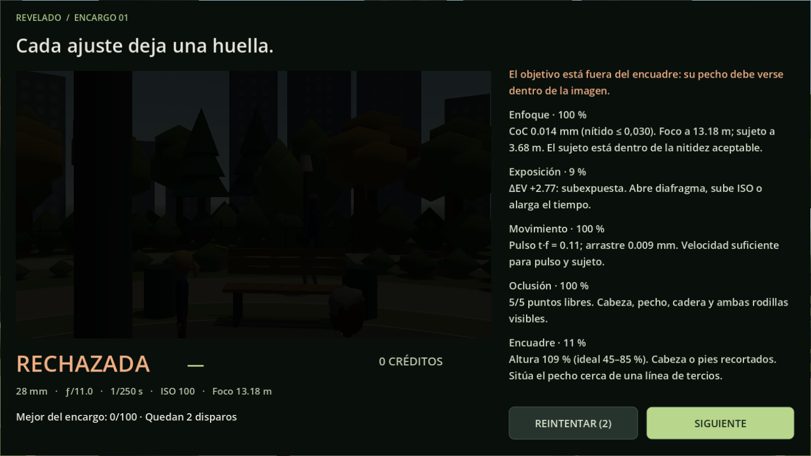 | Procesado de imagen fotográfica con grano químico analógico, bokeh por CoC, desenfoque cinético y desglose de puntos. |

---

## 2. Hojas de Contacto de Assets (Spritesheets)

Renderizado en estudio 3D virtual neutro con iluminación uniforme de tres puntos y focal de $85\text{ mm}$.

### 2.1 Mobiliario Urbano y Parque
Bancos con listones de madera, farolas de forja clásica con emisión cálida, papeleras, jardineras y fuentes de piedra.

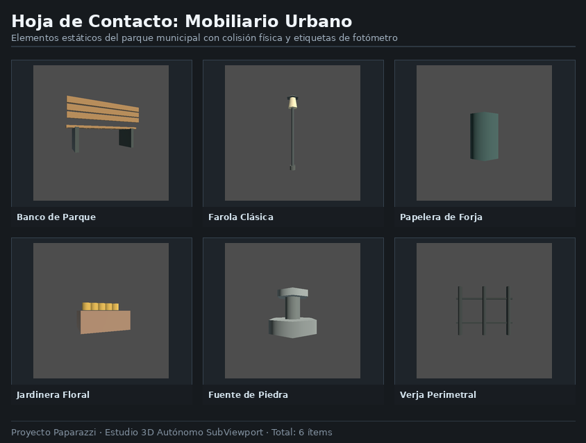

### 2.2 Flora y Cobertura Vegetal
Árboles procedurales adultos y jóvenes con copas esferoidales facetadas, seto perimetral denso, arbustos de sotobosque y matas florales.

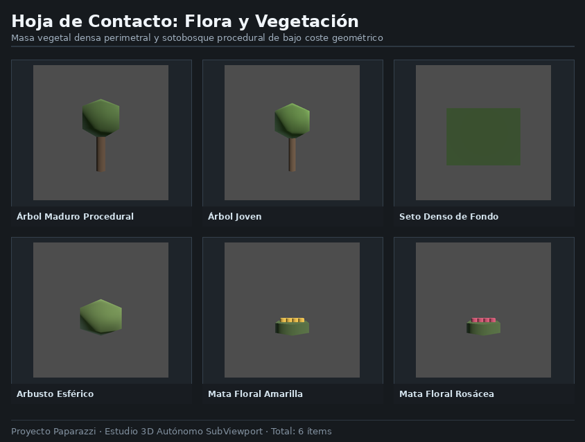

### 2.3 Catálogo de Prendas de Vestir
Colección completa de torsos (camisetas, polos, chaquetas formales, ropa técnica de running) y piernas (pantalones de vestir, vaqueros, faldas, bermudas y shorts de deporte).

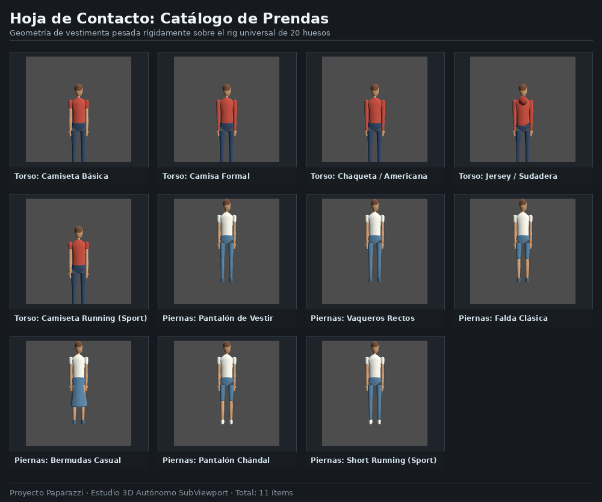

### 2.4 Accesorios y Peinados
Peinados morfológicos masculinos, femeninos e infantiles, sombreros, gorras visera, gorros de lana, mochilas de tirantes, bandoleras y bolsos cruzados.

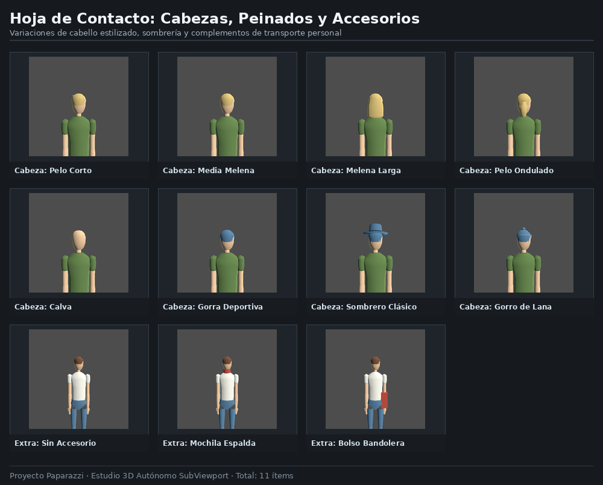

### 2.5 Equipamiento Fotográfico y Ópticas
Cuerpos de cámara (compacta digital, telemétrica analógica, réflex monocular), teleobjetivos profesionales de gran apertura, objetivos fijos luminosos y carretes de película de 35 mm.

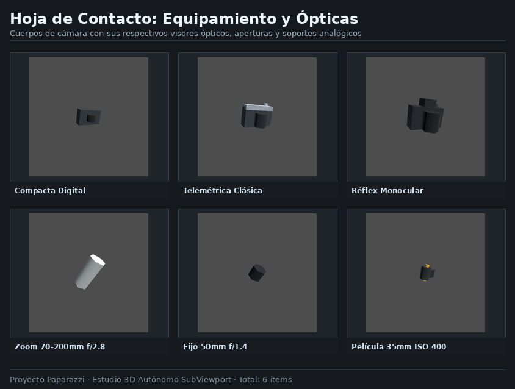

---

## 3. Muestrario de Personajes (Line-up 3D)

Comprobación de la coherencia anatómica de los **4 somatotipos base** (Estándar, Delgado, Robusto, Infantil), el rig universal de 20 huesos y las combinaciones de vestimenta formal, de paseo y deportiva exclusiva (`sport: true`).

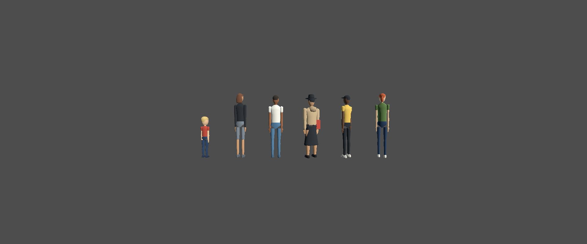

---

## 4. Cinemática, Locomoción y Variación de Luz

Demostración interactiva en bucles GIF animados cuantizados con paleta de color optimizada:

| Animación | Demostración GIF | Fundamento Cinemático Demostrado |
|---|---|---|
| **Caminata Pausada** ($0.75\text{ m/s}$) | 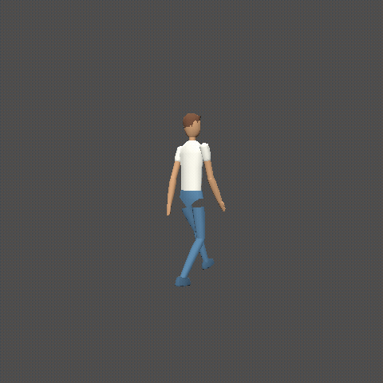 | **Deslizamiento nulo comprobado** (`drift == 0.000000 m/frame`), planta del pie horizontal ($y=0$) durante el apoyo y balanceo pélvico suave. |
| **Carrera Atlética** ($2.80\text{ m/s}$) | 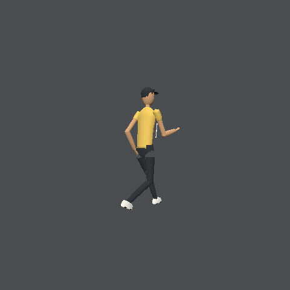 | **Fase aérea balística** (ambos pies en el aire simultáneamente), torso inclinado hacia delante y flexión angular de rodillas. |
| **Ciclo Sol / Nube / Noche** | 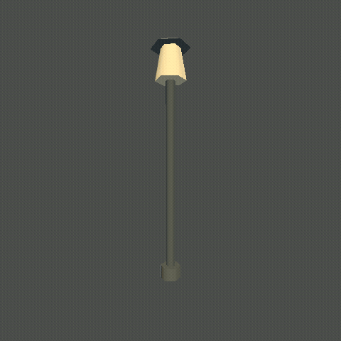 | Transición de iluminación cenital a sombra de nube (caída de 3 EV) y encendido nocturno de farolas con sombras dinámicas. |

---

*Galería compilada automáticamente por `tools/capture_evidence.gd` y `tools/build_sheets.py`.*
