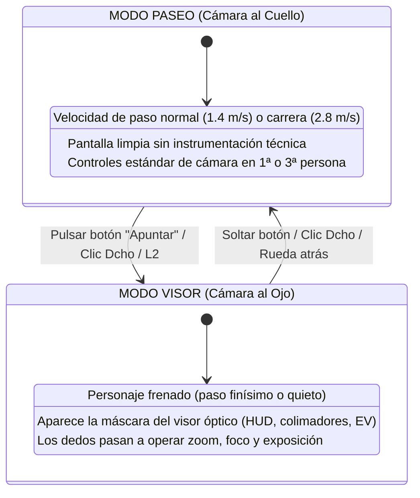

# Especificación Futura: Protagonista Controlable y Mapa Abierto

Este documento detalla el diseño conceptual, la arquitectura técnica y el esquema de controles para una futura iteración en la que el protagonista pueda desplazarse libremente por el entorno.

---

## 1. Justificación de Diseño y Dilema de Jugabilidad

### 1.1 El Reto Actual (Observador Estático)
En la versión actual, el jugador permanece en el centro exacto del parque $(0, 1.60\text{ m}, 0)$. El reto se basa en la **anticipación temporal y la elección de óptica**: predecir cuándo pasará el objetivo por una zona iluminada y qué objetivo ($28\text{ mm}$, $50\text{ mm}$, $105\text{ mm}$ o $135\text{ mm}$) permite encuadrarlo con la escala adecuada.

### 1.2 Oportunidades y Riesgos del Movimiento Libre
- **Oportunidades**:
  - Libertad para buscar líneas de fuga interesantes, contraluces espectaculares o encuadres a través de ramas y esculturas.
  - Mayor inmersión y sensación de presencia física en el mundo.
- **Riesgos de Diseño**:
  - **Devaluación de teleobjetivos**: Si el jugador puede correr hacia el objetivo, tenderá a ponerse a 2 metros con cualquier lente barata, arruinando el valor táctico de objetivos largos como el 105 mm o 135 mm.
  - **Pérdida de realismo social**: Acercarse a 50 cm de un desconocido apuntándole con una réflex sin que reaccione rompe la inmersión. Requeriría implementar estados de alerta peatonal ("incomodidad", "apartar la cara", "huir").

---

## 2. Solución de Control: Arquitectura de "Modo Dual"

Para evitar la sobrecarga cognitiva y la saturación de dedos (especialmente en pantallas táctiles), el sistema debe desacoplar el movimiento del personaje de la operación técnica de la cámara mediante una **máquina de estados de control dual**:

### Mapeo por Plataforma

| Acción | Pantalla Táctil (Móvil) | Teclado + Ratón (PC) | Gamepad (Consola/Mando) |
|---|---|---|---|
| **Mover personaje** | Joystick virtual izquierdo | Teclas `W`, `A`, `S`, `D` | Stick analógico izquierdo |
| **Girar cabeza (Mirar)** | Deslizar dedo derecho | Movimiento del ratón | Stick analógico derecho |
| **Transición a Modo Visor** | Botón flotante "Apuntar" | Clic derecho mantenido | Gatillo izquierdo ($L2$) |
| **Enfoque manual / Zoom** | Ruedas táctiles en bordes | Rueda del ratón / Teclas `Q`, `E` | Botones superiores ($L1$ / $R1$) |
| **Disparo del obturador** | Botón virtual de disparador | Clic izquierdo / Barra espaciadora | Gatillo derecho ($R2$) |
| **Ajuste de parámetros** | Rueda de apertura y velocidad | Teclas numéricas `1`, `2`, `3` | Cruceta digital ($D\text{-Pad}$) |

---

## 3. Niveles de Implementación Técnica

Se proponen tres alternativas según la profundidad del cambio deseado:

### Alternativa A: Puntos de Observación (*Waypoints / Bancos*) — [Recomendada para fase 1]
- El jugador no camina analógicamente con un joystick, sino que el parque dispone de **6 puestos de fotógrafo fijos** (por ejemplo, los 4 bancos exteriores, una plataforma elevada y una farola central).
- El jugador hace clic/tap en un icono de puesto y su punto de vista se traslada suavemente con una interpolación de cámara.
- **Ventaja**: Permite cambiar drásticamente de ángulo de luz y perspectiva sin rehacer la navegación cilíndrica de los viandantes.
- **Coste técnico**: Muy bajo (~1-2 días).

### Alternativa B: Desplazamiento por Raíl Cilíndrico — [Fase intermedia]
- El jugador puede caminar a izquierda y derecha a lo largo de un carril interior específico ($r = 1.0\text{ m}$).
- Conserva el modelo matemático cilíndrico actual $(r, \theta)$, pero permite desplazarse en $\theta$ para seguir a un viandante o ganar un mejor tiro de cámara.
- **Coste técnico**: Bajo-Medio (~3-4 días).

### Alternativa C: Mapa Abierto Completo con Grafo de Navegación — [Fase mayor]
- **Transformación del Escenario**: El parque se expande con avenidas arboladas, cruces en Y y plazoletas secundarias.
- **Grafo de Peatones**: Los viandantes sustituyen la ecuación angular $\Delta\theta = (v/r)\Delta t$ por un grafo de waypoints interconectados con bifurcaciones probabilísticas y evasión local vectorial (algoritmo RVO2 / ORCA).
- **Físicas del Jugador**: Instanciación de un `CharacterBody3D` con cápsula de colisión contra el terreno y los personajes.
- **Coste técnico**: Alto (~2-3 semanas de desarrollo y ajuste de IA).
