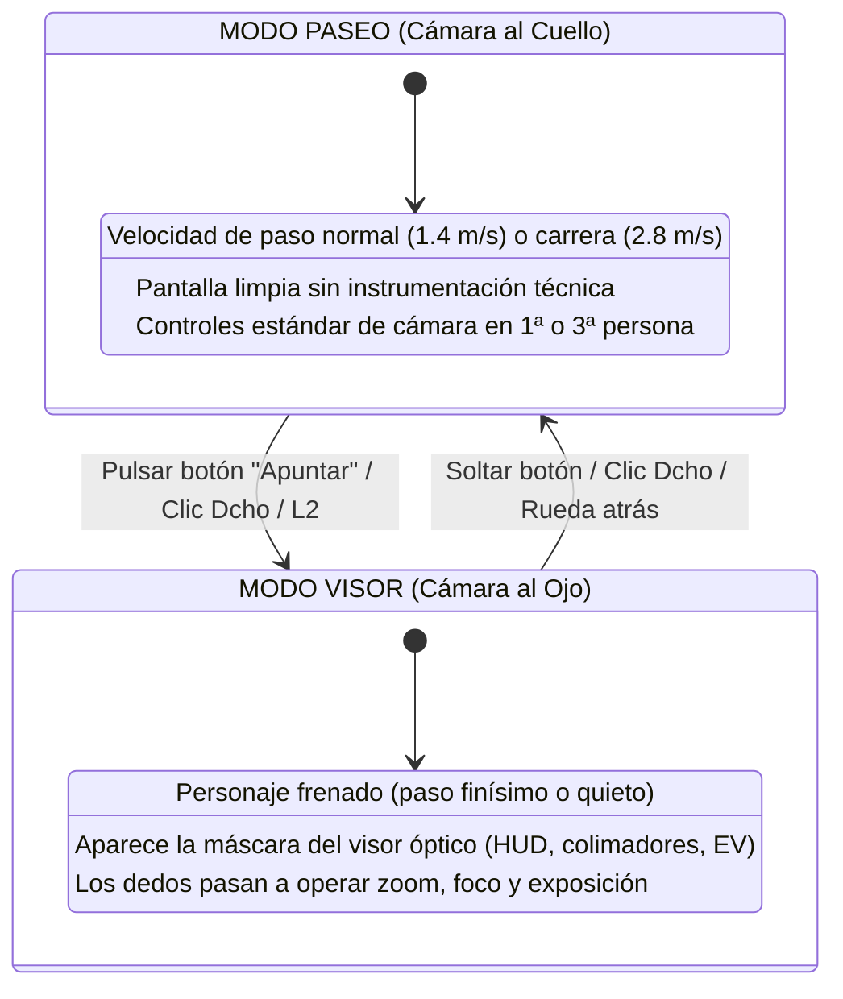

# Especificación Futura: Protagonista Controlable y Mapa Abierto

Este documento detalla el diseño conceptual, la arquitectura técnica y el esquema de controles para una futura iteración en la que el protagonista pueda desplazarse libremente por el entorno.

---

## 1. Justificación de Diseño y Dilema de Jugabilidad

### 1.1 El Reto Actual (Observador Estático)
En la versión actual, el jugador permanece en el centro exacto del parque $(0, 1.60\text{ m}, 0)$. El reto se basa en la **anticipación temporal y la elección de óptica**: predecir cuándo pasará el objetivo por una zona iluminada y qué objetivo del catálogo (de $24\text{ mm}$ a $200\text{ mm}$: zooms 24–120, 24–105 y 70–200, fijos de 35, 50 y 90 mm; ver `scripts/equipment.gd::LENSES`) permite encuadrarlo con la escala adecuada.

### 1.2 Oportunidades y Riesgos del Movimiento Libre
- **Oportunidades**:
  - Libertad para buscar líneas de fuga interesantes, contraluces espectaculares o encuadres a través de ramas y esculturas.
  - Mayor inmersión y sensación de presencia física en el mundo.
- **Riesgos de Diseño**:
  - **Devaluación de teleobjetivos**: Si el jugador puede correr hacia el objetivo, tenderá a ponerse a 2 metros con cualquier lente barata, arruinando el valor táctico de objetivos largos como el fijo de 90 mm o el zoom 70–200 mm.
  - **Pérdida de realismo social**: Acercarse a 50 cm de un desconocido apuntándole con una réflex sin que reaccione rompe la inmersión. Requeriría implementar estados de alerta peatonal ("incomodidad", "apartar la cara", "huir").

---

## 2. Solución de Control: Arquitectura de "Modo Dual"

Para evitar la sobrecarga cognitiva y la saturación de dedos (especialmente en pantallas táctiles), el sistema debe desacoplar el movimiento del personaje de la operación técnica de la cámara mediante una **máquina de estados de control dual**:

```mermaid
stateDiagram-v2
    state "MODO PASEO (Cámara al Cuello)" as ModoPaseo {
        [*] --> LocomocionLibre
        LocomocionLibre: Velocidad de paso normal (1.4 m/s) o carrera (2.8 m/s)
        LocomocionLibre: Pantalla limpia sin instrumentación técnica
        LocomocionLibre: Controles estándar de cámara en 1ª o 3ª persona
    }

    state "MODO VISOR (Cámara al Ojo)" as ModoVisor {
        [*] --> OperacionFotografica
        OperacionFotografica: Personaje frenado (paso finísimo o quieto)
        OperacionFotografica: Aparece la máscara del visor óptico (HUD, colimadores, EV)
        OperacionFotografica: Los dedos pasan a operar zoom, foco y exposición
    }

    ModoPaseo --> ModoVisor: Pulsar botón "Apuntar" / Clic Dcho / L2
    ModoVisor --> ModoPaseo: Soltar botón / Clic Dcho / Rueda atrás
```

### Mapeo por Plataforma

| Acción | Pantalla Táctil (Móvil) | Teclado + Ratón (PC) | Gamepad (Consola/Mando) |
|---|---|---|---|
| **Mover personaje** | Joystick virtual izquierdo | Teclas `W`, `A`, `S`, `D` | Stick izquierdo (solo en Modo Paseo) |
| **Girar cabeza (Mirar)** | Deslizar dedo sobre el visor | Movimiento del ratón | Stick derecho en Modo Paseo; stick izquierdo en Modo Visor (acción `mirar_*`) |
| **Transición a Modo Visor** | Botón flotante "Apuntar" | Clic derecho mantenido | Y / △ (conmutar) |
| **Enfoque manual / Zoom** | Rueda de foco y zonas de [13 §3](13_INTERFAZ_MOVIL_UTILIZABLE.md); pellizco para zoom | Rueda del ratón / Teclas `R`, `T` y `W`, `S` | Stick derecho: ←/→ foco, ↑/↓ zoom |
| **Disparo del obturador** | Disparador táctil de dos fases ([13 §4.1](13_INTERFAZ_MOVIL_UTILIZABLE.md)) | Barra espaciadora | Gatillo derecho de dos fases ([14 §3](14_SOPORTE_GAMEPAD.md)) |
| **Ajuste de parámetros** | Arrastre con tope sobre cada parámetro | Teclas `Q`/`E`, `Z`/`X`, `C`/`V` | Cruceta: ←/→ elige parámetro, ↑/↓ lo cambia |

> [!NOTE]
> Todas estas entradas se declaran como acciones de `InputMap` en el mapa único de [14 §2](14_SOPORTE_GAMEPAD.md). Las acciones nuevas de este documento (`mover_*`, `modo_visor`) se añaden allí, no como teclas sueltas.

---

## 3. Niveles de Implementación Técnica

Se proponen tres alternativas según la profundidad del cambio deseado:

### Alternativa A: Puntos de Observación (*Waypoints / Bancos*) — [Recomendada para fase 1]
- El jugador no camina analógicamente con un joystick, sino que el parque dispone de **6 puestos de fotógrafo fijos** (por ejemplo, los 4 bancos exteriores, una plataforma elevada y una farola central).
- El jugador hace clic/tap en un icono de puesto y su punto de vista se traslada suavemente con una interpolación de cámara.
- **Ventaja**: Permite cambiar drásticamente de ángulo de luz y perspectiva sin rehacer la navegación cilíndrica de los viandantes.
- **Coste técnico**: Muy bajo (~1-2 días).

### Alternativa B: Desplazamiento por Raíl Cilíndrico — [Fase intermedia]
- El jugador puede caminar a izquierda y derecha a lo largo de un carril interior específico ($r = 1.0\text{ m}$).
- Conserva el modelo matemático cilíndrico actual $(r, \theta)$, pero permite desplazarse en $\theta$ para seguir a un viandante o ganar un mejor tiro de cámara.
- **Coste técnico**: Bajo-Medio (~3-4 días).

### Alternativa C: Mapa Abierto Completo con Grafo de Navegación — [Fase mayor]
- **Transformación del Escenario**: El parque se expande con avenidas arboladas, cruces en Y y plazoletas secundarias.
- **Grafo de Peatones**: Los viandantes sustituyen la ecuación angular $\Delta\theta = (v/r)\Delta t$ por un grafo de waypoints interconectados con bifurcaciones probabilísticas y evasión local vectorial (algoritmo RVO2 / ORCA).
- **Físicas del Jugador**: Instanciación de un `CharacterBody3D` con cápsula de colisión contra el terreno y los personajes.
- **Coste técnico**: Alto (~2-3 semanas de desarrollo y ajuste de IA).

---

## 4. Recomendación y Criterios de Aceptación

- **Implementar solo la Alternativa A**, y después de la interfaz móvil ([13](13_INTERFAZ_MOVIL_UTILIZABLE.md)) y el mando ([14](14_SOPORTE_GAMEPAD.md)), que fijan cómo se controla la cámara.
- **B y C rompen supuestos centrales**: los carriles son círculos centrados en el jugador (AGENTS.md §3.3), lo que hace que la distancia a cada carril sea casi constante. Esa propiedad sostiene el enfoque por zonas de [13 §3.2](13_INTERFAZ_MOVIL_UTILIZABLE.md) y resta valor al AF-C ([12 §4.2](12_MODOS_FOTOMETRIA_Y_AUTOFOCUS.md)). Moverse libremente, además, devalúa los teleobjetivos, como se indica en §1.2.
- **La Alternativa C es la misma navegación por grafo que necesitan los escenarios de [04](04_DIVERSIDAD_ESCENARIOS.md)**; si se aborda, hay que hacerlo una sola vez para ambos.
- **Criterios de aceptación de A**:
  1. La cámara solo ocupa los 6 puestos definidos y la transición entre ellos dura ≤ 1 s, sin atravesar colisionadores.
  2. La evidencia usa la posición real de la cámara (`d` en `capture_evidence()`), y la puntuación es determinista con el puesto incluido en la entrada.
  3. Aforos y carriles intactos: `test_navigation.gd` y `simulate_jams.gd` pasan sin cambios.
  4. `test_game.gd` añade un cambio de puesto y comprueba `camera.global_position` y el encuadre del encargo siguiente.
