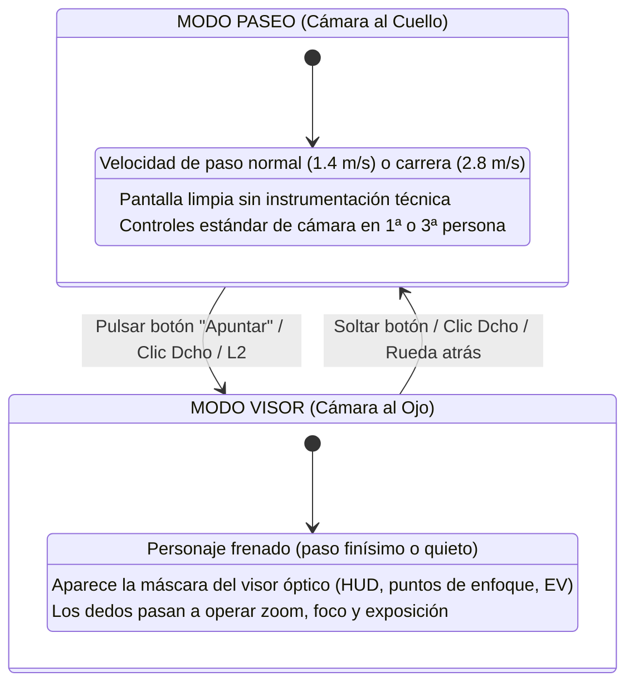

# Especificación: Protagonista Controlable y Mapa Abierto

> [!NOTE]
> **Estado (01-10-2026): 🟡 Alternativa C implementada como escenario adicional («parque grande»)**, por decisión del usuario, sin pasar por A ni B. El parque clásico sigue igual y es el de la Academia. Ver §6.

Este documento detalla el diseño conceptual, la arquitectura técnica y el esquema de controles para una futura iteración en la que el protagonista pueda desplazarse libremente por el entorno.

---

## 1. Justificación de Diseño y Dilema de Jugabilidad

### 1.1 El Reto Actual (Observador Estático)
En la versión actual, el jugador permanece en el centro exacto del parque $(0, 1.60\text{ m}, 0)$. El reto se basa en la **anticipación temporal y la elección de óptica**: predecir cuándo pasará el objetivo por una zona iluminada y qué objetivo del catálogo (de $24\text{ mm}$ a $200\text{ mm}$: zooms 24–120, 24–105 y 70–200, fijos de 35, 50 y 90 mm; ver `scripts/equipment.gd::LENSES`) permite encuadrarlo con la escala adecuada.

### 1.2 Oportunidades y Riesgos del Movimiento Libre
- **Oportunidades**:
  - Libertad para buscar líneas de fuga interesantes, contraluces espectaculares o encuadres a través de ramas y esculturas.
  - Mayor inmersión y sensación de presencia física en el mundo.
- **Riesgos de Diseño**:
  - **Devaluación de teleobjetivos**: Si el jugador puede correr hacia el objetivo, tenderá a ponerse a 2 metros con cualquier lente barata, arruinando el valor táctico de objetivos largos como el fijo de 90 mm o el zoom 70–200 mm.
  - **Pérdida de realismo social**: Acercarse a 50 cm de un desconocido apuntándole con una réflex sin que reaccione rompe la inmersión. Requeriría implementar estados de alerta peatonal ("incomodidad", "apartar la cara", "huir").

---

## 2. Solución de Control: Arquitectura de "Modo Dual"

Para evitar la sobrecarga cognitiva y la saturación de dedos (especialmente en pantallas táctiles), el sistema debe desacoplar el movimiento del personaje de la operación técnica de la cámara mediante una **máquina de estados de control dual**:

```mermaid
stateDiagram-v2
    state "MODO PASEO (Cámara al Cuello)" as ModoPaseo {
        [*] --> LocomocionLibre
        LocomocionLibre: Velocidad de paso normal (1.4 m/s) o carrera (2.8 m/s)
        LocomocionLibre: Pantalla limpia sin instrumentación técnica
        LocomocionLibre: Controles estándar de cámara en 1ª o 3ª persona
    }

    state "MODO VISOR (Cámara al Ojo)" as ModoVisor {
        [*] --> OperacionFotografica
        OperacionFotografica: Personaje frenado (paso finísimo o quieto)
        OperacionFotografica: Aparece la máscara del visor óptico (HUD, puntos de enfoque, EV)
        OperacionFotografica: Los dedos pasan a operar zoom, foco y exposición
    }

    ModoPaseo --> ModoVisor: Pulsar botón "Apuntar" / Clic Dcho / L2
    ModoVisor --> ModoPaseo: Soltar botón / Clic Dcho / Rueda atrás
```

### Mapeo por Plataforma

| Acción | Pantalla Táctil (Móvil) | Teclado + Ratón (PC) | Gamepad (Consola/Mando) |
|---|---|---|---|
| **Mover personaje** | Joystick virtual izquierdo | Teclas `W`, `A`, `S`, `D` | Stick izquierdo (solo en Modo Paseo) |
| **Girar cabeza (Mirar)** | Deslizar dedo sobre el visor | Movimiento del ratón | Stick derecho en Modo Paseo; stick izquierdo en Modo Visor (acción `mirar_*`) |
| **Transición a Modo Visor** | Botón flotante "Apuntar" | Clic derecho mantenido | Y / △ (conmutar) |
| **Enfoque manual / Zoom** | Rueda de foco y zonas de [13 §3](13_INTERFAZ_MOVIL_UTILIZABLE.md); pellizco para zoom | Rueda del ratón / Teclas `R`, `T` y `W`, `S` | Stick derecho: ←/→ foco, ↑/↓ zoom |
| **Disparo del obturador** | Disparador táctil de dos fases ([13 §4.1](13_INTERFAZ_MOVIL_UTILIZABLE.md)) | Barra espaciadora | Gatillo derecho de dos fases ([14 §3](14_SOPORTE_GAMEPAD.md)) |
| **Ajuste de parámetros** | Arrastre con tope sobre cada parámetro | Teclas `Q`/`E`, `Z`/`X`, `C`/`V` | Cruceta: ←/→ elige parámetro, ↑/↓ lo cambia |

> [!NOTE]
> Todas estas entradas se declaran como acciones de `InputMap` en el mapa único de [14 §2](14_SOPORTE_GAMEPAD.md). Las acciones nuevas de este documento (`mover_*`, `modo_visor`) se añaden allí, no como teclas sueltas.

---

## 3. Niveles de Implementación Técnica

Se proponen tres alternativas según la profundidad del cambio deseado:

### Alternativa A: Puntos de Observación (*Waypoints / Bancos*) — [Recomendada para fase 1]
- El jugador no camina analógicamente con un joystick, sino que el parque dispone de **6 puestos de fotógrafo fijos** (por ejemplo, los 4 bancos exteriores, una plataforma elevada y una farola central).
- El jugador hace clic/tap en un icono de puesto y su punto de vista se traslada suavemente con una interpolación de cámara.
- **Ventaja**: Permite cambiar drásticamente de ángulo de luz y perspectiva sin rehacer la navegación cilíndrica de los viandantes.
- **Coste técnico**: Muy bajo (~1-2 días).

### Alternativa B: Desplazamiento por Raíl Cilíndrico — [Fase intermedia]
- El jugador puede caminar a izquierda y derecha a lo largo de un carril interior específico ($r = 1.0\text{ m}$).
- Conserva el modelo matemático cilíndrico actual $(r, \theta)$, pero permite desplazarse en $\theta$ para seguir a un viandante o ganar un mejor tiro de cámara.
- **Coste técnico**: Bajo-Medio (~3-4 días).

### Alternativa C: Mapa Abierto Completo con Grafo de Navegación — [Fase mayor]
- **Transformación del Escenario**: El parque se expande con avenidas arboladas, cruces en Y y plazoletas secundarias.
- **Grafo de Peatones**: Los viandantes sustituyen la ecuación angular $\Delta\theta = (v/r)\Delta t$ por un grafo de waypoints interconectados con bifurcaciones probabilísticas y evasión local vectorial (algoritmo RVO2 / ORCA).
- **Físicas del Jugador**: Instanciación de un `CharacterBody3D` con cápsula de colisión contra el terreno y los personajes.
- **Coste técnico**: Alto (~2-3 semanas de desarrollo y ajuste de IA).

---

## 4. Recomendación y Criterios de Aceptación

- **Implementar solo la Alternativa A**, y después de la interfaz móvil ([13](13_INTERFAZ_MOVIL_UTILIZABLE.md)) y el mando ([14](14_SOPORTE_GAMEPAD.md)), que fijan cómo se controla la cámara.
- **B y C rompen supuestos centrales**: los carriles son círculos centrados en el jugador (AGENTS.md §3.3), lo que hace que la distancia a cada carril sea casi constante. Esa propiedad sostiene el enfoque por zonas de [13 §3.2](13_INTERFAZ_MOVIL_UTILIZABLE.md) y resta valor al AF-C ([12 §4.2](12_MODOS_FOTOMETRIA_Y_AUTOFOCUS.md)). Moverse libremente, además, devalúa los teleobjetivos, como se indica en §1.2.
- **La Alternativa C es la misma navegación por grafo que necesitan los escenarios de [04](04_DIVERSIDAD_ESCENARIOS.md)**; si se aborda, hay que hacerlo una sola vez para ambos.
- **Criterios de aceptación de A**:
  1. La cámara solo ocupa los 6 puestos definidos y la transición entre ellos dura ≤ 1 s, sin atravesar colisionadores.
  2. La evidencia usa la posición real de la cámara (`d` en `capture_evidence()`), y la puntuación es determinista con el puesto incluido en la entrada.
  3. Aforos y carriles intactos: `test_navigation.gd` y `simulate_jams.gd` pasan sin cambios.
  4. `test_game.gd` añade un cambio de puesto y comprueba `camera.global_position` y el encuadre del encargo siguiente.

---

## 6. Implementación: el parque grande (01-10-2026)

Decisiones del usuario: movimiento libre con WASD como en cualquier juego en primera persona; **sacar la cámara es un interruptor** (no hay que mantener pulsado) y solo entonces aparece la interfaz de cámara, hasta que se baja; escenario nuevo y adicional, un parque ampliado con una red de caminos; el clásico se mantiene para el tutor; se elige en la pantalla de inicio.

### 6.1 Piezas

| Pieza | Qué hace |
|---|---|
| `scripts/park_grande.gd` | Hereda de `park.gd` (entorno, luz, clima, modelos de Blender, texturas de suelo, fusión de mallas) y cambia la disposición: parque de 120 × 90 m con verja, plaza central con fuente (r = 10 m), avenida de plátanos norte–sur, caminos este–oeste, cuatro diagonales, paseo de ronda, quiosco en su plazoleta, zona de juegos (columpio, tobogán, arenero), 17 bancos con papelera junto a los caminos y unas 40 farolas. Define el **grafo de caminos** (`nodes`, `edges`, `neighbours`) y `path_distance()`. Sectores de fusión en una rejilla de 20 m; de noche solo proyectan sombra las farolas más cercanas al fotógrafo (6 en Ultra, 3 en Alto). |
| `scripts/crowd_graph.gd` | 45 viandantes por el grafo con la **misma marcha suave** del parque clásico (aceleraciones limitadas, lado de paso fijado, giro acotado), en el marco de la arista: avance a lo largo y desplazamiento lateral, por la derecha. En cada nodo eligen la siguiente arista al azar (sin volver atrás salvo en un callejón). Al entrar en una arista pueden pararse con una actividad, charlar con quien viene de frente, ir a sentarse a un banco cercano o sacar el móvil. Esquivan al fotógrafo y **reaccionan a una cámara levantada a menos de 2,5 m**: le miran, se tapan la cara (`taparse`) o aceleran. |
| `scripts/player_proxy.gd` | El fotógrafo tal como lo ven los viandantes y `travel_clear()`. |
| `scripts/main.gd` | `scenario` («clasico»/«grande»), `start_in()`/`reload_with()` (cambiar de escenario recarga la escena conservando el equipo), `populate_grande()`, `update_photographer()` (paseo con colisiones contra la capa 2, sin atravesar a nadie), `photographer_input()`, `toggle_raise()`/`eye_ready()` (gesto de 0,35 s), cámara colgada que solo se ve durante el gesto, campo de visión natural de 72° al pasear. |

### 6.2 Controles

| Acción | Teclado y ratón | Mando |
|---|---|---|
| Andar / correr / agacharse | WASD o flechas / Mayús / Ctrl (ojos a 1,05 m) | Stick izquierdo |
| Mirar | Ratón (capturado mientras se pasea) | Stick derecho |
| Sacar o guardar la cámara (interruptor) | Clic derecho | Y (`camara_al_ojo`) |
| Con la cámara en el ojo | Los controles de siempre (Tab muestra las barras) | Los de siempre |

Con la cámara en el ojo el fotógrafo se queda quieto; con ella bajada no se puede disparar.

### 6.3 Encargos y presupuestos

Los mismos encargos (5, con 3 disparos), sin límite de tiempo: el objetivo pasea por todo el parque y encontrarlo forma parte del reto. La evidencia ya usaba la posición real de la cámara, así que la puntuación no cambia de fórmula. Solo escritorio (Forward+). Medido: 3.503.056 triángulos (límite 5.000.000) y unos 4,2 ms de GPU a 1440p en Ultra.

### 6.4 Pendiente

- Escenas preparadas del vídeo y de la Academia en el parque grande (la Academia sigue en el clásico, por decisión del usuario).
- Más vida propia del parque grande: niños en los columpios, figurantes fuera de la verja.
- Reacción social con efecto en la nota, interfaz táctil y Android.

### 6.5 Pruebas

`tests/test_big_park.gd` (con display): el grafo es conexo y cada arista está pavimentada; 60 s de multitud sin atascos (> 5,5 s), sin salirse de los caminos ni solaparse y repartida por toda la red; alguien se sienta y alguien se para; se empieza paseando y sin interfaz; sin fotos con la cámara bajada; W avanza y la verja frena; el interruptor tarda el gesto y devuelve la interfaz; con la cámara en el ojo no hay paseo y se puede disparar; al bajarla se vuelve a pasear; una cámara a 1,8 m provoca una reacción.

### Suelos que parpadeaban junto al quiosco (06-10-2026)

El usuario vio el suelo del quiosco y el camino parpadear uno sobre otro. Todos los caminos estaban a 6 mm sobre el césped y todas las plazas a 8 mm: donde se solapan (la diagonal de asfalto bajo la plaza de losas del quiosco, el anillo de grava sobre el final de las avenidas, el ramal de losas al entrar en su plaza) las dos superficies se disputaban la misma profundidad. Ahora cada tipo de pavimento tiene su nivel (`park_grande.gd::paving_height()`: asfalto y adoquín 6 mm, grava 14 mm, losas 22 mm, y las plazas 4 mm por encima de los caminos de su tipo), de modo que lo que se solapa queda separado al menos 4 mm y casi siempre 8 o más; lo más alto está a 2,6 cm, sin que los pies se hundan. `tests/test_big_park.gd` lo comprueba. El parque clásico no tenía el problema: sus anillos no se solapan.

Por decisión del usuario, **en el quiosco manda el suelo del parque**: su plaza redonda queda por debajo de todos los caminos que llegan o la cruzan (`PAVING_UNDER`, 6 mm), y el resto de niveles sube 6 mm (asfalto y adoquín 12 mm, grava 20, losas 28; plazas 4 mm más, 3,2 cm como máximo).

Con una captura del usuario se vio que lo que montaba sobre el camino era **el final del ramal de losas** que va al quiosco, atravesado sobre el asfalto. Los dos ramales (quiosco y juegos) y la plaza del quiosco quedan ahora por debajo de los caminos del parque (`add_edge(..., under = true)`, `PAVING_UNDER`); el resto de niveles: asfalto y adoquín 14 mm, grava 22, losas 30, plazas 4 mm más.

### Sombras que iban y venían a la hora dorada (06-10-2026)

Junto al quiosco, mirando hacia el sol y subiendo o bajando la vista, el césped pasaba de estar al sol a quedar entero en sombra. Las sombras del sol solo se dibujan hasta una distancia de la cámara (48 m en Ultra), y con el sol a 15° ese límite, que depende de hacia dónde se mira, caía en mitad del parque: a un lado el suelo salía sombreado y al otro iluminado. A la hora dorada el parque grande multiplica por 2,6 el alcance de las sombras (`park_grande.gd::shadow_reach_factor()`), de modo que el límite queda fuera del recinto y el suelo se ve igual se mire como se mire. El parque clásico, más pequeño que ese alcance, no cambia. Se comprueba con dos capturas desde el mismo punto: `-- --scenario=grande --sandbox --time=golden --profile=Ultra --at=-22,-27,228 --pitch=12` y `--pitch=-24`.

Tras el arreglo quedaba un parpadeo de la luz al mover la vista. Medido punto a punto (brillo de puntos fijos del suelo con la cámara quieta y girando), venía de la **penumbra física** de las sombras (`light_angular_distance`): repartida sobre sombras de cien metros, daba un valor distinto en cada tramo del mapa de sombras, y el césped a media luz variaba un 20 % al cambiar de tramo. A la hora dorada, en el parque grande, las sombras son ahora planas y algo más difusas y dejan pasar parte del sol (`park.gd::long_shadows()`, `LONG_SHADOW_OPACITY = 0,55`, `shadow_blur = 2`): la misma luz en el suelo, y quieta (con la vista en movimiento el brillo de esos puntos varía lo mismo que con la cámara parada).

