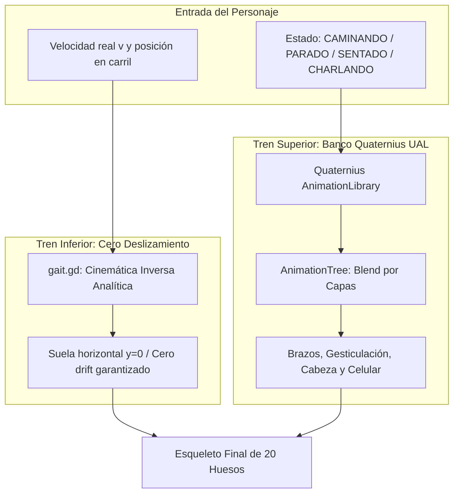
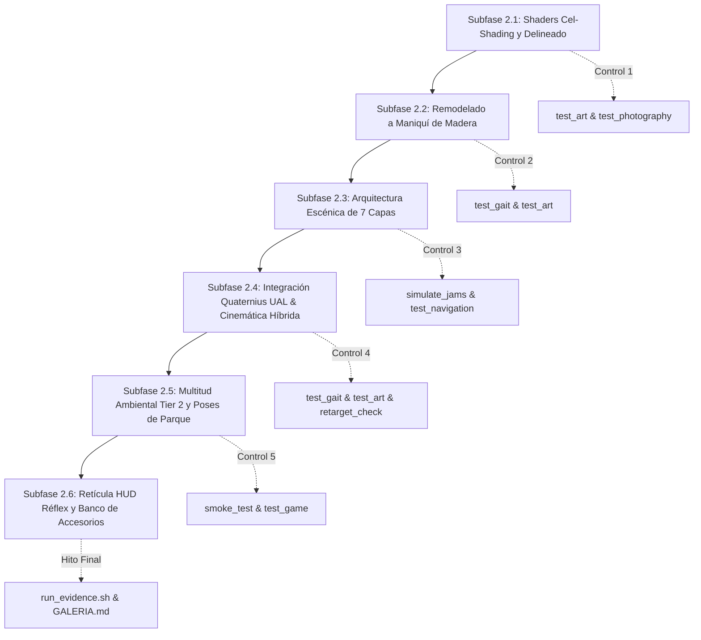

# Especificación Futura: Estilo Visual Canónico (Maniquíes + Cell Shading), Biblioteca Universal de Animaciones (Quaternius), Profundidad Multi-Plano (7+ Capas) y Fondo Escénico

Este documento establece la **dirección artística y técnica canónica** para la evolución gráfica de **Proyecto Paparazzi**, tomando como guía maestra la imagen conceptual de referencia [referencia.jpg](referencia.jpg), expandiendo la composición del parque a una arquitectura de **profundidad multi-plano de 7+ capas** e integrando un **banco universal de animaciones 3D de código abierto (CC0)** para dotar de vida orgánica, variedad de locomoción y actitudes urbanas a los personajes.

---

## 1. Imagen Conceptual de Referencia

La siguiente imagen representa el objetivo visual definitivo (*target render*) para la estética del juego, la composición de planos, la vida del escenario y la interfaz del visor:


### 1.1 Desglose del Lenguaje Visual de la Referencia
1. **Personajes de Maniquí Artístico**:
   - Cuerpos de maniquí de dibujo anatómico en madera clara pulida, con **rótulas esféricas visibles** en cuello, hombros, codos, muñecas, caderas y rodillas.
   - Cabezas ovoides lisas y estilizadas sin rasgos faciales individuales, garantizando neutralidad absoluta y reforzando la ética de casting.
   - Ropa estilizada de formas limpias superpuesta sobre el maniquí de madera (camisetas, faldas, pantalones vaqueros, chaquetas abiertas, ropa de running deportiva ajustada).
2. **Sombreado Toon / Cell Shading**:
   - Sombreado en bandas de luz nítidas (2-3 tonos por superficie, sin degradados continuos fotorrealistas).
   - **Líneas de contorno limpias (*ink outlines*)** en color gris carbón/negro que perfilan con elegancia tanto a los personajes como a los elementos arquitectónicos y vegetales.
3. **Composición Escénica Multi-Plano**:
   - Escalado rico de planos espaciales: desde elementos de enmarcado inmediato y bancos delanteros con familias sentadas, pasando por la calzada peatonal de viandantes, praderas interiores con estanque y quiosco, hasta la verja clásica con estudiantes de fondo y el horizonte urbano con bruma.
4. **Visor Réflex de Gama Alta**:
   - Retícula de 15 colimadores de enfoque en disposición de diamante/cruz central.
   - Marcas esquineras de encuadre en el marco visual.
   - Doble franja informativa con displays LCD retroiluminados en verde de 7 segmentos: velocidad (`1/250`), diafragma (`F4.0`), compensación de exposición (`-2..1..0..1..2+`), `ISO 400`, modo de disparo (`ONE SHOT`), nivel de batería y modo manual (`[M]`).
5. **Dinamismo y Expresividad Corporal**:
   - Locomoción rica y diferenciada (andares elegantes, apresurados, cansados, trote deportivo).
   - Actitudes vivas y creíbles: personas sentadas en bancos charlando, consultando el móvil, leyendo la prensa, tomando fotos como turistas o descansando.

---

## 2. Diagnóstico Técnico: ¿A qué distancia estamos del estado objetivo?

A continuación se evalúa la distancia entre el estado actual del código/motor y la visión marcada por la referencia:

| Dimensión Técnica | Estado Actual en el Repositorio | Objetivo según `referencia.jpg` | Distancia / Brecha Técnica | Esfuerzo Estimado |
|---|---|---|:---:|:---:|
| **Modelado de Personajes** | 4 anatomías (`AFOTANDO`) hechas con prismas y cilindros duros ensamblados rígidamente (`tools/build_catalog.py`). | Maniquíes de madera articulados con rótulas esféricas visibles, torso torneado y prendas de ropa modeladas sobre el maniquí. | **Media-Alta** | Sustituir las mallas base en `data/piezas/` por geometrías de maniquí de madera con esferas de articulación. |
| **Sombreado y Render** | `StandardMaterial3D` con iluminación difusa continua Lambert/PBR rugoso (`gl_compatibility`). Sin bordes. | **Cell Shading / Toon Shading** con cuantización de luz en 2 bandas y delineado exterior (*ink outline*). | **Media** | Crear un shader de material con función `light()` toon y pase de contorno `next_pass` (*inverted hull*). Compatible con WebGL/GLES3. |
| **Animación y Actitudes** | Solo locomoción cíclica procedural analítica básica (`gait.gd`), sin pausas, sin variedad de marcha, bancos vacíos. | **Locomoción orgánica multicapa** (varios estilos de marcha/carrera) y **banco rico de actitudes urbanas** (bancos habitados, charlas, móvil, fotos) con **Quaternius UAL 1 & 2**. | **Media** | Retargetear el banco libre CC0 de Quaternius al rig universal de 20 huesos y combinarlo en capas con `gait.gd` (cero deslizamiento). |
| **Planos de Profundidad** | 4 carriles concéntricos básicos ($r \in [1.8, 11.5]\text{ m}$) sin capas intermedias ni primer plano de enmarcado. | **7+ capas continuas de profundidad**: de enmarcado frontal a skyline atmosférico lejano. | **Media** | Reorganizar las cotas radiales en `park.gd` y segmentar los carriles en capas de atrezo, acción y fondo. |
| **Población y Multitudes** | 21 viandantes exactos (`counts = [3, 7, 6, 5]`). **Todos son 100% jugables** y reciben raycasts fotográficos en cada disparo. | Población dividida en **dos capas**: (1) Peatones jugables (objetivos) y (2) **Multitud de fondo / ambientación** no jugable (estudiantes, personas sentadas). | **Media** | Desacoplar la lista de personajes en `main.gd`: viandantes jugables en calzada vs actores estáticos/ambientales en bancos y parque interior. |
| **Escenario y Atmósfera** | Parque procedural básico: cubos para edificios, esferas para arbustos, cilindros de farolas simples (`park.gd`). | Parque rico y agradable: acera con bordillos, bancos clásicos de listones de madera, verja con pilares de sillería blanca, quiosco octogonal, estanque y árboles facetados armónicos. | **Media** | Enriquecer las funciones de ensamblado en `park.gd` añadiendo el estanque, la pérgola y pilares de piedra blanca. |
| **Visor HUD Réflex** | Visor funcional con 9 colimadores en cuadrícula, display inferior con textos y modos de cámara (`viewfinder.gd`). | Visor profesional réflex con retícula de 15 puntos en diamante, marcos de esquina y doble barra LCD verde de 7 segmentos. | **Baja-Media** | Rediseñar la retícula y tipografía de `viewfinder.gd` para aproximarla al estándar gráfico de la referencia. |

---

## 3. Especificación del Estilo Canónico: Maniquí de Madera + Cell Shading

### 3.1 Justificación Conceptual y Ética
- **Metáfora artística perfecta**: En un juego centrado en la fotografía y la composición artística, que los personajes sean maniquíes de dibujo articulados es una decisión diegética impecable que refuerza el tono del proyecto.
- **Solución definitiva a la ética de casting**: Los maniquíes de madera neutra eliminan cualquier ambigüedad en el tono de piel (todos comparten el acabado de madera noble natural: haya, arce, roble o nogal), concentrando las descripciones fotográficas exclusivamente en la indumentaria, accesorios y actitudes.
- **Eficiencia matemática de render**: Cada junta esférica o cilindro torneado tiene normales analíticas perfectas que se renderizan limpiamente con muy pocos polígonos (~2.200 a 2.600 triángulos por personaje completo).

```
+-------------------------------------------------------------------------------+
|                    ANATOMÍA DE MANIQUÍ ARTÍSTICO ARTICULADO                   |
+-------------------------------------------------------------------------------+
       (  ) Cabeza ovoide torneada (sin rostro, madera pulida)
        ||  Cuello cilíndrico
      [====] Hombros: articulación esférica vista (hueso hombro.D / hombro.I)
      |    | Torso superior: bloque curvado de madera / camiseta
       (  )  Cintura: esfera de rotación lumbar
      |====| Pelvis / Caderas: rótulas esféricas para fémur
      |    | Muslos torneados / pantalones
       (  )  Rodillas: junta esférica de flexión pura
      |    | Espinillas / pantorrillas
      (____) Pies / Zapatos estilizados de suela plana
```

### 3.2 Pipeline de Sombreado Toon en Godot 4 (`gl_compatibility`)

Para garantizar 60 FPS estables en navegadores y hardware móvil sin sobrecargar la GPU, el sombreado Toon se implementa mediante un shader directo de dos componentes:

#### A) Cuantización de Iluminación en Bandas (Shader Toon)
```glsl
shader_type spatial;
render_mode diffuse_toon, specular_toon;

uniform vec3 wood_albedo : source_color = vec3(0.85, 0.72, 0.55);
uniform float shadow_threshold : hint_range(0.0, 1.0) = 0.45;
uniform float shadow_smoothness : hint_range(0.0, 0.2) = 0.04;

void fragment() {
    ALBEDO = (COLOR.rgb != vec3(1.0)) ? COLOR.rgb : wood_albedo;
    ROUGHNESS = 0.85;
    SPECULAR = 0.15;
}

void light() {
    float NdotL = dot(NORMAL, LIGHT);
    float light_intensity = smoothstep(shadow_threshold - shadow_smoothness, 
                                       shadow_threshold + shadow_smoothness, 
                                       NdotL);
    DIFFUSE_LIGHT += clamp(light_intensity, 0.35, 1.0) * LIGHT_COLOR * ATTENUATION;
}
```

#### B) Líneas de Contorno Limpias (*Inverted Hull Outlines*)
El delineado exterior de los personajes y props se consigue mediante un segundo pase (`next_pass`) en el material:
- Modo de renderizado: `cull_front` (solo dibuja las caras traseras).
- Desplazamiento de vértices: `VERTEX += NORMAL * 0.008;` (extrusión uniforme de 8 mm hacia el exterior).
- Color del contorno: Gris oscuro o negro translúcido (`vec4(0.12, 0.12, 0.14, 1.0)`), insensible a la luz (`unshaded`).
- **Coste**: Renderizado en 1 solo draw call adicional por superficie, 100% compatible con WebGL y OpenGL Core Profile.

---

## 4. Banco Universal de Animaciones (Quaternius UAL 1 & 2), Retargeting y Cinemática Híbrida

Para dar el salto definitivo de una locomoción puramente funcional a una experiencia visual orgánica y profesional, se integra el catálogo de animaciones de código abierto más consolidado del ecosistema independiente: las librerías universales de Quaternius.

### 4.1 Fuentes Abiertas, Licenciamiento CC0 y Alcance
La integración se fundamenta en dos proyectos complementarios:
1. **[Universal Animation Library (Volumen 1)](https://quaternius.itch.io/universal-animation-library)**:
   - **Más de 120 animaciones** esqueléticas profesionales.
   - Abarca locomoción básica y multidireccional (8 direcciones), transiciones de parada y arranque, gestos y emotes sociales, posturas de reposo e interacciones con el entorno.
2. **[Universal Animation Library 2 (Volumen 2)](https://quaternius.itch.io/universal-animation-library-2)**:
   - **Más de 130 animaciones adicionales**.
   - Incluye locomoción específica avanzada, parkour urbano, interacciones complejas, posturas sentadas variadas y acciones cotidianas.
3. **Garantía Legal y Ética**:
   - Ambos conjuntos están publicados bajo licencia **CC0 (Creative Commons Zero / Dominio Público)**.
   - Permiten modificación, adaptación, conversión de formatos y uso libre tanto en proyectos personales como comerciales sin restricciones de atribución obligatoria ni costes de licencia.
   - Disponibles en formato nativo `.blend`, `.fbx` y **glTF/GLB**, con opciones de *Root Motion* activado y desactivado (*In-Place*).

---

### 4.2 Taxonomía de Animaciones Seleccionadas para Proyecto Paparazzi

Del repertorio de más de 250 animaciones disponibles, se selecciona un paquete temático específico para el parque urbano de Proyecto Paparazzi, estructurado en 4 familias funcionales:

```
+-------------------------------------------------------------------------------+
|       TAXONOMÍA DE ANIMACIONES UNIVERSALES PARA PROYECTO PAPARAZZI (CC0)      |
+-------------------------------------------------------------------------------+
  FAMILIA 1: LOCOMOCIÓN Y PASO ACTIVO (Tier 1 Jugable - Calzadas 1 y 2)
    * Walk_Casual       : Marcha relajada estándar de parque (v ~ 0.70 m/s)
    * Walk_Fast         : Paso ligero/apurado con mayor oscilación (v ~ 0.85 m/s)
    * Walk_Tired        : Marcha pesada, hombros ligeramente caídos (v ~ 0.58 m/s)
    * Walk_Confident    : Paso firme, cabeza erguida, braceo rítmico (v ~ 0.80 m/s)
    * Jogging           : Trote deportivo continuo (ropa de running, v ~ 2.6 m/s)
    * Sprint            : Zancada veloz de alta intensidad (v ~ 3.0 m/s)
    * Walk_Start/Stop   : Amortiguación natural de aceleración y desaceleración
    * Walk_Turn_L/R     : Inclinación sutil de tronco al virar en el carril curvo
  -----------------------------------------------------------------------------
  FAMILIA 2: BANCOS Y REPOSO URBANO (Tier 2 y Pausas - Capas 0, 3 y 4)
    * Sit_Down / Stand_Up : Transición limpia de bipedestación a sedente
    * Sitting_Idle        : Sentado erguido, manos sobre los muslos
    * Sitting_LegCrossed  : Sentado informal con pierna cruzada sobre rodilla
    * Sitting_Reading     : Mirada inclinada hacia periódico/revista en mano
    * Sitting_Phone       : Manejo de smartphone a dos manos en el banco
    * Idle_Relaxed        : De pie en la verja, peso descargado en una pierna
    * Idle_LookAround     : Giro suave de cabeza admirando el estanque o árboles
    * Idle_CheckWatch     : Consulta breve del reloj de muñeca
    * Idle_LeanRail       : Apoyo de antebrazos en la barandilla de la Capa 4
  -----------------------------------------------------------------------------
  FAMILIA 3: GESTUALIDAD SOCIAL Y CONVERSACIÓN (Tier 2 - Capas 0 y 3)
    * Talking_Gesture_01  : Explicación dialógica con movimiento de una mano
    * Talking_Gesture_02  : Conversación animada con gesticulación bilateral
    * Listening_Nod       : Escucha activa con asentimiento de cabeza
    * Laughing            : Risa compartida con leve cabeceo hacia atrás
    * Wave_Hand           : Saludo con mano alzada a alguien en la otra orilla
    * Cheering            : Aplauso moderado o gesto de felicitación
  -----------------------------------------------------------------------------
  FAMILIA 4: ACCIONES FOTOGRÁFICAS Y TEMÁTICAS URBANAS
    * Taking_Photo_Phone  : Turista levantando el teléfono móvil para encuadrar
    * Taking_Photo_Camera : Peatón apuntando con cámara compacta hacia el quiosco
    * Pose_Photo          : Pose simpática al percibir el objetivo del paparazzi
    * Tie_Shoes           : Flexión en una rodilla para atarse los cordones
    * Carrying_Backpack   : Ajuste periódico de los tirantes de la mochila
```

---

### 4.3 Arquitectura Técnica de Retargeting en Godot 4: Humanoid a Rig de 20 Huesos

Las animaciones de Quaternius siguen la convención estándar **Humanoid**. Para integrarlas de forma limpia con el rig universal del juego, se utiliza el sistema de **`BoneMap` / `SkeletonProfileHumanoid`** de Godot 4:

#### Tabla de Correspondencia Ósea 1:1
| Hueso Estándar Quaternius (Humanoid) | Hueso Proyecto Paparazzi | Índice en `Skeleton3D` | Tipo de Articulación en Maniquí |
|---|---|:---:|---|
| `Hips` / `Pelvis` | `caderas` | **1** | Rótula esférica de pelvis |
| `Spine` | `lumbar` | **2** | Esfera de rotación de cintura |
| `Chest` / `UpperChest` | `torax` | **3** | Bloque de caja torácica |
| `Neck` | `cuello` | **4** | Cilindro de enlace cervical |
| `Head` | `cabeza` | **5** | Cabeza ovoide torneada |
| `LeftUpperArm` | `brazo.I` | **6** | Rótula de hombro izquierdo |
| `LeftLowerArm` | `antebrazo.I` | **7** | Rótula de codo izquierdo |
| `LeftHand` | `mano.I` | **8** | Muñeca esférica izquierda |
| `RightUpperArm` | `brazo.D` | **9** | Rótula de hombro derecho |
| `RightLowerArm` | `antebrazo.D` | **10** | Rótula de codo derecho |
| `RightHand` | `mano.D` | **11** | Muñeca esférica derecha |
| `LeftUpperLeg` | `muslo.I` | **12** | Rótula cotiloidea cadera izquierda |
| `LeftLowerLeg` | `pierna.I` | **13** | Rótula de rodilla izquierda |
| `LeftFoot` | `pie.I` | **14** | Tobillo esférico izquierdo |
| `LeftToes` | `punta.I` | **15** | Junta metatarsiana izquierda |
| `RightUpperLeg` | `muslo.D` | **16** | Rótula cotiloidea cadera derecha |
| `RightLowerLeg` | `pierna.D` | **17** | Rótula de rodilla derecha |
| `RightFoot` | `pie.D` | **18** | Tobillo esférico derecho |
| `RightToes` | `punta.D` | **19** | Junta metatarsiana derecha |

> [!NOTE]
> El hueso raíz `raiz (0)` actúa como ancla transformacional de mundo en el origen del personaje ($y = 0$).

#### Preservación Inquebrantable del Rigging Rígido (Single Weight)
- En un maniquí de dibujo anatómico de madera, **cada pieza torneada es un cuerpo rígido independiente**.
- Cada vértice de una pieza pertenece exclusivamente a 1 solo hueso (`ARRAY_WEIGHTS[0] == 1.0`).
- **Gran ventaja técnica frente a personajes de piel flexible**: No existe deformación ni estiramiento elástico en las axilas, codos o ingles (*candy-wrapper artifact*). Las rótulas esféricas giran limpiamente dentro de los huecos cóncavos, permitiendo aplicar cualquier animación de Quaternius sin requerir ajustes de peso en vértices ni shaders complejos de *linear blend skinning*.

---

### 4.4 Cinemática Híbrida: Garantía Matemática de Cero Deslizamiento de Pie

Uno de los mayores desafíos al utilizar animaciones basadas en clips en juegos de cámara fija o teleobjetivo es el **deslizamiento de pie (*foot sliding*)**, el cual delata artificialidad y rompe el realismo óptico.

Para resolver esto sin perder la riqueza gestual de Quaternius, Proyecto Paparazzi adopta una **Arquitectura de Animación Híbrida por Capas**:



1. **Tren Inferior (Piernas y Pies - Huesos 12 a 19)**:
   - Durante la marcha continua, la orientación y posición de muslos, pantorrillas y pies se calcula en tiempo real con `gait.gd`.
   - La fase avanza con $\Delta \phi = rac{\Delta 	ext{distancia} \cdot 2\pi}{	ext{zancada}}$, garantizando matemáticamente que el pie en contacto con el suelo permanece estático respecto al firme (`drift == 0.000000 m/frame`) y con la suela perfectamente horizontal ($y = 0$).
2. **Tren Superior (Tronco, Cabeza y Brazos - Huesos 2 a 11)**:
   - Se alimenta directamente desde los clips seleccionados de Quaternius (`Walk_Confident`, `Walk_Fast`, `Idle_CheckPhone`, etc.) mediante un `AnimationTree` con un nodo `AnimationNodeBlend2` y máscara ósea (`filter_enabled = true`).
   - Los hombros se balancean orgánicamente, la cabeza reacciona al entorno y los brazos ejecutan braceos naturales o sostienen accesorios (mochila, revista, teléfono).
3. **Pausas y Estados Estáticos (Sentados y Charlas)**:
   - Cuando un personaje se detiene por completo ($v = 0$), se realiza una transición suave (*cross-fade* de 0.25 s) al clip completo de Quaternius (`Sitting_Reading`, `Talking_Gesture`, etc.), liberando la restricción de marcha.

---

### 4.5 Pipeline de Importación, Compresión y Optimización de Memoria

Para cumplir rigurosamente con los límites de hardware del proyecto (VRAM < 60 MiB, compatible con WebGL / móvil):

1. **Empaquetado en Recurso Nativo Compartido (`AnimationLibrary`)**:
   - Las animaciones se importan y guardan en un único archivo de biblioteca compilado (`data/animaciones/quaternius_parque.res`).
   - Todos los viandantes en escena comparten la **misma instancia en memoria** del recurso. No se clonan datos de pistas entre personajes.
2. **Compresión de Pistas de Animación**:
   - **Canales de Escala**: Eliminados al 100% (la escala ósea es fija $1.0$).
   - **Canales de Rotación**: Comprimidos mediante cuaterniones de 16 bits con umbral de tolerancia angular ($0.001	ext{ rad}$).
   - **Muestreo**: 30 Hz con interpolación cúbica fluida en runtime.
3. **Presupuesto de Memoria Medido**:
   - Cada clip comprimido ocupa entre **40 KB y 80 KB**.
   - El catálogo completo de 35 clips seleccionados suma apenas **~2.2 MiB en RAM**, un consumo absolutamente despreciable que encaja holgadamente en el presupuesto global.

---

## 5. Arquitectura Escénica de Profundidad Multi-Plano (7+ Capas)

Para recrear la riqueza espacial de `referencia.jpg`, el escenario cilíndrico del parque se divide en **7 capas concéntricas con funciones visuales bien diferenciadas**:

```
+---------------------------------------------------------------------------------------------------+
|                           ARQUITECTURA DE PROFUNDIDAD EN 7 CAPAS DEL PARQUE                       |
+---------------------------------------------------------------------------------------------------+
  [CAPA -1: ENMARCADO FRONTAL Y BOKEH INMEDIATO]          r = 0.5 m a 1.2 m
    * Ramas bajas de sauce, hojas flotantes desenfocadas en primerísimo plano
    * Oclusión periférica suave que enmarca la toma y refuerza la profundidad
  -------------------------------------------------------------------------------------------------
  [CAPA 0: ACERA Y MOBILIARIO CERCANO]                    r = 1.5 m a 2.5 m
    * Pavimento de losas de piedra, bordillo exterior curvo
    * 4 Bancos de madera clásicos con familias/parejas sentadas (personajes en reposo)
    * Farolas victorianas bajas y papeleras de fundición
  -------------------------------------------------------------------------------------------------
  [CAPA 1: CALZADA PEATONAL PRINCIPAL (VIANDANTES ACTIVOS)] r = 3.2 m a 4.5 m
    * Asfalto liso gris con franja adoquines; zona de mayor densidad de peatones
    * Viandantes evaluables por raycast: paseantes rápidos, gente con prisa, accesorios
  -------------------------------------------------------------------------------------------------
  [CAPA 2: CALZADA EXTERIOR Y ZONA DEPORTIVA]             r = 5.0 m a 6.8 m
    * Carril secundario con espacio amplio para corredores (ropa running a 2.8 m/s)
    * Espacio de cruce y adelantamiento dinámico sin atascos peatonales
  -------------------------------------------------------------------------------------------------
  [CAPA 3: PRADERA INTERIOR, ESTANQUE Y CENADOR]          r = 7.5 m a 10.5 m
    * Extensa pradera verde con sutiles desniveles poligonales
    * Estanque de agua reflectante elíptico con patos/cisnes estilizados
    * Quiosco / Pérgola de madera octogonal con tejado de cobre envejecido
  -------------------------------------------------------------------------------------------------
  [CAPA 4: VERJA CLÁSICA Y MULTITUD DE FONDO]             r = 12.0 m a 14.5 m
    * Verja perimetral de forja negra rematada por pilares de sillería blanca
    * Peatones secundarios y grupos de estudiantes paseando o apoyados en la reja
  -------------------------------------------------------------------------------------------------
  [CAPA 5: MASA VEGETAL DENSA (BARRERA ESCÉNICA)]         r = 15.0 m a 22.0 m
    * Fila continua de árboles estilizados con copas poliédricas facetadas y setos altos
    * Crea la barrera visual natural que aísla el microclima del parque del bullicio exterior
  -------------------------------------------------------------------------------------------------
  [CAPA 6: HORIZONTE URBANO Y SKYLINE METROPOLITANO]      r = 25.0 m a 50.0 m
    * Siluetas escalonadas de rascacielos y torres de oficinas en tonos azulados agrisados
    * Gradiente de perspectiva aérea y bruma de distancia (Distance Fog)
  -------------------------------------------------------------------------------------------------
  [CAPA 7: BÓVEDA CELESTE Y ATMÓSFERA INFINITA]           r > 50.0 m
    * Cúpula celeste procedural con sol dinámico, nubes volumétricas poligonales y atenuación EV
+---------------------------------------------------------------------------------------------------+
```

### 5.1 Desacoplamiento Técnico en 3 Niveles de Fidelidad (Tiers)

Para sostener 7 capas con múltiples personajes y elementos escénicos sin degradar la tasa de 60 FPS ni violar el presupuesto de VRAM (<60 MiB):

```
+-------------------------------------------------------------------------------+
|             PIRÁMIDE DE RENDIMIENTO: 3 NIVELES DE FIDELIDAD (TIERS)           |
+-------------------------------------------------------------------------------+
  TIER 1: NÚCLEO FOTOGRÁFICO JUGABLE (Capas 1 y 2)
    * 21 Viandantes activos evaluables
    * Lógica completa de fotografía: 5 raycasts de oclusión, encuadre, prendas, CoC
    * Navegación cilíndrica 2D con anti-bloqueo y adelantamiento
    * Cinemática híbrida (gait.gd analítico + blend de clips Quaternius UAL)
  -----------------------------------------------------------------------------
  TIER 2: POBLACIÓN AMBIENTAL DESACOPLADA (Capas 0, 3 y 4)
    * 14 a 20 personajes secundarios (familias en bancos, estudiantes al fondo)
    * Cero coste en `photography.gd`: excluidos de listas de objetivos y raycasts
    * Animaciones directas de Quaternius: sentado en banco, charlando, móvil, etc.
    * Mallas combinadas compartidas con el mismo shader Toon
  -----------------------------------------------------------------------------
  TIER 3: ESCENARIO ESTÁTICO UNIFICADO (Capas -1, 0, 3, 4, 5, 6 y 7)
    * Todo el parque estático (aceras, bancos, cenador, estanque, verja, árboles)
    * Fusión en un único draw call con colores de vértice (`ARRAY_COLOR`)
    * MultiMeshInstance3D para elementos repetitivos (pilares de verja y farolas)
```

### 5.2 Impacto de los 7 Planos en la Jugabilidad Fotográfica

La presencia de 7 capas reales introduce mecánicas de composición profesional ausentes en juegos convencionales:

1. **Enmarcado Natural (*Frame within a Frame*)**:
   - Encuadrar al sujeto (Capa 1 o 2) utilizando elementos desenfocados de la Capa -1 (ramas de sauce) o de la Capa 4 (los barrotes y pilares de la verja clásica).
2. **Bokeh de Primer Término (*Foreground Blur*)**:
   - En objetivos luminosos ($f/1.4$, $f/2.0$), los elementos de la Capa -1 y 0 se diluyen en manchas pictóricas de color suave, otorgando un aspecto tridimensional cinematográfico al retrato del sujeto enfocado.
3. **Compresión de Teleobjetivo vs. Gran Angular**:
   - A $135\text{ mm}$, las 7 capas se comprimen visualmente: el sujeto de la Capa 1 parece caminar justo delante del quiosco de la Capa 3 con el skyline de la Capa 6 alzándose inmediatamente detrás.
   - A $28\text{ mm}$, la perspectiva se expande y acentúa la sensación de inmensidad y soledad dentro del parque urbano.
4. **Nuevos Desafíos Fotográficos de Profundidad**:
   - *"Retrato en Capas"*: Capturar al objetivo nítido con al menos 1 viandante desenfocado en primer término y la multitud de fondo visible en la verja.
   - *"Composición en el Cenador"*: Retratar al sujeto alineado con el eje del cenador octogonal de la Capa 3.

---

## 6. Catálogo de Elementos para las 7 Capas Escénicas

Siguiendo el diseño armónico de `referencia.jpg`, el parque distribuye sus elementos arquitectónicos y vegetales a lo largo de las capas:

| Elemento Escénico | Capa / Radio | Descripción Geométrica / Material | Aporte a la Atmósfera |
|---|---|---|---|
| **Follaje Frontal Colgante** | Capa -1 ($r \approx 0.8\text{ m}$) | Hojas facetadas bajas y ramas de sauce en el margen superior | Crea enmarcado natural y bokeh de primer plano. |
| **Acera y Bordillos** | Capa 0 ($r \approx 1.8\text{ m}$) | Prisma curvo con losas rectangulares beige y bordillo blanco | Delimita el espacio del espectador y da escala humana. |
| **Bancos con Personajes** | Capa 0 ($r \approx 2.0\text{ m}$) | Listones de madera clara con patas de fundición gris oscuro | Elimina la sensación de soledad; familias y parejas charlando con animaciones Quaternius UAL. |
| **Calzada Peatonal Bitonal** | Capas 1 y 2 ($r \approx 3.0 - 5.5\text{ m}$) | Firme de asfalto gris neutro con franjas laterales de adoquín | Guía visual del flujo peatonal activo. |
| **Estanque de Agua** | Capa 3 ($r \approx 7.5\text{ m}$) | Elipse de lámina azul reflectante con borde de sillería | Reflejos y contraste de color con la pradera verde. |
| **Pérgola / Cenador** | Capa 3 ($r \approx 9.0\text{ m}$) | Estructura octogonal de madera de 8 pilares con tejado cónico | Gran hito visual e icono paisajístico del parque. |
| **Verja Clásica con Pilares** | Capa 4 ($r \approx 12.5\text{ m}$) | Reja de hierro negro rematada por pilares de piedra blanca piramidales | Marco señorial y orden compositivo frente al fondo. |
| **Multitud Escolar de Fondo** | Capa 4 ($r \approx 13.5\text{ m}$) | Figuras simplificadas con mochilas de colores caminando juntas | Sensación de vida urbana más allá del área jugable. |
| **Arbolado Poligonal Facetado** | Capa 5 ($r \approx 16.0 - 20.0\text{ m}$) | Troncos marrones con copas poliédricas de 3 tonos verdes | Pantalla verde natural con estética de diorama pulido. |
| **Skyline con Bruma Aérea** | Capa 6 ($r \approx 30.0 - 50.0\text{ m}$) | Bloques rectangulares en gradiente hacia el azul celeste | Sensación de metrópoli viva abrazando el parque. |

---

## 7. Banco de Nuevos Accesorios e Interacciones

Para enriquecer la narrativa visual y las combinaciones de encargos, se especifican nuevos accesorios e interacciones de pose vinculadas al catálogo de Quaternius:

| Accesorio / Pose | Categoría | Implementación Geométrica | Efecto en Encargo / Pose |
|---|---|---|---|
| **Mochila Escolar / Urbana** | Accesorio `torax` | Cubo biselado con tiras dobles sobre hombros | Usada por estudiantes y jóvenes en Capas 1, 2 y 4 con animación `Walk_Fast` o `Idle_LeanRail`. |
| **Niño Pequeño de la Mano** | Interacción doble | Modelo infantil vinculado cinemáticamente a la mano del adulto | Objetivo fotográfico especial: *"Retrato familiar"* o *"Tutor con hijo"*. |
| **Pose Sentado en Banco** | Clip Quaternius | `Sitting_Idle` o `Sitting_LegCrossed` con flexión de articulaciones a $90^\circ$ | Permite habitar los bancos del parque sin consumir CPU de navegación ni deslizar suela. |
| **Gesticulación de Charla** | Clip Quaternius | `Talking_Gesture_01/02` y `Listening_Nod` con oscilación natural | Parejas o amigos conversando de forma realista en los bancos de la Capa 0 o cenador. |
| **Atuendo de Running Completo** | Ropa deportiva | Top deportivo ceñido, mallas y zapatillas de suela contrastada | Ya presente en `casting.gd`, potenciado con animaciones `Jogging` y `Sprint` de Quaternius UAL. |
| **Periódico o Revista Abierta** | Accesorio `mano` | Hoja doble ligeramente combada de color crema | Personaje en pose `Sitting_Reading` en el banco o cenador. |
| **Teléfono Inteligente / Cámara** | Accesorio `mano` | Placa rectangular o prisma con lente circular | Permite encargos tipo *"Viandante tomando foto"* (`Taking_Photo_Phone/Camera`). |

---

## 8. Plan de Implementación Detallado: Subfases, Tareas Atómicas y Controles

Para acometer esta transformación estética sin introducir regresiones en los invariantes del proyecto (rendimiento en `gl_compatibility`, VRAM < 60 MiB, cinemática de pie fijo `gait.gd` y determinismo fotográfico), el trabajo se estructura en **6 subfases atómicas progresivas**:



---

### Subfase 2.1: Pipeline de Shaders (Cel-Shading y Contorno Inverted Hull)
**Objetivo**: Implementar el sombreado estilo cómic/animación mediante cuantización de luz en bandas y delineado exterior limpio sin alterar la geometría de mallas actual.

- [ ] **Tarea 2.1.1 (Atómica)**: Crear el shader `shaders/cel_shading.gdshader` con:
  - Función `light()` que cuantiza la luz difusa en 2 bandas (`smoothstep(threshold - smoothness, threshold + smoothness, NdotL)`).
  - Soporte completo para `COLOR` de vértices (`ARRAY_COLOR`).
  - Delineado `next_pass` mediante extrusión de normales con descarte de caras frontales (`cull_front`, `VERTEX += NORMAL * 0.008`).
- [ ] **Tarea 2.1.2 (Atómica)**: Crear el material `ShaderMaterial` en `scripts/person.gd` en sustitución del `StandardMaterial3D` plano.
- [ ] **Tarea 2.1.3 (Atómica)**: Aplicar una variante del shader toon con tinte vegetal a los elementos del parque en `scripts/park.gd`.

> **Control Intermedio 1**:
> - Ejecutar pruebas headless: `godot-4 --headless --path . --script tests/test_photography.gd` y `godot-4 --headless --path . --script tests/test_art.gd`.
> - Verificar visualmente con captura rápida que no hay artefactos en `gl_compatibility`.

---

### Subfase 2.2: Remodelado Procedural del Maniquí de Madera Articulado
**Objetivo**: Transformar los cuerpos geométricos duros en figuras de maniquí de dibujo con rótulas esféricas visibles y torso torneado, preservando el pesaje rígido de 20 huesos.

- [ ] **Tarea 2.2.1 (Atómica)**: Parametrizar `tools/build_catalog.py` con soporte multi-perfil (segmentos $6, 8, 14$) y generar la anatomía base del maniquí con:
  - Cabeza ovoide torneada pulida.
  - Rótulas esféricas visibles en hombros, codos, muñecas, cintura lumbar, caderas, rodillas y tobillos.
  - Normales elipsoidales analíticas continuas.
- [ ] **Tarea 2.2.2 (Atómica)**: Adaptar los moldes de las prendas (`torso`, `piernas`, `cabeza`, `accesorio`) en `tools/build_catalog.py` para que se ajusten sobre la silueta del maniquí dejando las juntas esféricas parcialmente a la vista.
- [ ] **Tarea 2.2.3 (Atómica)**: Recompilar el catálogo completo (`python3 tools/build_catalog.py`) y validar la integridad de los 92 archivos JSON en `data/piezas/`.

> **Control Intermedio 2**:
> - `godot-4 --headless --path . --script tests/test_gait.gd` (8.840 checks de cero deslizamiento de pie).
> - `godot-4 --headless --path . --script tests/test_art.gd` (2.880 verificaciones de mallas y 20 huesos).
> - VRAM check: verificar que la memoria de mallas permanece por debajo de 50 MiB.

---

### Subfase 2.3: Reestructuración Escénica del Parque en 7 Capas
**Objetivo**: Expandir el espacio cilíndrico desde los 4 planos actuales hasta un diorama de 7 capas concéntricas con hitos visuales de composición (estanque, cenador, verja con pilares y ramas de enmarcado frontal).

- [ ] **Tarea 2.3.1 (Atómica)**: Redefinir la zonificación radial en `scripts/park.gd`:
  - Capa -1 ($r \approx 0.8\text{ m}$): Ramas de sauce y hojas colgantes en margen superior (bokeh frontal).
  - Capa 0 ($r \approx 1.8\text{ m}$): Acera biselada y bancos de listones de madera.
  - Capas 1 y 2 ($r \approx 3.5 - 5.5\text{ m}$): Calzada peatonal bitonal activa (los 21 viandantes jugables).
  - Capa 3 ($r \approx 7.5 - 9.5\text{ m}$): Estanque reflectante azul y cenador/pérgola octogonal de madera.
  - Capa 4 ($r \approx 12.5\text{ m}$): Verja clásica de hierro negro con pilares de sillería piramidales.
  - Capa 5 ($r \approx 15.0 - 20.0\text{ m}$): Arbolado facetado denso.
  - Capa 6 ($r \approx 35.0 - 50.0\text{ m}$): Skyline de siluetas urbanas lejanas con bruma atmosférica.
- [ ] **Tarea 2.3.2 (Atómica)**: Preservar la fusión de todo el parque estático en **1 único draw call** (`Mesh.ARRAY_VERTEX`, `ARRAY_COLOR`) en `scripts/park.gd::build()`.
- [ ] **Tarea 2.3.3 (Atómica)**: Ajustar los límites de calzada peatonal `LANE_BOUNDS` en `scripts/person.gd` y `scripts/main.gd` para que los 21 viandantes circulen sin atascos en las nuevas cotas.

> **Control Intermedio 3**:
> - `godot-4 --path . --script tests/test_navigation.gd` (10 checks de carriles).
> - `godot-4 --path . --script tests/simulate_jams.gd` (20 segundos sin un solo deadlock peatonal).
> - Triángulos totales en escena $\le 100.000$ (verificado en runtime).

---

### Subfase 2.4: Integración de la Biblioteca de Animaciones Quaternius (UAL 1 & 2), Retargeting y Cinemática Híbrida
**Objetivo**: Dotar a los personajes de movimiento orgánico, andares variados y actitudes expresivas utilizando los proyectos gratuitos CC0 de Quaternius, asegurando la cinemática de cero deslizamiento de pie.

- [ ] **Tarea 2.4.1 (Atómica)**: Crear la herramienta de extracción y compresión en `tools/import_quaternius_anims.py`:
  - Mapear el esqueleto Humanoid estándar de Quaternius a los 20 huesos del rig universal de Proyecto Paparazzi vía `BoneMap`.
  - Descartar pistas de escala constantes y comprimir rotaciones cuaterniónicas a 30 Hz.
  - Generar el recurso unificado `data/animaciones/quaternius_parque.res` (< 2.5 MiB).
- [ ] **Tarea 2.4.2 (Atómica)**: Implementar la arquitectura híbrida en `scripts/person.gd` y `scripts/gait.gd`:
  - `AnimationTree` con nodo de mezcla por capas (`AnimationNodeBlend2`): tren inferior gobernado por la cinemática analítica de `gait.gd` (suela horizontal y cero drift) y tren superior modulado por clips de Quaternius (`filter_enabled = true`).
  - Sincronización de velocidad de reproducción en locomoción: $\text{time\_scale} = v / v_{\text{clip}}$.
- [ ] **Tarea 2.4.3 (Atómica)**: Integrar transiciones de parada y reposo (`cross_fade(0.25)`):
  - Cambio fluido entre marcha y estados de reposo (`Idle_CheckPhone`, `Idle_LookAround`, etc.).
- [ ] **Tarea 2.4.4 (Atómica)**: Crear test unitario automatizado `tests/test_quaternius_retarget.gd`:
  - Validar que los 20 huesos reciben las transformaciones correctas y que la cinemática de pie mantiene `drift == 0.000000 m/frame`.

> **Control Intermedio 4**:
> - `godot-4 --headless --path . --script tests/test_gait.gd` (8.840 checks de cero deslizamiento).
> - `godot-4 --headless --path . --script tests/test_art.gd` (2.880 mallas).
> - `godot-4 --headless --path . --script tests/test_quaternius_retarget.gd` (verificación de tracks óseos).

---

### Subfase 2.5: Multitud Ambiental Desacoplada (Tier 2) y Poses Dinámicas de Parque
**Objetivo**: Dar vida al parque habitando los bancos, el cenador y la verja de fondo utilizando las animaciones de reposo y conversación de Quaternius UAL sin sobrecargar la CPU de evaluación fotográfica ni la lógica de navegación.

- [ ] **Tarea 2.5.1 (Atómica)**: Implementar en `scripts/person.gd` el modo `ambient = true` (Tier 2):
  - Excluido de listas de objetivos en `main.gd` y libre de cálculos de oclusión por raycasts en `photography.gd`.
- [ ] **Tarea 2.5.2 (Atómica)**: Asignar clips de Quaternius para personajes ambientales:
  - Bancos Capa 0 y cenador: `Sitting_Idle`, `Sitting_LegCrossed`, `Sitting_Reading`, `Sitting_Phone`.
  - Parejas charlando: `Talking_Gesture_01` acoplado con `Listening_Nod`.
  - Verja Capa 4: `Idle_Relaxed` e `Idle_LeanRail`.
- [ ] **Tarea 2.5.3 (Atómica)**: Instanciar 8-12 personajes ambientales en los bancos y 6-8 figuras secundarias en la verja de fondo (Capa 4), compartiendo la biblioteca de animaciones en memoria.

> **Control Intermedio 5**:
> - `godot-4 --path . -- --smoke-test` (triángulos $\le 100\text{k}$, 21 viandantes jugables intactos).
> - `godot-4 --path . --script tests/test_game.gd` (sesión completa de 5 encargos con fluidez absoluta a 60 FPS).

---

### Subfase 2.6: Retícula Réflex en Diamante (15 Puntos) y Nuevos Accesorios
**Objetivo**: Pulir la interfaz óptica profesional y ampliar el banco de accesorios con atrezo temático y fotográfico.

- [ ] **Tarea 2.6.1 (Atómica)**: Rediseñar la retícula del visor en `scripts/viewfinder.gd`:
  - Distribución de 15 colimadores AF en patrón de diamante (según `referencia.jpg`).
  - Marcos de esquina y visualización LCD verde de 7 segmentos en display inferior.
- [ ] **Tarea 2.6.2 (Atómica)**: Modelar nuevos accesorios en `tools/build_catalog.py` y `data/catalogo.json`:
  - Mochila urbana/escolar (accesorio de espalda/tórax).
  - Periódico/revista en mano (accesorio para personajes sentados).
  - Teléfono móvil o cámara compacta para peatones turistas en pose de disparo.
- [ ] **Tarea 2.6.3 (Atómica)**: Registrar los nuevos textos descriptivos de accesorios y actitudes en `data/textos.es.json` y `scripts/texts.gd`.

> **Control Intermedio 6 (Hito Final)**:
> - Ejecutar la suite completa de pruebas: `test_photography.gd`, `test_art.gd`, `test_equipment.gd`, `test_gait.gd`, `test_navigation.gd`, `test_expansion.gd`, `test_game.gd`.
> - Regenerar automáticamente la suite visual con `./tools/run_evidence.sh` y comprobar que [`docs/evidencias/GALERIA.md`](../evidencias/GALERIA.md) refleja la nueva estética con total fidelidad.
> - Actualizar matrices y documentos técnicos en `docs/` y `AGENTS.md`.

---

## 9. Matriz de Riesgos Técnicos y Mitigaciones

| Riesgo Técnico | Impacto | Estrategia de Mitigación |
|---|:---:|---|
| Aumento de triángulos por las juntas esféricas del maniquí | Medio | Emplear cilindros y esferas de bajo conteo (8 segmentos por anillo en `loft_mesh`). Presupuesto: máx. 2.600 tris/personaje. |
| Incompatibilidad del shader Toon en WebGL/GLES3 | Alto | Usar exclusivamente directivas estándar `render_mode diffuse_toon, specular_toon` y cálculos vectoriales básicos sin pases post-procesado pesados. |
| Deslizamiento de pie (*foot sliding*) por clips de animación | Crítico | **Arquitectura híbrida multicapa**: el tren inferior se mantiene estrictamente conducido por `gait.gd` analítico ($drift = 0$), usando los clips de Quaternius para el tren superior. |
| Retargeting impreciso en los 4 perfiles anatómicos (niño, robusto, etc.) | Medio | Los 4 perfiles comparten la misma jerarquía de 20 huesos; las traslaciones de caderas se normalizan por la altura sin cabeza $NZ$. |
| Sobrecarga de CPU por evaluación de múltiples `AnimationTree` | Medio | Desacoplamiento Tier 2: los personajes ambientales en bancos ejecutan clips cíclicos estáticos simples (`AnimationPlayer`) evaluados a menor tasa de refresco si están lejos. |
| Crecimiento desmedido de memoria por tracks de animación | Bajo-Medio | Empaquetado compartido en un único recurso `.res` (< 2.5 MiB), descartando canales de escala y comprimiendo rotaciones. Cero duplicación por instancia. |
| Caída de FPS por añadir personajes de fondo | Medio | Desacoplamiento estricto Tier 2: los personajes ambientales no ejecutan raycasts fotográficos ni colisiones dinámicas continuas. |

---

## 10. Sistema Multi-Perfil de Carga Gráfica (Scalable Graphics Profiles)

Para garantizar una experiencia visual óptima tanto en **dispositivos móviles de gama baja y WebGL en navegadores**, como en **escritorios potentes con pantallas de alta tasa de refresco**, se especifica una arquitectura de **3 Perfiles Gráficos Escalonados**.

A diferencia de los ajustes gráficos tradicionales que solo reducen la resolución de texturas, en Proyecto Paparazzi la carga geométrica, procedural y de animación se adapta dinámicamente tanto en el **generador de mallas** (`build_catalog.py`) como en los **shaders de contorno**, el **árbol escénico de capas**, la **densidad de población** y el **sistema de animación**.

### 10.1 Tabla Comparativa de Perfiles Gráficos

| Parámetro Técnico | Perfil 1: Rendimiento Móvil / WebGL (*Low*) | Perfil 2: Equilibrado Estándar (*Medium / Default*) | Perfil 3: Fidelidad Alta / Desktop (*Ultra*) |
|---|---|---|---|
| **Dispositivos Objetivo** | Móviles antiguos, WebGL ligero, Raspberry Pi. | Móviles de gama media, portátiles, WebGL estándar. | PCs de escritorio, monitores 1440p/4K, hardware dedicado. |
| **Segmentos Radiales Mallas (`segments`)** | **6 segmentos** (estética facetada/origami limpia). | **8 segmentos** (maniquí estilizado suave estándar). | **12-16 segmentos** (esferas y cilindros de madera torneada pura). |
| **Triángulos por Maniquí** | $\approx 950 - 1.200\text{ tris}$ | $\approx 1.800 - 2.400\text{ tris}$ | $\approx 3.800 - 5.200\text{ tris}$ |
| **Delineado de Contorno (*Outlines*)** | **Desactivado** (Toon puro en 1 draw call) o edge-detection ligero. | **Inverted Hull básico** (`next_pass` a 8 mm). | **Inverted Hull suavizado** con grosor adaptativo según distancia. |
| **Sistema de Animaciones (Quaternius UAL)** | **`gait.gd` analítico puro** + poses estáticas simples en bancos (sin `AnimationTree` activo). | **Cinemática Híbrida** (`gait.gd` inferior + blend superior con Quaternius UAL a 30 Hz). | **Animación Completa** con `AnimationTree`, transiciones ricas, micro-gestos y miradas al entorno. |
| **Población en Escena** | **21 viandantes** (Tier 1 jugable únicamente, sin Tier 2). | **21 viandantes jugables + 12 ambientales** (Tier 1 + Tier 2 moderado). | **21 viandantes jugables + 28 ambientales** (Tier 1 + Tier 2 denso y banco habitado). |
| **Arquitectura de Capas** | **4 capas simplificadas** (sin Capa -1 de follaje ni Capa 6 de bruma). | **7 capas completas** (enmarcado frontal, acera, calzada, estanque, verja, árboles, bruma). | **7 capas completas + props dinámicos** (hojas mecidas por viento, reflejos en agua). |
| **Sombra Direccional** | Atlas de 1024 / Sombras duras. | Atlas de 2048 / Filtro de sombra suave PCF. | Atlas de 4096 / Sombras de alta definición con penumbra gradual. |
| **Triángulos Totales en Escena** | $\le 45.000\text{ tris}$ | $\le 95.000\text{ tris}$ | $\approx 160.000 - 200.000\text{ tris}$ |
| **Consumo de VRAM Objetivo** | $< 35\text{ MiB}$ | $< 55\text{ MiB}$ | $< 90\text{ MiB}$ |

---

### 10.2 Impacto en el Pipeline de Modelado Procedural (`tools/build_catalog.py`)

El generador paramétrico `loft_mesh` y las primitivas esféricas se parametrizan mediante un flag de resolución o multiplicador de densidad:

```python
# tools/build_catalog.py
# Generación paramétrica multi-LOD para los 3 perfiles
LOD_PROFILES = {
    "low":    {"segments": 6,  "sphere_rings": 4, "subdivisions": 1},
    "medium": {"segments": 8,  "sphere_rings": 6, "subdivisions": 2},
    "high":   {"segments": 14, "sphere_rings": 10, "subdivisions": 3},
}
```

1. **Estructura de Almacenamiento en Datos**:
   - Para no duplicar innecesariamente el peso del repositorio, se puede:
     - **Opción A (Recomendada - Tiempo de Carga/Generación)**: Mantener las especificaciones geométricas en JSON como descriptores de curvas guía (radios y alturas) y compilar la malla en runtime según el perfil elegido en las opciones del juego.
     - **Opción B (Pre-generación en carpetas)**: Generar carpetas `data/piezas/low/`, `data/piezas/medium/` y `data/piezas/high/`, cargando la ruta correspondiente en el inicio del juego.
2. **Preservación Incondicional del Rigging**:
   - Sea cual sea el número de segmentos radiales ($6$, $8$ o $14$), **los 20 huesos y los índices de asignación ósea se mantienen estrictamente idénticos**.
   - Cada vértice sigue perteneciendo con peso `1.0` a su hueso padre. `gait.gd` y el retargeting de Quaternius garantizan exactamente la misma cinemática sin deslizamiento en cualquiera de los perfiles.

---

### 10.3 Selector de Perfil y Escalabilidad Dinámica en Runtime

El menú de configuración y el visor técnico incorporan el selector de perfil gráfico:
- **Ajuste Automático**: Al arrancar en navegador WebGL o dispositivos identificados como Android de gama baja, el juego selecciona por defecto el **Perfil Rendimiento (*Low*)**.
- **Ajuste Manual**: Desde el menú de pausa / sandbox, el jugador puede conmutar entre los perfiles; el escenario reajusta dinámicamente la visibilidad de las capas periféricas, el shader de los maniquíes y la complejidad del árbol de animación sin necesidad de reiniciar la sesión.
