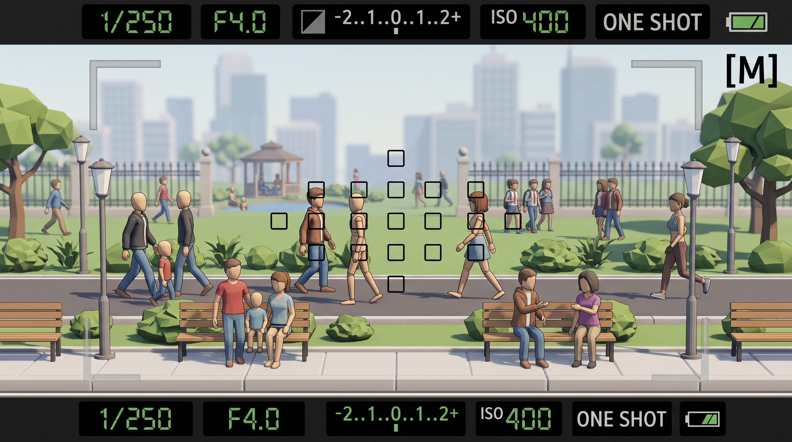
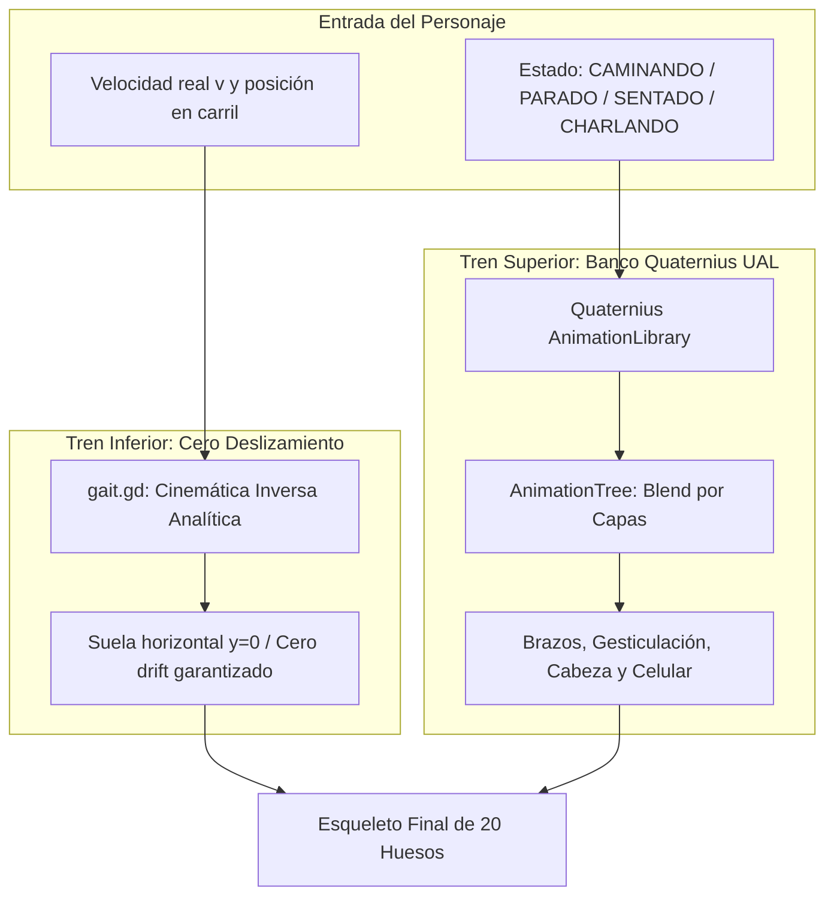

# Especificación Futura: Estilo Visual Canónico (Toon) y Modo Diorama Físico (PBR Realista + Render Avanzado Godot 4)

Este documento establece la **dirección artística y técnica integral** para la evolución gráfica de **Proyecto Paparazzi**, articulando dos vertientes visuales coherentes sobre la misma base lúdica y ética:
1. **Estilo Canónico Toon / Ilustración (Base y WebGL)**: Guiado por la imagen conceptual [referencia.jpg](referencia.jpg), con estética de dibujo/animación, sombreado cell-shading en bandas, contornos de tinta (*inverted hull*), arquitectura de **profundidad multi-plano de 7+ capas** y la **biblioteca universal de animaciones CC0 (Quaternius UAL 1 & 2)** retargeteada al rig universal de 20 huesos.
2. **Modo Diorama Físico de Estudio (Alta Fidelidad / Next-Gen)**: Evolución fotorrealista donde la escena se percibe inequívocamente como una **maqueta física artesanal de escala 1:12 o 1:18** montada en un set fotográfico o taller de modelismo. Los personajes son **maniquíes de madera noble torneada y barnizada** vestidos con **ropa textil real** (tramas de hilo, microfibras y costuras a escala macro), en un parque rico con mobiliario de forja y madera, pavimentos de adoquín detallados y el despliegue del arsenal moderno de **Godot 4 Forward+** (iluminación global SDFGI/VoxelGI/LightmapGI, sombras suaves PCSS, oclusión SSAO, niebla volumétrica y postprocesado óptico de diafragma macro/tilt-shift).

---

> [!IMPORTANT]
> **Guía de lectura (revisión del 29-09-2026)**
> - **Hoja de ruta real**: el estilo **Toon canónico de los maniquíes** (§3.1–3.2, capas de §5, animación de §4). El paso 1 ([16](16_PARQUE_ILUSTRADO_QUICK_WIN.md)) probó a extender el toon y el contorno a todo el parque y **se descartó**: el parque conserva su sombreado suave, ahora fusionado y con oclusión horneada. Cualquier propuesta de este documento que pida toon o contorno en el escenario queda en suspenso.
> - **Perfil Ultra**: aprovecha una GPU de escritorio potente con Forward+ y presupuestos ampliados, pero **justificados** (§10). El banco ampliado de mejoras está en §11 y la variedad procedural en [15_VARIEDAD_PROCEDURAL.md](15_VARIEDAD_PROCEDURAL.md).
> - **Modo Diorama PBR** (§1.2, §3.3–3.4): estilo alternativo exclusivo de Ultra, con sus cifras limitadas por la tabla de §10.2. Donde este documento cite 14.000 triángulos por maniquí o 550.000 en escena, manda §10.2 (8.000 y 1.500.000).
> - Ningún perfil puede cambiar la puntuación fotográfica (§10.3).

## 1. Imagen Conceptual de Referencia y Doble Dirección Visual

La siguiente imagen representa el punto de partida artístico (*target render*) para la estética del juego, la composición de planos, la vida del escenario y la interfaz del visor:



### 1.1 Desglose del Lenguaje Visual de la Referencia (Estilo Toon)
1. **Personajes de Maniquí Artístico**:
   - Cuerpos de maniquí de dibujo anatómico en madera clara pulida, con **rótulas esféricas visibles** en cuello, hombros, codos, muñecas, caderas y rodillas.
   - Cabezas ovoides lisas y estilizadas sin rasgos faciales individuales, garantizando neutralidad absoluta y reforzando la ética de casting.
   - Ropa estilizada de formas limpias superpuesta sobre el maniquí de madera (camisetas, faldas, pantalones vaqueros, chaquetas abiertas, ropa de running deportiva ajustada).
2. **Sombreado Toon / Cell Shading**:
   - Sombreado en bandas de luz nítidas (2-3 tonos por superficie, sin degradados continuos fotorrealistas).
   - **Líneas de contorno limpias (*ink outlines*)** en color gris carbón/negro que perfilan con elegancia tanto a los personajes como a los elementos arquitectónicos y vegetales.
3. **Composición Escénica Multi-Plano**:
   - Escalado rico de planos espaciales: desde elementos de enmarcado inmediato y bancos delanteros con familias sentadas, pasando por la calzada peatonal de viandantes, praderas interiores con estanque y quiosco, hasta la verja clásica con estudiantes de fondo y el horizonte urbano con bruma.
4. **Visor Réflex de Gama Alta**:
   - Retícula de 15 colimadores de enfoque en disposición de diamante/cruz central.
   - Marcas esquineras de encuadre en el marco visual.
   - Doble franja informativa con displays LCD retroiluminados en verde de 7 segmentos: velocidad (`1/250`), diafragma (`F4.0`), compensación de exposición (`-2..1..0..1..2+`), `ISO 400`, modo de disparo (`ONE SHOT`), nivel de batería y modo manual (`[M]`).
5. **Dinamismo y Expresividad Corporal**:
   - Locomoción rica y diferenciada (andares elegantes, apresurados, cansados, trote deportivo).
   - Actitudes vivas y creíbles: personas sentadas en bancos charlando, consultando el móvil, leyendo la prensa, tomando fotos como turistas o descansando.

### 1.2 La Evolución Hacia el Diorama Físico de Estudio (Next-Gen)
Como alternativa de máxima fidelidad técnica para hardware de escritorio y consolas, se define el **Modo Diorama Físico**:
- La imagen se transforma en la **fotografía macro de una maqueta real de taller**: los maniquíes lucen vetas de madera noble con barniz brillante `clearcoat`, la ropa muestra hilos y microfibras reales con efecto `sheen`, los bancos son de teca con herrajes de fundición martillada, y la cámara exhibe una profundidad de campo superficial (*tilt-shift*) con bokeh cremoso que vende instantáneamente la ilusión de escala en miniatura.

---

## 2. Diagnóstico Técnico: ¿A qué distancia estamos del estado objetivo?

A continuación se evalúa la distancia entre el estado actual del código/motor y la visión integral (Toon y Diorama PBR):

| Dimensión Técnica | Estado Actual en el Repositorio | Objetivo Toon Canónico | Objetivo Modo Diorama Físico | Brecha Técnica |
|---|---|---|---|:---:|
| **Modelado de Personajes** | 4 anatomías con *lofts* elípticos rígidos (`tools/build_catalog.py`), rótulas visibles en extremidades descubiertas y mallas facetadas (6 lados). | Maniquíes estilizados de 8-10 lados con rótulas esféricas continuas en todas las juntas. | Maniquíes torneados ultra-suaves (16-24 lados, 8k-14k tris) con pernos de latón/acero y pliegues reales. | **Media** (Toon) / **Alta** (Diorama) |
| **Materiales y Texturas** | Colores de vértice planos (`ARRAY_COLOR`) con oclusión precalculada (`person.gd::occlusion()`). | Shaders Toon en 3 bandas con contorno *inverted hull* (1,6 px) sin texturas. | **Texturas PBR 1K/2K**: vetas de madera noble con `Clearcoat`, telas con `Sheen`, forja martillada y adoquines ORM. | **Media** (Toon) / **Alta** (Diorama) |
| **Sombreado e Iluminación** | Luz directa direccional y hemisferio plano en `gl_compatibility`. Parque con `StandardMaterial3D`. | Toon cuantizado con sombras PCF estándar en parque y personajes. | **Forward+ Clustered**: Iluminación Global (`VoxelGI`/`SDFGI`), sombras PCSS con penumbra suave y Contact Shadows. | **Media** (Toon) / **Media-Alta** (Diorama) |
| **Óptica y Postprocesado** | Revelado por shader monocromo/color (`develop.gdshader`), visor con 9 colimadores (`viewfinder.gd`). | Visor de 15 puntos en diamante y displays LCD verde de 7 segmentos. | **DoF Macro Tilt-Shift física** ($f/1.4-f/2.8$), bokeh de 9 palas, Tone Mapping AgX/ACES, viñeteo óptico y grano analógico. | **Baja-Media** (¡Bajo coste / Alto impacto!) |
| **Entorno y Mobiliario** | Parque procedural básico: cubos para edificios, esferas facetadas para arbustos, cilindros de farolas (`park.gd`). | Parque armónico: acera con bordillos, bancos de madera, verja con pilares, estanque y quiosco. | **Mobiliario de modelismo de precisión**: bancos de 7 listones de teca con tornillería, farolas de vidrio, estanque PBR y peana perimetral. | **Media** (Toon) / **Alta** (Diorama) |
| **Animación y Actitudes** | Locomoción analítica pura (`gait.gd`), sin pausas, sin variedad de marcha, bancos vacíos. | Cinemática híbrida (`gait.gd` analítico + blend Quaternius UAL 1 & 2 a 30 Hz). | Cinemática híbrida completa + micro-vibraciones mecánicas + multitud ambiental (Tier 2) en bancos y verja. | **Media** (Ambos) |
| **Planos de Profundidad** | 4 carriles concéntricos básicos ($r \in [1.8, 11.5]\text{ m}$) sin capas intermedias. | 7 capas escénicas continuas (enmarcado frontal a skyline brumoso). | 7 capas completas con peana perimetral de caoba en el límite y props de alta densidad. | **Media** (Ambos) |

---

## 3. Especificación de los Dos Estilos Visuales: Toon Canónico y Diorama Físico de Estudio

```
+---------------------------------------------------------------------------------------------------+
|                        ARQUITECTURA DE ESTILOS VISUALES COMPLEMENTARIOS                           |
+---------------------------------------------------------------------------------------------------+
                                  PROYECTO PAPARAZZI
                                          |
          +-------------------------------+-------------------------------+
          |                                                               |
          v                                                               v
  [ ESTILO CANÓNICO TOON ]                                    [ MODO DIORAMA FÍSICO ]
  - Backend: gl_compatibility                                 - Backend: Forward+ (Clustered Vulkan)
  - Estética: Ilustración / Cómic limpio                      - Estética: Maqueta de Estudio / Escala 1:18
  - Shaders: Cel-Shading 3 bandas + Inverted Hull Outlines    - Shaders: PBR StandardMaterial3D (Clearcoat, Sheen)
  - Geometría: 1.800 tris/maniquí, 95k tris escena            - Geometría: ≤ 8.000 tris/maniquí, ≤ 1,5 M tris
  - Texturas: Ninguna (ARRAY_COLOR en vértices)               - Texturas: PBR 1K/2K (Albedo, Normal, ORM)
  - Iluminación: Sombras directas PCF                         - Iluminación: VoxelGI/SDFGI, PCSS, Contact Shadows
  - Objetivo: WebGL, Móviles, 60 FPS universales              - Objetivo: Desktop PC, Consolas, Efecto WOW
```

### 3.1 Justificación Conceptual y Ética (Común a Ambos Estilos)
- **Metáfora artística perfecta**: En un juego centrado en la fotografía y la composición artística, que los personajes sean maniquíes de dibujo articulados es una decisión diegética impecable que refuerza el tono del proyecto.
- **Solución definitiva a la ética de casting**: Los maniquíes de madera neutra eliminan cualquier ambigüedad en el tono de piel (todos comparten el acabado de madera noble natural: haya, arce, roble o nogal), concentrando las descripciones fotográficas exclusivamente en la indumentaria, accesorios y actitudes.
- **Eficiencia matemática de render**: Cada junta esférica o cilindro torneado tiene normales analíticas perfectas que se renderizan limpiamente con muy pocos polígonos (hasta 1.900 triángulos por personaje en los perfiles móviles, 4.000 en Alto y 8.000 en Ultra; ver §10.2).

```
+-------------------------------------------------------------------------------+
|                    ANATOMÍA DE MANIQUÍ ARTÍSTICO ARTICULADO                   |
+-------------------------------------------------------------------------------+
       (  ) Cabeza ovoide torneada (sin rostro, madera pulida)
        ||  Cuello cilíndrico
      [====] Hombros: articulación esférica vista (hueso hombro.D / hombro.I)
      |    | Torso superior: bloque curvado de madera / camiseta
       (  )  Cintura: esfera de rotación lumbar
      |====| Pelvis / Caderas: rótulas esféricas para fémur
      |    | Muslos torneados / pantalones
       (  )  Rodillas: junta esférica de flexión pura
      |    | Espinillas / pantorrillas
      (____) Pies / Zapatos estilizados de suela plana
```

### 3.2 Pipeline de Sombreado Toon en Godot 4 (`gl_compatibility`)

Para garantizar 60 FPS estables en navegadores y hardware móvil sin sobrecargar la GPU, el sombreado Toon se implementa mediante un shader directo de dos componentes:

#### A) Cuantización de Iluminación en Bandas (Shader Toon)
```glsl
shader_type spatial;
render_mode diffuse_toon, specular_toon;

uniform vec3 wood_albedo : source_color = vec3(0.85, 0.72, 0.55);
uniform float shadow_threshold : hint_range(0.0, 1.0) = 0.45;
uniform float shadow_smoothness : hint_range(0.0, 0.2) = 0.04;

void fragment() {
    ALBEDO = (COLOR.rgb != vec3(1.0)) ? COLOR.rgb : wood_albedo;
    ROUGHNESS = 0.85;
    SPECULAR = 0.15;
}

void light() {
    float NdotL = dot(NORMAL, LIGHT);
    float light_intensity = smoothstep(shadow_threshold - shadow_smoothness, 
                                       shadow_threshold + shadow_smoothness, 
                                       NdotL);
    DIFFUSE_LIGHT += clamp(light_intensity, 0.35, 1.0) * LIGHT_COLOR * ATTENUATION;
}
```

#### B) Líneas de Contorno Limpias (*Inverted Hull Outlines*)
El delineado exterior de los personajes y props se consigue mediante un segundo pase (`next_pass`) en el material:
- Modo de renderizado: `cull_front` (solo dibuja las caras traseras).
- Desplazamiento de vértices: `VERTEX += NORMAL * 0.008;` (extrusión uniforme de 8 mm hacia el exterior o 1,6 px constante).
- Color del contorno y modulación armónica: Tinta base oscura (`vec4(0.10, 0.10, 0.12, 1.0)`), insensible a la luz (`unshaded`), modulada armónicamente con el color de vértice (`tint_strength = 0.45`) para lograr perfiles cálidos sobre madera noble y tonos profundos en tejidos textiles, con atenuación cúbica adaptativa por distancia y sesgo de profundidad (`depth_bias = 0.0015`) anti-recortes en articulaciones.
- **Coste**: Renderizado en 1 solo draw call adicional por superficie, 100% compatible con WebGL y OpenGL Core Profile.

---

### 3.3 Especificación del Modo Diorama Físico de Estudio (PBR y Entorno de Alta Fidelidad)

El **Modo Diorama Físico** persigue la reproducción fotorrealista y tangible de una **maqueta artesanal física a escala 1:18**, ensamblada con materiales auténticos y fotografiada bajo iluminación de estudio:

#### A) La "Piel" de Madera Noble de los Maniquíes
- **Maderas Nobles según Atributo de Acabado**:
  - `tono_0` (Claro): **Madera de Arce Blanco / Fresno** (albedo beige muy claro `vec3(0.92, 0.86, 0.76)`, veta lineal recta y sutil).
  - `tono_1` (Medio claro): **Haya Europea Pulida** (albedo melocotón suave `vec3(0.86, 0.72, 0.58)`, punteado característico de radios medulares).
  - `tono_2` (Medio tostado): **Roble Dorado Americano** (albedo tostado cálido `vec3(0.74, 0.58, 0.42)`, veta flamígera ancha y relieve marcado).
  - `tono_3` (Oscuro): **Nogal Español / Caoba** (albedo pardo oscuro profundo `vec3(0.48, 0.35, 0.26)`, veta ondulada con contrastes de tono).
- **Mapa de Normales y Microrrugosidad**:
  - Normal map de 2048×2048 con micro-poro leñoso orientado a lo largo del eje longitudinal de las extremidades y torso.
  - Roughness base de la madera entre $0.40$ y $0.60$, con ligeras variaciones a lo largo de las vetas.
- **Capa de Barniz / Laca con `Clearcoat`**:
  - Activación de `clearcoat = 0.85` y `clearcoat_roughness = 0.12` en `StandardMaterial3D`.
  - Genera una doble respuesta especular idéntica a la de una figura de colección barnizada a mano: un reflejo especular nítido y brillante en la capa externa de laca sobre el brillo sordo y cálido de la madera interior.
- **Rótulas y Mecánica Interna**:
  - En las superficies de corte y juntas esféricas visibles (cuello, hombros, codos, muñecas, caderas, rodillas), la textura simula el **corte a testa de la madera** (anillos concéntricos de crecimiento) o incorpora un núcleo de perno axial con acabado metálico satinado de latón envejecido (`metallic = 0.9`, `roughness = 0.35`).

#### B) Telas e Indumentaria Textil Realista (Micro-tramas y Efecto Sheen)
- **Tramas Textiles Físicas por Prenda**:
  - **Pantalones vaqueros (Denim)**: Tejido de sarga diagonal en relieve (*twill pattern*), con hilos longitudinales de urdimbre azul índigo y trama transversal de algodón blanco crudo. Mapa de normales con inclinación a 45° visible con teleobjetivo.
  - **Camisetas y sudaderas**: Tejido de punto liso (*jersey*) o piqué de algodón con textura de celda microscópica, rugosidad alta ($0.85 - 0.95$) y reflectancia metálica cero.
  - **Chaquetas deportivas y ropa de running**: Tejido sintético de micro-ripstop con leve brillo satinado (`roughness = 0.45`), cuadrícula de refuerzo antidesgarro y cremalleras metálicas modeladas con pernos funcionales.
  - **Faldas y vestidos**: Caída de tela de lino o crepé con micro-arrugas orgánicas en zonas de flexión.
  - **Calzado**: Piel curtida satinada (`roughness = 0.38`) en zapatos formales con veta de cuero legítimo; lona gruesa y goma vulcanizada micro-estriada con ribete blanco en zapatillas deportivas.
- **Canal Sheen (Lustre de Fibras Textiles)**:
  - En Godot 4 `StandardMaterial3D`, el parámetro `sheen = 0.75` con tinte blanco roto emula físicamente el halo de luz retrodispersada por las micro-fibras del tejido en ángulos rasantes (*Fresnel retro-reflection*), eliminando el aspecto "plástico" de los materiales tradicionales y dotando a la ropa de tacto cálido de tela real.

#### C) Mobiliario Urbano de Maqueta de Estudio
- **Bancos Clásicos del Parque**:
  - Listones independientes de madera de teca o pino tratado: veta erosionada por la intemperie, pequeños arañazos, micro-fisuras en los extremos de los tablones y tornillos de hierro embutidos en la madera con hendidura ranurada.
  - Patas y brazos de soporte: hierro fundido con textura rugosa de forja martillada (*hammered cast iron*), esmalte verde carruaje clásico o negro forja satinado, con micro-desgastes en aristas que revelan el metal grisáceo subyacente.
- **Farolas y Verjas**:
  - Estructura de fundición de hierro oscura con sutiles imperfecciones de moldeado en miniatura.
  - Faroles con 4 paneles de vidrio transparente con refracción física, sutil suciedad en las esquinas y una bombilla interior cálida con filamento LED incandescente modelado.
- **Papeleras y Fuentes**:
  - Papeleras con chapa perforada esmaltada al horno o cubiertas de madera noble; fuentes de piedra con grifo de latón dorado patinado con cardenillo verdoso microscópico.

#### D) Pavimento, Vegetación y Estanque de Alta Fidelidad
- **Adoquinado de Granito y Aceras**:
  - Calzada principal modelada con adoquines de granito con mapas de normales y oclusión ambiental de alta resolución: juntas de arena fina de sílice, micro-desniveles entre piezas adyacentes y pequeños parches de musgo seco en las hendiduras más umbrías.
  - Aceras con losas biseladas de piedra caliza y bordillos continuos con aristas ligeramente melladas.
- **Arbolado y Follaje**:
  - Troncos con mallas orgánicas de alta densidad y texturas de corteza botánica (plátano de sombra con placas descascarilladas, arce con estrías longitudinales).
  - Hojas modeladas en ramilletes con textura fotográfica de alta definición y canal de **translucidez / Subsurface Scattering** activo: cuando el sol se sitúa tras las copas de los árboles, las hojas se iluminan interiormente con un brillo dorado-esmeralda natural.
- **Estanque de Diorama**:
  - Lecho con cantos rodados de río, sedimentos de limo y plantas acuáticas de modelismo (nenúfares).
  - Superficie líquida con shader de agua PBR: refracción basada en profundidad, normales de ondas suaves en movimiento, espuma sutil en las orillas de piedra y reflejos especulares en tiempo real.

#### E) Superación Radical del "Low-Poly" y Peana Perimetral de Maqueta
- **Mallas de Alta Densidad**:
  - De 1.900 tris a **hasta 8.000 triángulos por maniquí** (límite de Ultra, §10.2), eliminando aristas facetadas visibles incluso en primeros planos con el teleobjetivo de 200 mm.
  - Bancos de 7 listones independientes curvados con pernos avellanados ($pprox 2.400\text{ tris}$).
  - Farolas con coronas ornamentales y vidrio transparente ($pprox 1.800\text{ tris}$).
  - Árboles con ramificación fractal y copas de hojas poligonales densas ($pprox 4.500 - 8.000\text{ tris}$).
- **Peana Perimetral de Madera Noble**:
  - El límite exterior del parque remata en una base circular de caoba oscura pulida con moldura de ebanistería y una **placa de latón envejecido grabada** con la leyenda *"Parque de la Alameda — Estudio Escénico a Escala 1:18"*, vendiendo definitivamente la metáfora artesanal.

---

### 3.4 Batería de Tecnologías Godot 4 Forward+ para el Diorama

1. **Backend Clustered Forward+**: Permite gestionar decenas de luces de estudio y farolas agrupadas en celdas espaciales 3D sin coste multiplicativo de draw calls.
2. **Iluminación Global (GI)**:
   - **`VoxelGI`**: Volumen de $256^3$ vóxeles que cubre el parque ($45 	imes 12 	imes 45\text{ m}$). Ofrece rebotes indirectos de alta fidelidad y oclusión especular indirecta sobre el barniz de los maniquíes.
   - **`SDFGI`**: Iluminación global dinámica en tiempo real que produce sangrado de color (*color bleeding*) difuso del césped sobre los bancos y las piernas de los maniquíes.
   - **`LightmapGI`**: Horneado estático con denoiser GPU; sombras de contacto perfectas y rebotes fotorrealistas con **0 ms de coste en runtime** (ideal para equipos de gama media).
   - **`SSIL`**: Rebotes locales de espacio de pantalla entre personajes y vestimenta cercana.
3. **Sombras Físicas y Oclusión**:
   - **PCSS Soft Shadows**: Penumbra física suave proporcional a la distancia del objeto que proyecta la sombra.
   - **Screen-Space Contact Shadows**: Micro-rayos de oclusión que anclan con peso físico los pies y las patas de los bancos al suelo (eliminando el *peter-panning*).
   - **SSAO a Escala Macro**: Oclusión ambiental en rótulas esféricas, hendiduras de bancos y dobladillos.
4. **Atmósfera Volumétrica e Iluminación de Set**:
   - **Niebla Volumétrica (Volumetric Fog)**: Haces de luz solar (*god rays*) atravesando las ramas de los árboles.
   - **Partículas GPU de Polvo**: Motas microscópicas flotando lentamente a contraluz, evocando una maqueta en un taller.
5. **Postprocesado Óptico de Maqueta (Tilt-Shift & Macro)**:
   - **DoF Física Extrema**: Diafragma $f/1.4 - f/2.8$ con bokeh cremoso de 9 palas que confiere la sensación óptica inconfundible de maqueta a escala reducida (*miniature faking*).
   - **Tone Mapping AgX / ACES**: Gestión de altas luces que preserva los reflejos especulares del barniz sin quemar en blancos planos.
   - **Viñeteo Óptico y Aberración Cromática**: Desfase espectral sutil en las esquinas del encuadre.
   - **Grano Analógico Físico**: Emulación ISO 100/400 que unifica las texturas y elimina la esterilidad digital.

---

## 4. Banco Universal de Animaciones (Quaternius UAL 1 & 2), Retargeting y Cinemática Híbrida

Para dar el salto definitivo de una locomoción puramente funcional a una experiencia visual orgánica y profesional, se integra el catálogo de animaciones de código abierto más consolidado del ecosistema independiente: las librerías universales de Quaternius.

### 4.1 Fuentes Abiertas, Licenciamiento CC0 y Alcance
La integración se fundamenta en dos proyectos complementarios:
1. **[Universal Animation Library (Volumen 1)](https://quaternius.itch.io/universal-animation-library)**:
   - **Más de 120 animaciones** esqueléticas profesionales.
   - Abarca locomoción básica y multidireccional (8 direcciones), transiciones de parada y arranque, gestos y emotes sociales, posturas de reposo e interacciones con el entorno.
2. **[Universal Animation Library 2 (Volumen 2)](https://quaternius.itch.io/universal-animation-library-2)**:
   - **Más de 130 animaciones adicionales**.
   - Incluye locomoción específica avanzada, parkour urbano, interacciones complejas, posturas sentadas variadas y acciones cotidianas.
3. **Garantía Legal y Ética**:
   - Ambos conjuntos están publicados bajo licencia **CC0 (Creative Commons Zero / Dominio Público)**.
   - Permiten modificación, adaptación, conversión de formatos y uso libre tanto en proyectos personales como comerciales sin restricciones de atribución obligatoria ni costes de licencia.
   - Disponibles en formato nativo `.blend`, `.fbx` y **glTF/GLB**, con opciones de *Root Motion* activado y desactivado (*In-Place*).

---

### 4.2 Taxonomía de Animaciones Seleccionadas para Proyecto Paparazzi

Del repertorio de más de 250 animaciones disponibles, se selecciona un paquete temático específico para el parque urbano de Proyecto Paparazzi, estructurado en 4 familias funcionales:

```
+-------------------------------------------------------------------------------+
|       TAXONOMÍA DE ANIMACIONES UNIVERSALES PARA PROYECTO PAPARAZZI (CC0)      |
+-------------------------------------------------------------------------------+
  FAMILIA 1: LOCOMOCIÓN Y PASO ACTIVO (Tier 1 Jugable - Calzadas 1 y 2)
    * Walk_Casual       : Marcha relajada estándar de parque (v ~ 0.70 m/s)
    * Walk_Fast         : Paso ligero/apurado con mayor oscilación (v ~ 0.85 m/s)
    * Walk_Tired        : Marcha pesada, hombros ligeramente caídos (v ~ 0.58 m/s)
    * Walk_Confident    : Paso firme, cabeza erguida, braceo rítmico (v ~ 0.80 m/s)
    * Jogging           : Trote deportivo continuo (ropa de running, v ~ 2.6 m/s)
    * Sprint            : Zancada veloz de alta intensidad (v ~ 3.0 m/s)
    * Walk_Start/Stop   : Amortiguación natural de aceleración y desaceleración
    * Walk_Turn_L/R     : Inclinación sutil de tronco al virar en el carril curvo
  -----------------------------------------------------------------------------
  FAMILIA 2: BANCOS Y REPOSO URBANO (Tier 2 y Pausas - Capas 0, 3 y 4)
    * Sit_Down / Stand_Up : Transición limpia de bipedestación a sedente
    * Sitting_Idle        : Sentado erguido, manos sobre los muslos
    * Sitting_LegCrossed  : Sentado informal con pierna cruzada sobre rodilla
    * Sitting_Reading     : Mirada inclinada hacia periódico/revista en mano
    * Sitting_Phone       : Manejo de smartphone a dos manos en el banco
    * Idle_Relaxed        : De pie en la verja, peso descargado en una pierna
    * Idle_LookAround     : Giro suave de cabeza admirando el estanque o árboles
    * Idle_CheckWatch     : Consulta breve del reloj de muñeca
    * Idle_LeanRail       : Apoyo de antebrazos en la barandilla de la Capa 4
  -----------------------------------------------------------------------------
  FAMILIA 3: GESTUALIDAD SOCIAL Y CONVERSACIÓN (Tier 2 - Capas 0 y 3)
    * Talking_Gesture_01  : Explicación dialógica con movimiento de una mano
    * Talking_Gesture_02  : Conversación animada con gesticulación bilateral
    * Listening_Nod       : Escucha activa con asentimiento de cabeza
    * Laughing            : Risa compartida con leve cabeceo hacia atrás
    * Wave_Hand           : Saludo con mano alzada a alguien en la otra orilla
    * Cheering            : Aplauso moderado o gesto de felicitación
  -----------------------------------------------------------------------------
  FAMILIA 4: ACCIONES FOTOGRÁFICAS Y TEMÁTICAS URBANAS
    * Taking_Photo_Phone  : Turista levantando el teléfono móvil para encuadrar
    * Taking_Photo_Camera : Peatón apuntando con cámara compacta hacia el quiosco
    * Pose_Photo          : Pose simpática al percibir el objetivo del paparazzi
    * Tie_Shoes           : Flexión en una rodilla para atarse los cordones
    * Carrying_Backpack   : Ajuste periódico de los tirantes de la mochila
```

---

### 4.3 Arquitectura Técnica de Retargeting en Godot 4: Humanoid a Rig de 20 Huesos

Las animaciones de Quaternius siguen la convención estándar **Humanoid**. Para integrarlas de forma limpia con el rig universal del juego, se utiliza el sistema de **`BoneMap` / `SkeletonProfileHumanoid`** de Godot 4:

#### Tabla de Correspondencia Ósea 1:1
| Hueso Estándar Quaternius (Humanoid) | Hueso Proyecto Paparazzi | Índice en `Skeleton3D` | Tipo de Articulación en Maniquí |
|---|---|:---:|---|
| `Hips` / `Pelvis` | `caderas` | **1** | Rótula esférica de pelvis |
| `Spine` | `lumbar` | **2** | Esfera de rotación de cintura |
| `Chest` / `UpperChest` | `torax` | **3** | Bloque de caja torácica |
| `Neck` | `cuello` | **4** | Cilindro de enlace cervical |
| `Head` | `cabeza` | **5** | Cabeza ovoide torneada |
| `LeftUpperArm` | `brazo.I` | **6** | Rótula de hombro izquierdo |
| `LeftLowerArm` | `antebrazo.I` | **7** | Rótula de codo izquierdo |
| `LeftHand` | `mano.I` | **8** | Muñeca esférica izquierda |
| `RightUpperArm` | `brazo.D` | **9** | Rótula de hombro derecho |
| `RightLowerArm` | `antebrazo.D` | **10** | Rótula de codo derecho |
| `RightHand` | `mano.D` | **11** | Muñeca esférica derecha |
| `LeftUpperLeg` | `muslo.I` | **12** | Rótula cotiloidea cadera izquierda |
| `LeftLowerLeg` | `pierna.I` | **13** | Rótula de rodilla izquierda |
| `LeftFoot` | `pie.I` | **14** | Tobillo esférico izquierdo |
| `LeftToes` | `punta.I` | **15** | Junta metatarsiana izquierda |
| `RightUpperLeg` | `muslo.D` | **16** | Rótula cotiloidea cadera derecha |
| `RightLowerLeg` | `pierna.D` | **17** | Rótula de rodilla derecha |
| `RightFoot` | `pie.D` | **18** | Tobillo esférico derecho |
| `RightToes` | `punta.D` | **19** | Junta metatarsiana derecha |

> [!NOTE]
> El hueso raíz `raiz (0)` actúa como ancla transformacional de mundo en el origen del personaje ($y = 0$).

#### Preservación Inquebrantable del Rigging Rígido (Single Weight)
- En un maniquí de dibujo anatómico de madera, **cada pieza torneada es un cuerpo rígido independiente**.
- Cada vértice de una pieza pertenece exclusivamente a 1 solo hueso (`ARRAY_WEIGHTS[0] == 1.0`).
- **Gran ventaja técnica frente a personajes de piel flexible**: No existe deformación ni estiramiento elástico en las axilas, codos o ingles (*candy-wrapper artifact*). Las rótulas esféricas giran limpiamente dentro de los huecos cóncavos, permitiendo aplicar cualquier animación de Quaternius sin requerir ajustes de peso en vértices ni shaders complejos de *linear blend skinning*.

---

### 4.4 Cinemática Híbrida: Garantía Matemática de Cero Deslizamiento de Pie

Uno de los mayores desafíos al utilizar animaciones basadas en clips en juegos de cámara fija o teleobjetivo es el **deslizamiento de pie (*foot sliding*)**, el cual delata artificialidad y rompe el realismo óptico.

Para resolver esto sin perder la riqueza gestual de Quaternius, Proyecto Paparazzi adopta una **Arquitectura de Animación Híbrida por Capas**:


```mermaid
graph TD
    subgraph Entrada del Personaje
        V[Velocidad real v y posición en carril]
        State[Estado: CAMINANDO / PARADO / SENTADO / CHARLANDO]
    end

    subgraph Tren Inferior: Cero Deslizamiento
        V --> Gait[gait.gd: Cinemática Inversa Analítica]
        Gait --> Feet[Suela horizontal y=0 / Cero drift garantizado]
    end

    subgraph Tren Superior: Banco Quaternius UAL
        State --> AnimLib[Quaternius AnimationLibrary]
        AnimLib --> BlendNode[AnimationTree: Blend por Capas]
        BlendNode --> TorsoHead[Brazos, Gesticulación, Cabeza y Celular]
    end

    Feet --> Skeleton[Esqueleto Final de 20 Huesos]
    TorsoHead --> Skeleton
```

1. **Tren Inferior (Piernas y Pies - Huesos 12 a 19)**:
   - Durante la marcha continua, la orientación y posición de muslos, pantorrillas y pies se calcula en tiempo real con `gait.gd`.
   - La fase avanza con $\Delta \phi = rac{\Delta 	ext{distancia} \cdot 2\pi}{	ext{zancada}}$, garantizando matemáticamente que el pie en contacto con el suelo permanece estático respecto al firme (`drift == 0.000000 m/frame`) y con la suela perfectamente horizontal ($y = 0$).
2. **Tren Superior (Tronco, Cabeza y Brazos - Huesos 2 a 11)**:
   - Se alimenta directamente desde los clips seleccionados de Quaternius (`Walk_Confident`, `Walk_Fast`, `Idle_CheckPhone`, etc.) mediante un `AnimationTree` con un nodo `AnimationNodeBlend2` y máscara ósea (`filter_enabled = true`).
   - Los hombros se balancean orgánicamente, la cabeza reacciona al entorno y los brazos ejecutan braceos naturales o sostienen accesorios (mochila, revista, teléfono).
3. **Pausas y Estados Estáticos (Sentados y Charlas)**:
   - Cuando un personaje se detiene por completo ($v = 0$), se realiza una transición suave (*cross-fade* de 0.25 s) al clip completo de Quaternius (`Sitting_Reading`, `Talking_Gesture`, etc.), liberando la restricción de marcha.

---

### 4.5 Pipeline de Importación, Compresión y Optimización de Memoria

Para cumplir rigurosamente con los límites de hardware del proyecto (VRAM < 60 MiB, compatible con WebGL / móvil):

1. **Empaquetado en Recurso Nativo Compartido (`AnimationLibrary`)**:
   - Las animaciones se importan y guardan en un único archivo de biblioteca compilado (`data/animaciones/quaternius_parque.res`).
   - Todos los viandantes en escena comparten la **misma instancia en memoria** del recurso. No se clonan datos de pistas entre personajes.
2. **Compresión de Pistas de Animación**:
   - **Canales de Escala**: Eliminados al 100% (la escala ósea es fija $1.0$).
   - **Canales de Rotación**: Comprimidos mediante cuaterniones de 16 bits con umbral de tolerancia angular ($0.001	ext{ rad}$).
   - **Muestreo**: 30 Hz con interpolación cúbica fluida en runtime.
3. **Presupuesto de Memoria Medido**:
   - Cada clip comprimido ocupa entre **40 KB y 80 KB**.
   - El catálogo completo de 35 clips seleccionados suma apenas **~2.2 MiB en RAM**, un consumo absolutamente despreciable que encaja holgadamente en el presupuesto global.

---

---

## 5. Arquitectura Escénica de Profundidad Multi-Plano (7+ Capas)

Para recrear la riqueza espacial de `referencia.jpg`, el escenario cilíndrico del parque se divide en **7 capas concéntricas con funciones visuales bien diferenciadas**:

```
+---------------------------------------------------------------------------------------------------+
|                           ARQUITECTURA DE PROFUNDIDAD EN 7 CAPAS DEL PARQUE                       |
+---------------------------------------------------------------------------------------------------+
  [CAPA -1: ENMARCADO FRONTAL Y BOKEH INMEDIATO]          r = 0.5 m a 1.2 m
    * Ramas bajas de sauce, hojas flotantes desenfocadas en primerísimo plano
    * Oclusión periférica suave que enmarca la toma y refuerza la profundidad
  -------------------------------------------------------------------------------------------------
  [CAPA 0: ACERA Y MOBILIARIO CERCANO]                    r = 1.5 m a 2.5 m
    * Pavimento de losas de piedra, bordillo exterior curvo
    * 4 Bancos de madera clásicos con familias/parejas sentadas (personajes en reposo)
    * Farolas victorianas bajas y papeleras de fundición
  -------------------------------------------------------------------------------------------------
  [CAPA 1: CALZADA PEATONAL PRINCIPAL (VIANDANTES ACTIVOS)] r = 3.2 m a 4.5 m
    * Asfalto liso gris con franja adoquines; zona de mayor densidad de peatones
    * Viandantes evaluables por raycast: paseantes rápidos, gente con prisa, accesorios
  -------------------------------------------------------------------------------------------------
  [CAPA 2: CALZADA EXTERIOR Y ZONA DEPORTIVA]             r = 5.0 m a 6.8 m
    * Carril secundario con espacio amplio para corredores (ropa running a 2.8 m/s)
    * Espacio de cruce y adelantamiento dinámico sin atascos peatonales
  -------------------------------------------------------------------------------------------------
  [CAPA 3: PRADERA INTERIOR, ESTANQUE Y CENADOR]          r = 7.5 m a 10.5 m
    * Extensa pradera verde con sutiles desniveles poligonales
    * Estanque de agua reflectante elíptico con patos/cisnes estilizados
    * Quiosco / Pérgola de madera octogonal con tejado de cobre envejecido
  -------------------------------------------------------------------------------------------------
  [CAPA 4: VERJA CLÁSICA Y MULTITUD DE FONDO]             r = 12.0 m a 14.5 m
    * Verja perimetral de forja negra rematada por pilares de sillería blanca
    * Peatones secundarios y grupos de estudiantes paseando o apoyados en la reja
  -------------------------------------------------------------------------------------------------
  [CAPA 5: MASA VEGETAL DENSA (BARRERA ESCÉNICA)]         r = 15.0 m a 22.0 m
    * Fila continua de árboles estilizados con copas poliédricas facetadas y setos altos
    * Crea la barrera visual natural que aísla el microclima del parque del bullicio exterior
  -------------------------------------------------------------------------------------------------
  [CAPA 6: HORIZONTE URBANO Y SKYLINE METROPOLITANO]      r = 25.0 m a 50.0 m
    * Siluetas escalonadas de rascacielos y torres de oficinas en tonos azulados agrisados
    * Gradiente de perspectiva aérea y bruma de distancia (Distance Fog)
  -------------------------------------------------------------------------------------------------
  [CAPA 7: BÓVEDA CELESTE Y ATMÓSFERA INFINITA]           r > 50.0 m
    * Cúpula celeste procedural con sol dinámico, nubes volumétricas poligonales y atenuación EV
+---------------------------------------------------------------------------------------------------+
```

### 5.1 Desacoplamiento Técnico en 3 Niveles de Fidelidad (Tiers)

Para sostener 7 capas con múltiples personajes y elementos escénicos sin degradar la tasa de 60 FPS ni violar el presupuesto de VRAM (<60 MiB):

```
+-------------------------------------------------------------------------------+
|             PIRÁMIDE DE RENDIMIENTO: 3 NIVELES DE FIDELIDAD (TIERS)           |
+-------------------------------------------------------------------------------+
  TIER 1: NÚCLEO FOTOGRÁFICO JUGABLE (Capas 1 y 2)
    * 21 Viandantes activos evaluables
    * Lógica completa de fotografía: 5 raycasts de oclusión, encuadre, prendas, CoC
    * Navegación cilíndrica 2D con anti-bloqueo y adelantamiento
    * Cinemática híbrida (gait.gd analítico + blend de clips Quaternius UAL)
  -----------------------------------------------------------------------------
  TIER 2: POBLACIÓN AMBIENTAL DESACOPLADA (Capas 0, 3 y 4)
    * 14 a 20 personajes secundarios (familias en bancos, estudiantes al fondo)
    * REGLA §10.3.2: los de las capas 0 y 3 están dentro de la zona jugable y pueden tapar al objetivo, así que deben existir en TODOS los perfiles, con colisionadores y rayos de oclusión. Solo la capa 4 (tras la verja) puede variar por perfil
    * Cero coste en `photography.gd`: excluidos de listas de objetivos y raycasts
    * Animaciones directas de Quaternius: sentado en banco, charlando, móvil, etc.
    * Mallas combinadas compartidas con el mismo shader Toon
  -----------------------------------------------------------------------------
  TIER 3: ESCENARIO ESTÁTICO UNIFICADO (Capas -1, 0, 3, 4, 5, 6 y 7)
    * Todo el parque estático (aceras, bancos, cenador, estanque, verja, árboles)
    * Fusión en un único draw call con colores de vértice (`ARRAY_COLOR`)
    * MultiMeshInstance3D para elementos repetitivos (pilares de verja y farolas)
```

### 5.2 Impacto de los 7 Planos en la Jugabilidad Fotográfica

La presencia de 7 capas reales introduce mecánicas de composición profesional ausentes en juegos convencionales:

1. **Enmarcado Natural (*Frame within a Frame*)**:
   - Encuadrar al sujeto (Capa 1 o 2) utilizando elementos desenfocados de la Capa -1 (ramas de sauce) o de la Capa 4 (los barrotes y pilares de la verja clásica).
2. **Bokeh de Primer Término (*Foreground Blur*)**:
   - En objetivos luminosos ($f/1.4$, $f/2.0$), los elementos de la Capa -1 y 0 se diluyen en manchas pictóricas de color suave, otorgando un aspecto tridimensional cinematográfico al retrato del sujeto enfocado.
3. **Compresión de Teleobjetivo vs. Gran Angular**:
   - A $135\text{ mm}$, las 7 capas se comprimen visualmente: el sujeto de la Capa 1 parece caminar justo delante del quiosco de la Capa 3 con el skyline de la Capa 6 alzándose inmediatamente detrás.
   - A $28\text{ mm}$, la perspectiva se expande y acentúa la sensación de inmensidad y soledad dentro del parque urbano.
4. **Nuevos Desafíos Fotográficos de Profundidad**:
   - *"Retrato en Capas"*: Capturar al objetivo nítido con al menos 1 viandante desenfocado en primer término y la multitud de fondo visible en la verja.
   - *"Composición en el Cenador"*: Retratar al sujeto alineado con el eje del cenador octogonal de la Capa 3.

---

---

## 6. Catálogo de Elementos para las 7 Capas Escénicas

Siguiendo el diseño armónico de `referencia.jpg`, el parque distribuye sus elementos arquitectónicos y vegetales a lo largo de las capas:

| Elemento Escénico | Capa / Radio | Descripción Geométrica / Material | Aporte a la Atmósfera |
|---|---|---|---|
| **Follaje Frontal Colgante** | Capa -1 ($r \approx 0.8\text{ m}$) | Hojas facetadas bajas y ramas de sauce en el margen superior | Crea enmarcado natural y bokeh de primer plano. |
| **Acera y Bordillos** | Capa 0 ($r \approx 1.8\text{ m}$) | Prisma curvo con losas rectangulares beige y bordillo blanco | Delimita el espacio del espectador y da escala humana. |
| **Bancos con Personajes** | Capa 0 ($r \approx 2.0\text{ m}$) | Listones de madera clara con patas de fundición gris oscuro | Elimina la sensación de soledad; familias y parejas charlando con animaciones Quaternius UAL. |
| **Calzada Peatonal Bitonal** | Capas 1 y 2 ($r \approx 3.0 - 5.5\text{ m}$) | Firme de asfalto gris neutro con franjas laterales de adoquín | Guía visual del flujo peatonal activo. |
| **Estanque de Agua** | Capa 3 ($r \approx 7.5\text{ m}$) | Elipse de lámina azul reflectante con borde de sillería | Reflejos y contraste de color con la pradera verde. |
| **Pérgola / Cenador** | Capa 3 ($r \approx 9.0\text{ m}$) | Estructura octogonal de madera de 8 pilares con tejado cónico | Gran hito visual e icono paisajístico del parque. |
| **Verja Clásica con Pilares** | Capa 4 ($r \approx 12.5\text{ m}$) | Reja de hierro negro rematada por pilares de piedra blanca piramidales | Marco señorial y orden compositivo frente al fondo. |
| **Multitud Escolar de Fondo** | Capa 4 ($r \approx 13.5\text{ m}$) | Figuras simplificadas con mochilas de colores caminando juntas | Sensación de vida urbana más allá del área jugable. |
| **Arbolado Poligonal Facetado** | Capa 5 ($r \approx 16.0 - 20.0\text{ m}$) | Troncos marrones con copas poliédricas de 3 tonos verdes | Pantalla verde natural con estética de diorama pulido. |
| **Skyline con Bruma Aérea** | Capa 6 ($r \approx 30.0 - 50.0\text{ m}$) | Bloques rectangulares en gradiente hacia el azul celeste | Sensación de metrópoli viva abrazando el parque. |

---

---

## 7. Banco de Nuevos Accesorios e Interacciones

Para enriquecer la narrativa visual y las combinaciones de encargos, se especifican nuevos accesorios e interacciones de pose vinculadas al catálogo de Quaternius:

| Accesorio / Pose | Categoría | Implementación Geométrica | Efecto en Encargo / Pose |
|---|---|---|---|
| **Mochila Escolar / Urbana** | Accesorio `torax` | Cubo biselado con tiras dobles sobre hombros | Usada por estudiantes y jóvenes en Capas 1, 2 y 4 con animación `Walk_Fast` o `Idle_LeanRail`. |
| **Niño Pequeño de la Mano** | Interacción doble | Modelo infantil vinculado cinemáticamente a la mano del adulto | Objetivo fotográfico especial: *"Retrato familiar"* o *"Tutor con hijo"*. |
| **Pose Sentado en Banco** | Clip Quaternius | `Sitting_Idle` o `Sitting_LegCrossed` con flexión de articulaciones a $90^\circ$ | Permite habitar los bancos del parque sin consumir CPU de navegación ni deslizar suela. |
| **Gesticulación de Charla** | Clip Quaternius | `Talking_Gesture_01/02` y `Listening_Nod` con oscilación natural | Parejas o amigos conversando de forma realista en los bancos de la Capa 0 o cenador. |
| **Atuendo de Running Completo** | Ropa deportiva | Top deportivo ceñido, mallas y zapatillas de suela contrastada | Ya presente en `casting.gd`, potenciado con animaciones `Jogging` y `Sprint` de Quaternius UAL. |
| **Periódico o Revista Abierta** | Accesorio `mano` | Hoja doble ligeramente combada de color crema | Personaje en pose `Sitting_Reading` en el banco o cenador. |
| **Teléfono Inteligente / Cámara** | Accesorio `mano` | Placa rectangular o prisma con lente circular | Permite encargos tipo *"Viandante tomando foto"* (`Taking_Photo_Phone/Camera`). |

---

---

## 8. Plan de Implementación Estratégico y Priorizado (Coste vs Impacto Visual)

### 8.1 Filosofía del Plan: De los "Quick Wins" Ópticos a la Riqueza Escénica
Para evitar el riesgo habitual de invertir semanas en tareas pesadas de modelado sin percibir mejoras visibles en pantalla, el plan de trabajo se reordena bajo el principio de **máxima gratificación visual iterativa**:
- **Se acometen primero las intervenciones de bajo coste que transforman radicalmente la imagen** (postprocesado óptico de maqueta, sombras de contacto, SSAO y peana de diorama). En cuestión de 2 a 4 días, el juego ya luce como una miniatura cinematográfica reconocible.
- **A continuación se introducen los grandes hitos de materialidad física** (maniquíes con maderas barnizadas PBR, telas con efecto Sheen y mobiliario detallado).
- **Por último se abordan las tareas de mayor carga de modelado y rigging** (arbolado denso de 7 capas y retargeting de animaciones Quaternius), con la base estética ya validada y deslumbrante.

---

### 8.2 Matriz de Priorización: Cuadrantes de Coste vs Impacto Visual

```
       IMPACTO VISUAL EN PANTALLA ("EFECTO WOW")
          ^
     Alto |   [ 🚀 CUADRANTE 1: QUICK WINS ]           [ 💎 CUADRANTE 2: GRANDES HITOS ]
          |   - Hito 1: DoF Macro Tilt-Shift & AgX     - Hito 3: Mobiliario Diorama & Peana
          |   - Hito 2: Contact Shadows & SSAO         - Hito 4: Maniquí Madera PBR Clearcoat
          |                                            - Hito 5: Confección Textil PBR Sheen
          |                                            - Hito 6: GI VoxelGI & Estanque PBR
          |--------------------------------------------+-----------------------------------
          |   [ ⚙️ CUADRANTE 4: INFRAESTRUCTURA ]      [ 👑 CUADRANTE 3: INVERSIONES PRÉMIUM ]
          |   - Pipeline UVs analíticas                - Hito 7: Animaciones Quaternius UAL
          |   - Desacoplamiento Tier 2 de personajes   - Hito 8: Arbolado Botánico & 7 Capas
     Bajo |   - Presets de exportación Forward+
          +-------------------------------------------------------------------------------->
             Bajo                                                                     Alto
                                COSTE / ESFUERZO DE DESARROLLO
```

---

### 8.3 Hoja de Ruta Secuencial en 8 Hitos: Resultados Parciales Llamativos

#### 🚀 HITO 1: El Despertar Óptico de la Maqueta (Postprocesado Macro Tilt-Shift & Tone Mapping AgX)
> [!WARNING]
> **Revisado.** Un DoF macro decorativo en el visor contradice la mecánica: el jugador elige la apertura y la puntuación usa su profundidad de campo real. El DoF del visor debe estar calibrado con `Photography.dof()` para el objetivo y el diafragma elegidos ([11 §4](11_MECANICAS_BARRIDO_Y_DOF_REALTIME.md), mejora G14 de §11). `gl_compatibility` no trae DoF integrado, así que en Bajo, Medio y Alto requiere un shader propio.
- **Clasificación**: `Bajo Coste (S) / Muy Alto Impacto Visual` | **Duración estimada**: 1 a 2 días.
- **Intervención**:
  - Configurar `CameraAttributesPhysical` en la cámara principal del jugador (`scripts/main.gd`).
  - Activar **Profundidad de Campo (DoF) física macro** con apertura amplia ($f/1.4 - f/2.0$), distancia de enfoque a los carriles peatonales ($r pprox 3.5 - 5.0\text{ m}$) y bokeh poligonal de 9 palas con reborde suave.
  - Implementar **Tone Mapping AgX o ACES** en el entorno (`WorldEnvironment`), preservando las altas luces y degradados suaves.
  - Añadir viñeteo óptico sutil, aberración cromática marginal y grano de emulsión analógica ISO 100 en [`shaders/develop.gdshader`](../../shaders/develop.gdshader).
- **🎉 Resultado Parcial Llamativo**:
  - *Sin modificar un solo vértice ni textura*, la escena actual adquiere instantáneamente la estética cinematográfica de una maqueta en miniatura fotografiada en estudio con una lente macro de alta gama. El efecto tilt-shift engaña al cerebro desde el primer segundo.

#### 🚀 HITO 2: Iluminación de Estudio, Contact Shadows y Volumen Físico (SSAO & PCSS)
> [!WARNING]
> **Revisado.** Todo este hito exige `forward_plus`, así que solo se aplica al perfil **Ultra** (§10.2), con reinicio al cambiar de renderizador (§10.3.3). Las sombras de contacto en espacio de pantalla no forman parte del entorno estándar de Godot 4 (ver §11). El «quick win» real de bajo coste para todos los perfiles es el **parque ilustrado** ([16](16_PARQUE_ILUSTRADO_QUICK_WIN.md)).
- **Clasificación**: `Bajo-Medio Coste (S-M) / Alto Impacto Visual` | **Duración estimada**: 2 a 3 días.
- **Intervención**:
  - Configurar el backend `Forward+` en `project.godot` para habilitar el pipeline de sombras avanzadas.
  - Activar **Screen-Space Contact Shadows**: traza micro-rayos de oclusión que anclan con firmeza los zapatos de los viandantes y las patas de los bancos al pavimento.
  - Activar **SSAO (Screen Space Ambient Occlusion)** con radio corto ($0.35\text{ m}$) y filtrado bilateral para sombrear las cavidades de las rótulas esféricas, los cuellos y las hendiduras.
  - Configurar sombras direccionales con filtro **PCSS (Percentage-Closer Soft Shadows)** para penumbras suaves naturales.
  - Activar niebla volumétrica homogénea muy tenue con motas microscópicas de polvo (`GPUParticles3D`) flotando en el haz de luz solar.
- **🎉 Resultado Parcial Llamativo**:
  - Desaparece por completo el efecto de "personajes flotantes" (*peter-panning*). La escena adquiere peso físico, volumen tridimensional y la atmósfera tangible de un taller de modelismo iluminado por un foco cenital.

#### 💎 HITO 3: Mobiliario de Diorama de Alta Definición y Peana Perimetral
- **Clasificación**: `Medio Coste (M) / Alto Impacto Visual` | **Duración estimada**: 3 a 4 días.
- **Intervención**:
  - Sustituir los bancos cúbicos por modelos de modelismo artesanal: 7 listones de teca curvados independientes con cabezas de tornillos avellanados y patas ornamentadas de forja martillada (`park.gd::prop()`).
  - Modelar farolas ornamentales de hierro fundido con tulipa acristalada de refracción física y filamento cálido interior.
  - Construir en el perímetro exterior ($r = 13.5\text{ m}$ o límite escénico) una **peana circular de caoba oscura pulida** con moldura de ebanistería y una **placa de latón envejecido grabada** (*"Parque de la Alameda — Escala 1:18"*).
  - Instanciar todo el mobiliario mediante `MultiMeshInstance3D` para mantener los draw calls estáticos en 1 por categoría.
- **🎉 Resultado Parcial Llamativo**:
  - El parque deja de parecer un escenario de pruebas y se revela formalmente como una maqueta de exposición artesanal de coleccionista. Los bancos en primer plano invitan a encuadrar tomas fotográficas memorables.

#### 💎 HITO 4: El Maniquí de Colección PBR (Mallas Redondeadas, UVs y Madera con Clearcoat)
- **Clasificación**: `Medio Coste (M) / Muy Alto Impacto Visual` | **Duración estimada**: 4 a 5 días.
- **Intervención**:
  - Actualizar `tools/build_catalog.py` para generar coordenadas UV cilíndricas y esféricas continuas (`ARRAY_TEX_UV`) en todas las piezas corporales.
  - Aumentar la densidad geométrica a 16-20 segmentos radiales para conseguir cilindros y esferas perfectamente lisos.
  - Crear materiales PBR para los 4 tonos de madera noble (arce, haya, roble, nogal) con mapas de poro leñoso, rugosidad calibrada y **`clearcoat = 0.85`** activo para simular la laca barnizada a mano.
  - Diseñar rótulas esféricas con textura de madera a testa y pernos axiales de latón envejecido.
- **🎉 Resultado Parcial Llamativo**:
  - Los personajes se transforman en auténticas figuras de maniquí de madera barnizada, con reflejos satinados vivos en las curvaturas del torso y rótulas mecánicas visibles de extraordinaria artesanía.

#### 💎 HITO 5: Confección Textil PBR (Canal Sheen, Tramas Denim/Algodón y Calzado Real)
- **Clasificación**: `Bajo-Medio Coste (S-M) / Alto Impacto Visual` | **Duración estimada**: 3 a 4 días.
- **Intervención**:
  - Crear un atlas de texturas textiles PBR compartido: sarga diagonal denim con hilos azules y blancos para pantalones vaqueros, punto piqué para camisetas, micro-ripstop sintético para chaquetas y cuero curtido para calzado.
  - Activar el parámetro **`sheen = 0.75`** en `StandardMaterial3D` para emular el halo aterciopelado de microfibras en ángulos rasantes.
  - Incorporar mapas de normales de costuras, dobladillos y bolsillos en relieve.
- **🎉 Resultado Parcial Llamativo**:
  - Al hacer zoom o disparar con teleobjetivos (70–200 mm), la vestimenta muestra microtextura de tela real confeccionada a medida sobre la madera, eliminando cualquier sensación de muñeco de plástico.

#### 💎 HITO 6: Iluminación Global (GI VoxelGI / SDFGI) y Agua del Estanque PBR
> [!WARNING]
> **Revisado.** El parque se genera en tiempo de ejecución: `LightmapGI` (horneado en el editor) no es viable, y `VoxelGI` se hornea de forma estática y no sigue los cambios de hora. Se elige **SDFGI + SSIL** para Ultra (§10.2, mejoras G10 y G11 de §11).
- **Clasificación**: `Medio Coste (M) / Alto Impacto Visual` | **Duración estimada**: 3 a 4 días.
- **Intervención**:
  - Configurar un nodo `VoxelGI` horneado o `SDFGI` en tiempo real que abarque el parque ($45 	imes 12 	imes 45\text{ m}$).
  - Calibrar el rebote indirecto de luz difusa: la hierba verde brillante tiñe con un suave halo esmeralda el vientre de los bancos y las piernas de madera de los maniquíes (*color bleeding*).
  - Desarrollar un shader PBR de agua para el estanque: lecho con guijarros de río, refracción en base a la profundidad, micro-ondas en movimiento y reflejos en tiempo real de los paseantes vía SSR.
- **🎉 Resultado Parcial Llamativo**:
  - Fotorrealismo lumínico completo y coherencia óptica absoluta; el estanque refleja el entorno como resina transparente de modelismo de alta gama.

#### 👑 HITO 7: Vida Orgánica y Actitudes Urbanas (Quaternius UAL & Tier 2 en Bancos)
- **Clasificación**: `Medio-Alto Coste (M-L) / Alto Impacto Visual y Jugable` | **Duración estimada**: 5 a 6 días.
- **Intervención**:
  - Crear la herramienta `tools/import_quaternius_anims.py` para mapear las animaciones CC0 Humanoid de Quaternius UAL 1 & 2 a los 20 huesos del rig universal de Proyecto Paparazzi.
  - Implementar la cinemática híbrida en `person.gd`: tren inferior gobernado por `gait.gd` analítico (garantía de cero deslizamiento de pie $drift = 0$) y tren superior modulado por clips de Quaternius (andares variados, paradas, miradas al entorno).
  - Instanciar multitud ambiental desacoplada (Tier 2) en los bancos y cenador: personajes sentados charlando, leyendo el periódico o consultando el móvil.
- **🎉 Resultado Parcial Llamativo**:
  - El diorama deja de ser una maqueta estática para convertirse en un micromundo urbano vivo, orgánico y lleno de dinamismo humano creíble.

#### 👑 HITO 8: Entorno Botánico Denso y Arquitectura de 7 Capas Escénicas
- **Clasificación**: `Alto Coste (L) / Medio-Alto Impacto Visual` | **Duración estimada**: 6 a 8 días.
- **Intervención**:
  - Reorganizar la zonificación radial en `park.gd` en 7 capas de profundidad (de ramas de enmarcado frontal a $r = 0.8\text{ m}$ hasta skyline urbano lejano a $r = 45\text{ m}$).
  - Modelar arbolado botánico de alta densidad con troncos de corteza rugosa y ramilletes de hojas con **translucidez / Subsurface Scattering (SSS)**.
  - Modelar pavimento de adoquines de granito con juntas de arena fina y alcorques de tierra vegetal compactada.
  - Incorporar quiosco/pérgola octogonal de madera en Capa 3 y verja perimetral de hierro forjado con pilares de sillería en Capa 4.
- **🎉 Resultado Parcial Llamativo**:
  - Profundidad escénica infinita, riqueza botánica orgánica y acabado de producto comercial prémium de máxima categoría.

---

### 8.4 Matriz Integral de Tareas Atómicas Priorizadas

| Hito | ID Tarea | Descripción Técnica | Coste / Esfuerzo | Impacto Visual | Cuadrante | Estado | Entregable / Hito Verificable |
|---|:---:|---|:---:|:---:|:---:|:---:|---|
| **Hito 0** | **2.0.1** | Shaders Toon en 3 bandas y contorno *inverted hull* | Bajo (S) | Alto | 🚀 Quick Win | ✅ **Hecho** | [`cel_shading.gdshader`](../../shaders/cel_shading.gdshader), [`cel_outline.gdshader`](../../shaders/cel_outline.gdshader) |
| **Hito 0** | **2.0.2** | Material Toon único compartido en `person.gd` | Bajo (S) | Medio | ⚙️ Base | ✅ **Hecho** | `Person.mannequin_material()` activo |
| **Hito 0** | **2.0.3** | Mallas base de maniquí con rótulas visibles parciales | Medio (M) | Medio | ⚙️ Base | 🟡 **Parcial** | Catálogo con rótulas en miembros descubiertos |
| **Hito 1** | **2.1.1** | DoF del visor **calibrado** con `Photography.dof()` (sin tilt-shift decorativo) | Medio (M) | Alto | 💎 Gran Hito | 📝 Pendiente | Ver [11 §4](11_MECANICAS_BARRIDO_Y_DOF_REALTIME.md) y G14 (§11) |
| **Hito 1** | **2.1.2** | Tone Mapping AgX / ACES y curva de color de estudio | Muy Bajo (XS) | Alto | 🚀 **Quick Win** | ✅ **Hecho** | Altas luces de barniz suaves sin quemado con compresión S-curve |
| **Hito 1** | **2.1.3** | Viñeteo óptico, aberración cromática y grano ISO analógico | Bajo (S) | Medio-Alto | 🚀 **Quick Win** | ✅ **Hecho** | Shaders de revelado con caída cos^4, dispersión radial y grano estocástico |
| **Hito 2** | **2.2.1** | Perfil Ultra con `forward_plus` vía `override.cfg` y reinicio; vuelta automática a Compatibility | Bajo (S) | Medio | ⚙️ Base | 📝 Pendiente | §10.3.3 |
| **Hito 2** | **2.2.2** | ~~Sombras de contacto en espacio de pantalla~~: no están en el entorno estándar de Godot 4; se sustituyen por SSAO + SSIL | — | — | — | ❌ Descartado | §11 |
| **Hito 2** | **2.2.3** | SSAO macro ($0.35\text{ m}$) en rótulas y pliegues | Bajo (S) | Alto | 🚀 **Quick Win** | 📝 Pendiente | Sombras de cavidad profundas en articulaciones |
| **Hito 2** | **2.2.4** | Sombras con penumbra física (PCSS de Forward+, `light_angular_distance`), solo Ultra | Bajo (S) | Medio | 🚀 Quick Win | 📝 Pendiente | G13 (§11) |
| **Hito 2** | **2.2.5** | Volumetric Fog y motas de polvo flotando en contraluz | Bajo-Medio (S-M) | Alto | 🚀 **Quick Win** | 📝 Pendiente | Atmósfera de taller de modelismo con haz de luz |
| **Hito 3** | **2.3.1** | Bancos de 7 listones de teca biselados y patas de forja | Bajo (S) | Alto | 🚀 **Quick Win** | ✅ **Hecho** | Acabado físico de forja y teca satinada en `park.gd` |
| **Hito 3** | **2.3.2** | Farolas de fundición de hierro con cristal y filamento | Medio (M) | Alto | 💎 **Gran Hito** | ✅ **Hecho** | Farolas ornamentales en `park.gd::build_farola_mesh()` con 4 paneles de cristal `TRANSPARENCY_ALPHA`, bombilla con emisión dinámica día/noche y visual en `docs/evidencias/sheets/sheet_mobiliario.png` |
| **Hito 3** | **2.3.3** | Peana circular de caoba perimetral con placa de latón | Bajo (S) | Alto | 🚀 **Quick Win** | ✅ **Hecho** | Zócalo perimetral de caoba y placa a escala en `park.gd` |
| **Hito 4** | **2.4.1** | Generador de UVs analíticas cilíndricas en `build_catalog.py` | Medio (M) | Medio | ⚙️ Base | 📝 Pendiente | Coordenadas UV uniformes sin costuras visibles |
| **Hito 4** | **2.4.2** | Remodelado a 16-20 segmentos radiales ultra-suaves | Medio (M) | Alto | 💎 **Gran Hito** | 📝 Pendiente | Maniquíes perfectamente redondeados en teleobjetivo |
| **Hito 4** | **2.4.3** | Material de maderas nobles con `Clearcoat` y barniz satinado | Bajo (S) | **Muy Alto** | 🚀 **Quick Win** | ✅ **Hecho** | Brillo satinado y rim light en `cel_shading.gdshader` |
| **Hito 4** | **2.4.4** | Rótulas esféricas con textura a testa y pernos de latón | Bajo-Medio (S-M) | Alto | 💎 **Gran Hito** | 📝 Pendiente | Articulaciones mecánicas visibles hiperrealistas |
| **Hito 5** | **2.5.1** | Atlas de texturas textiles PBR (denim, piqué, ripstop) | Medio (M) | Alto | 💎 **Gran Hito** | 📝 Pendiente | Ropa con hilado de tejido visible a 45° en zoom |
| **Hito 5** | **2.5.2** | Activación del canal `Sheen` para lustre de microfibras | Bajo (S) | Alto | 💎 **Gran Hito** | 📝 Pendiente | Halo aterciopelado en hombros y bordes de ropa |
| **Hito 5** | **2.5.3** | Normal maps de costuras, dobladillos y calzado de cuero | Bajo-Medio (S-M) | Medio-Alto | 💎 **Gran Hito** | 📝 Pendiente | Calzado con suela estriada y pespuntes de hilo |
| **Hito 6** | **2.6.1** | SDFGI + SSIL en Ultra (LightmapGI y VoxelGI descartados, ver §11) | Bajo (S) | Alto | 💎 **Gran Hito** | 📝 Pendiente | Rebote verde del césped sobre los maniquíes |
| **Hito 6** | **2.6.2** | Shader PBR de agua para el estanque con refracción y SSR | Medio (M) | Alto | 💎 **Gran Hito** | 📝 Pendiente | Estanque reflectante con lecho de grava sumergido |
| **Hito 7** | **2.7.1** | Herramienta de retargeting de Quaternius UAL 1 & 2 | Medio (M) | Medio | ⚙️ Base | 📝 Pendiente | `tools/import_quaternius_anims.py` y `BoneMap` |
| **Hito 7** | **2.7.2** | Cinemática híbrida en `person.gd` (analítico + blend) | Medio-Alto (M-L) | **Muy Alto** | 👑 **Prémium** | 📝 Pendiente | Cero drift en pies ($drift=0$) con andares orgánicos |
| **Hito 7** | **2.7.3** | Multitud ambiental Tier 2 en bancos y cenador | Medio (M) | Alto | 👑 **Prémium** | 📝 Pendiente | 12-20 personajes sentados charlando y leyendo |
| **Hito 8** | **2.8.1** | Arquitectura escénica de 7 capas concéntricas en `park.gd` | Medio-Alto (M-L) | Alto | 👑 **Prémium** | 📝 Pendiente | Planos desde sauce frontal hasta skyline lejano |
| **Hito 8** | **2.8.2** | Arbolado botánico denso con hojas translúcidas (SSS) | Alto (L) | Alto | 👑 **Prémium** | 📝 Pendiente | Copas de árboles orgánicas que brillan a contraluz |
| **Hito 8** | **2.8.3** | Pavimento de adoquines de granito con juntas de arena | Medio-Alto (M-L) | Medio-Alto | 👑 **Prémium** | 📝 Pendiente | Calzada modelada con microdesniveles de maqueta |
| **Hito 8** | **2.8.4** | Menú de ajustes gráficos estándar (Bajo, Medio, Alto, Ultra) y configuración personalizada granular | Bajo-Medio (S-M) | Alto | ⚙️ Base | ✅ **Hecho** | Selector reactivo en `main.gd::show_graphics_settings()`, `park.gd::apply_graphics_preset()` (Ultra por defecto) y captura en `docs/evidencias/estados/08_ajustes_graficos.png` |

---

## 9. Matriz de Riesgos Técnicos y Mitigaciones

| Riesgo Técnico Identificado | Nivel de Riesgo | Estrategia de Mitigación y Control Arquitectónico |
|---|:---:|---|
| **Disparo del consumo de VRAM por texturas PBR** | Alto | **Empaquetado ORM y Atlas Compartidos**: Combinar Oclusión, Rugosidad y Metálico en un solo mapa de 3 canales. Utilizar atlas de texturas reutilizables para maderas y telas en lugar de texturas únicas por personaje. |
| **Aumento de Draw Calls por materiales PBR múltiples** | Alto | **MultiMeshInstance3D y Texture Arrays**: Mobiliario urbano instanciado por MultiMesh (1 draw call por familia). Maniquíes agrupados en shaders compartidos indexando arrays de texturas. |
| **Deslizamiento de pie (*foot sliding*) por clips Quaternius** | Crítico | **Cinemática híbrida multicapa**: El tren inferior se mantiene estrictamente conducido por `gait.gd` analítico ($drift = 0.000000\text{ m/frame}$), aplicando Quaternius únicamente al tren superior mediante máscara de huesos. |
| **Incompatibilidad de Forward+ en WebGL / navegadores** | Crítico | **Arquitectura Multi-Perfil Escalonada**: El motor mantiene `gl_compatibility` como base para los Perfiles 1, 2 y 3. El Modo Diorama Forward+ se reserva como Perfil 4 exclusivo de escritorio. |
| **Deformación y costuras aberrantes en texturas de maderas** | Medio | **UVs Cilíndricas Analíticas**: Cálculo matemático de coordenadas UV en `build_catalog.py` alineadas con el eje óseo de cada pieza de maniquí, garantizando continuidad de veta leñosa. |
| **Caída de rendimiento por evaluación de AnimationTree en multitudes** | Medio | **Desacoplamiento Tier 2**: Los personajes ambientales de fondo ejecutan clips cíclicos estáticos (`AnimationPlayer`) evaluados a menor tasa de refresco, sin raycasts fotográficos. |
| **Regresión en tests fotográficos y determinismo** | Crítico | **Aislamiento de la lógica de evaluación**: `photography.gd` y la física de rayos se mantienen estrictamente independientes del pipeline de sombreado y postprocesado. |
| **Perfiles que alteran la puntuación** (mallas LOD, población o vegetación extra que tapan al objetivo) | Crítico | Colisionadores y puntos de control siempre de la geometría base; lo añadido por perfil solo fuera de la zona jugable o por debajo de 0,3 m (§10.3); prueba de coherencia entre perfiles (§10.4). |

---

## 10. Perfiles Gráficos: Presupuestos por Perfil y Ultra para GPUs Potentes

> [!IMPORTANT]
> **Revisión del 29-09-2026.** Esta sección sustituye a la versión anterior, que tenía tres problemas: presupuestos de Alto/Ultra incompatibles con los invariantes de AGENTS.md §3.1, un cambio de backend «en caliente» imposible en Godot 4 y tecnologías que Godot no ofrece de serie (DLSS). Los invariantes pasan a ser **por perfil** (AGENTS.md §3.1). Los perfiles móviles conservan los límites actuales; **Ultra** se amplía para aprovechar una GPU de escritorio potente, pero solo donde se nota en la imagen.

### 10.1 Estado actual
- Los cuatro perfiles (`Bajo`, `Medio`, `Alto`, `Ultra`) existen en `main.gd::show_graphics_settings()` y `park.gd::apply_graphics_preset()`. Hoy todos usan `gl_compatibility` y solo cambian sombras, niebla, curva de color y grosor del contorno.
- `Ultra` es el perfil por defecto en **todas** las plataformas, también en el APK Android.
- Medidas en [TESTS_Y_VERIFICACION.md §5](../TESTS_Y_VERIFICACION.md): tras el parque ilustrado ([16](16_PARQUE_ILUSTRADO_QUICK_WIN.md)), 189 draw calls de día en Ultra (antes 1.790) y 60 FPS en una Intel Iris Xe. De noche el coste lo marcan las sombras de farola, que ya dependen del perfil (Ultra 12, Alto 4, Medio y Bajo 0).

### 10.2 Tabla de perfiles objetivo

| Parámetro | Bajo | Medio | Alto | Ultra |
|---|---|---|---|---|
| **Plataforma** | Móviles de entrada | Móviles de gama media-alta y tablets (**por defecto en móvil**) | PC con gráfica integrada o dedicada modesta, Steam Deck (**por defecto en escritorio**) | PC con GPU dedicada potente (opcional, requiere reinicio) |
| **Renderizador** | `gl_compatibility` | `gl_compatibility` | `gl_compatibility` | **`forward_plus`** (Vulkan/D3D12) |
| **Triángulos por maniquí** | ≤ 1.900 (catálogo actual) | ≤ 1.900 | ≤ 4.000 (10–12 lados) | **≤ 8.000** (16–20 lados) |
| **Triángulos en escena** | ≤ 100.000 | ≤ 100.000 | ≤ 300.000 | **≤ 1.500.000** (la mayoría en hierba instanciada) |
| **VRAM** | < 60 MiB | < 60 MiB | < 256 MiB | **< 1 GiB** |
| **Draw calls (objetivo)** | ≤ 100 | ≤ 150 | ≤ 300 | ≤ 1.000 |
| **Parque** | Fusionado con colores de vértice y oclusión horneada ([16](16_PARQUE_ILUSTRADO_QUICK_WIN.md)) | Igual | Igual + hierba y flores instanciadas (densidad 0,3) con viento | Densidad 1,0, hojas sueltas, copas con más lóbulos ([15](15_VARIEDAD_PROCEDURAL.md)) |
| **Sombras del sol** | Desactivadas (mancha de contacto bajo cada viandante) | Atlas 1024 | Atlas 2048 filtradas | Atlas 4096 con penumbra física (`light_angular_distance`, PCSS de Forward+) |
| **Iluminación indirecta** | Ambiente plano | Hemisferio cielo/suelo | Hemisferio + oclusión horneada | **SDFGI** (dinámica, compatible con día, hora dorada y noche) + **SSIL** |
| **Oclusión ambiental** | Horneada en vértices | Horneada | Horneada | Horneada + **SSAO** |
| **Atmósfera** | Niebla de profundidad | Niebla de profundidad | Profundidad + altura | **Niebla volumétrica**: haces de sol entre copas en hora dorada, halos de farola de noche |
| **Brillo (glow)** | No | No | Farolas y cielo de noche | Glow HDR completo |
| **Antialiasing** | Ninguno | FXAA (ya activo) | FXAA (ya activo); MSAA 4× cuando el presupuesto de VRAM del perfil lo permita | TAA o FSR 2.2, con MSAA |
| **DoF en el visor** | No | No | Shader propio calibrado ([11 §4](11_MECANICAS_BARRIDO_Y_DOF_REALTIME.md)) | `CameraAttributesPractical` calibrado con `Photography.dof()` |
| **Población ambiental** | 0 | 0 | +12 fuera de la zona jugable | +36 fuera de la zona jugable |

**Por qué estos límites en Ultra y no más**:
- **8.000 triángulos por maniquí**: a 200 mm, el encuadre vertical a 4 m abarca solo 0,40 m (sensor de 36 × 20,25 mm), así que la cabeza y los hombros de un viandante del carril 1 llenan la pantalla. A 1440p, pasar de 6 a 16–20 lados elimina las aristas visibles en siluetas y rótulas. Por encima de unos 8.000 la diferencia ya no se aprecia ni en ese caso, así que el coste no compensa.
- **1,5 M de triángulos en escena**: el grueso es hierba y flores instanciadas (`MultiMeshInstance3D`), que es lo que da vida al césped en planos generales. Los 21 viandantes a 8.000 suman solo 168.000.
- **1 GiB de VRAM**: suficiente para el atlas de sombras de 4096, los búferes de SDFGI, SSIL, SSAO y niebla volumétrica y las texturas PBR del Diorama (§3.3), con margen en cualquier GPU de 6 GB o más.

### 10.3 Reglas de coherencia entre perfiles (obligatorias)
1. **La puntuación no depende del perfil.** Colisionadores, rayos de oclusión y puntos de control usan siempre la geometría base (la de Bajo). Los perfiles solo cambian la malla visible, y la misma evidencia da la misma nota en Bajo y en Ultra (determinismo, AGENTS.md §3.5).
2. **Lo que añade un perfil no puede tapar al objetivo sin puntuar.** La población ambiental y la vegetación extra solo se colocan fuera de la zona jugable ($r > 12.8\text{ m}$, tras la verja) o por debajo de 0,3 m (hierba y flores, bajo el punto de control de las rodillas). Así ningún perfil muestra una oclusión que la puntuación no ve.
3. **Cambiar de renderizador exige reiniciar.** Godot 4 fija el método de renderizado al arrancar. Al elegir Ultra se escribe `rendering/renderer/rendering_method="forward_plus"` en `override.cfg` y se reinicia con `OS.set_restart_on_exit(true)`. Si el equipo no admite Vulkan ni D3D12, Godot vuelve a `gl_compatibility` y el juego baja a Alto. Bajo, Medio y Alto se cambian en caliente, como hoy.
4. **El APK Android nunca usa Ultra.** El preset `Android` sigue en `gl_compatibility` y el perfil inicial en móvil es `Medio` ([13 §5](13_INTERFAZ_MOVIL_UTILIZABLE.md)).
5. **Detección inicial**: `OS.has_feature("mobile")` → Medio; escritorio → Alto. Ultra solo se activa si el jugador lo elige; se puede sugerir cuando `RenderingServer.get_video_adapter_type()` indica una GPU dedicada.

### 10.4 Pruebas por perfil
- `--smoke-test` acepta `--profile=<nombre>` y comprueba los presupuestos de triángulos de ese perfil. `test_game.gd` mide la VRAM con el límite del perfil activo.
- `test_photography.gd` añade una prueba de coherencia: la misma evidencia evaluada con geometría de Bajo y de Ultra da la misma nota.
- `--metrics` ya imprime `draw_calls` ([TESTS §4.1](../TESTS_Y_VERIFICACION.md)); se añade un umbral por perfil en `test_game.gd`.
- `./tools/run_evidence.sh` captura la misma escena en los cuatro perfiles para comparar.

### 10.5 Mallas multi-LOD
El generador `tools/build_catalog.py` se parametriza por nivel de detalle, con la misma jerarquía de 20 huesos y los mismos pesos rígidos en todos los niveles:

```python
LOD_PROFILES = {
    "base":  {"segments": 6,  "sphere_rings": 4},   # Bajo, Medio y colisiones de todos los perfiles
    "alto":  {"segments": 12, "sphere_rings": 8},
    "ultra": {"segments": 18, "sphere_rings": 12},
}
```

Generar las piezas en tiempo de ejecución en lugar de guardarlas en `data/piezas/` evita triplicar su tamaño en disco y es la base de la variedad procedural de [15](15_VARIEDAD_PROCEDURAL.md).

---

## 11. Banco Ampliado de Mejoras Gráficas

Ordenado por relación impacto/coste. La columna **Perfiles** indica dónde se activa cada mejora.

| # | Mejora | Perfiles | Coste | Impacto | Notas |
|---|---|---|:---:|:---:|---|
| G1 | ✅ **Parque fusionado y oclusión horneada** (hecho) | Todos | S-M | Muy alto | [16_PARQUE_ILUSTRADO_QUICK_WIN.md](16_PARQUE_ILUSTRADO_QUICK_WIN.md): 38 superficies con colores de vértice, oclusión de contacto, niebla moderada y luz corregida; draw calls de día de ~1.790 a 119. El toon y el contorno en el parque se probaron y se descartaron. |
| G2 | Césped con variación cromática por ruido de baja frecuencia y bordillos claros en los paseos | Todos | S | Alto | Colores de vértice en los anillos de suelo; subdividirlos lo justo para que el ruido se vea. |
| G3 | Cielo pintado: gradiente de tres tonos, disco solar estilizado y skyline con perspectiva aérea | Todos | S | Alto | Parte de [07 §3](07_VISORES_REALISTAS_Y_MOVIL.md); en la referencia el cielo claro y el skyline dan la profundidad. |
| G4 | Viento en copas y arbustos (vaivén en el shader de vértices, ponderado por altura) | Medio+ | S | Medio-alto | El peso va en un canal de vértice; sin coste de CPU. No afecta a colisionadores. |
| G5 | Mancha de contacto bajo cada viandante cuando no hay sombras | Bajo | XS | Medio | Evita el efecto de «personajes flotantes» en móviles de entrada. |
| G6 | Hierba y flores instanciadas con `MultiMeshInstance3D`, altura < 0,3 m | Alto, Ultra | M | Alto | Densidad por perfil; regla §10.3.2. |
| G7 | Glow en farolas y filamentos de noche | Alto, Ultra | XS | Alto (noche) | Solo ajustes de `Environment`. |
| G8 | Maniquíes de 12 y 18 lados (LOD de §10.5) | Alto, Ultra | M | Alto en teleobjetivo | Mismo rig y pesos; test de uniones de `test_art.gd` por nivel. |
| G9 | Hora dorada continua (progresión de temperatura de color y longitud de sombras) | Todos | S-M | Alto | [07 §3.3](07_VISORES_REALISTAS_Y_MOVIL.md); `park.illumination_ev()` debe seguir la misma curva. |
| G10 | SDFGI + SSIL: rebote verde del césped en bancos y maniquíes | Ultra | S (config.) | Alto | Dinámico: sirve para día, hora dorada y noche sin hornear. |
| G11 | SSAO de radio corto en rótulas, bancos y alcorques | Ultra | XS | Medio-alto | Complementa la oclusión horneada. |
| G12 | Niebla volumétrica: haces de sol en hora dorada y halos de farola de noche | Ultra | S | Muy alto (hora dorada y noche) | Coste de GPU alto; solo Ultra. |
| G13 | Sombras de 4096 con penumbra física (PCSS de Forward+) | Ultra | XS | Medio | `light_angular_distance` del sol y `light_size` de las farolas. |
| G14 | DoF del visor calibrado con el objetivo real | Alto, Ultra | M | Alto | Ver [11 §4](11_MECANICAS_BARRIDO_Y_DOF_REALTIME.md); nunca un tilt-shift decorativo que contradiga la apertura elegida. |
| G15 | Variedad procedural de vegetación y personajes | Todos (densidad por perfil) | M-L | Muy alto a medio plazo | [15_VARIEDAD_PROCEDURAL.md](15_VARIEDAD_PROCEDURAL.md). |
| G16 | Materiales PBR del Diorama (§3.3): madera con clearcoat, telas con sheen | Ultra | L | Alto | Exige UVs analíticas en `build_catalog.py` (tarea 2.4.1). Es un estilo alternativo, no una mejora del toon. |

**Tecnologías descartadas o condicionadas**:
- **LightmapGI**: solo se hornea en el editor y el parque se genera en tiempo de ejecución. Inviable salvo que el parque pase a ser una escena guardada.
- **VoxelGI**: su horneado es estático y lento; no sigue los cambios de hora. SDFGI encaja mejor.
- **DLSS**: Godot no lo incluye de serie. FSR 2.2 sí está disponible en Forward+.
- **Sombras de contacto en espacio de pantalla** (Hito 2, tarea 2.2.2): no forman parte del entorno estándar de Godot 4. Requerirían un shader propio; SSAO y SSIL cubren buena parte del efecto.
