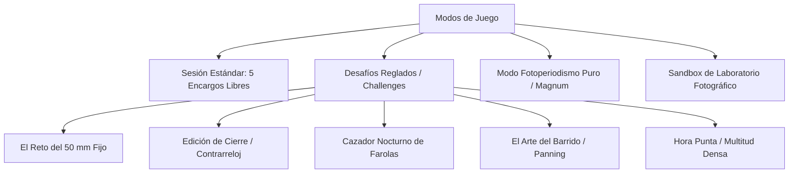

# Especificación Futura: Desafíos Específicos y Modos de Juego

Este documento especifica un conjunto de modos de juego reglados y desafíos fotográficos temáticos diseñados para poner a prueba las habilidades técnicas del jugador.

---

## 1. Modos de Juego Especializados

---

## 2. Detalle de Desafíos Fotográficos

### 2.1 El Reto del 50 mm (*La Disciplina Clásica de Cartier-Bresson*)
- **Regla Estricta**:
  - Objetivo bloqueado a **$50\text{ mm}$ fijo** sin posibilidad de zoom ni cambio de lente.
  - Apertura máxima disponible $f/1.8$.
- **Objetivo Pedagógico**:
  - Forzar al jugador a interiorizar la perspectiva natural y esperar pacientemente a que los viandantes alcancen la distancia adecuada para llenar el encuadre ($r = 4.0\text{ m}$).
- **Bonificación**:
  - Multiplicador de créditos $\times 1.5$ si se logra una composición que cumpla estrictamente la regla de los tercios.

### 2.2 Edición de Cierre (*Paparazzi Contrarreloj*)
- **Regla Estricta**:
  - **Temporizador de 25 segundos** por encargo.
  - La rotativa del periódico cierra edición: si el tiempo expira sin disparar, el encargo cuenta como 0 créditos.
- **Tensión Mecánica**:
  - Obliga a utilizar modos semiautomáticos (AF rápido, prioridad a la apertura) o dominar el enfoque manual por zonas a hiperfocal.

### 2.3 Cazador Nocturno (*Luz en la Oscuridad*)
- **Regla Estricta**:
  - Parque en plena noche ($EV \le 4.0$).
  - El sujeto solo es fotografiable cuando atraviesa el haz de luz de una de las 12 farolas del parque ($r = 0.8\text{ m}$ o $r = 8.6\text{ m}$).
  - Disparar fuera del cono de luz resulta en subexposición severa (menos de 20 puntos).

### 2.4 El Arte del Barrido (*Panning de Velocidad*)
- **Regla Estricta**:
  - Tiempo de obturación forzado a **$1/30\text{ s}$** o **$1/60\text{ s}$**.
  - El objetivo asignado es un **corredor rápido ($v \ge 2.6\text{ m/s}$)**.
- **Criterio de Evaluación Especial**:
  - El shader de revelado penaliza el desenfoque del sujeto pero premia el desenfoque direccional del fondo.
  - El jugador debe rotar la cámara a la misma velocidad angular que el corredor ($\omega = v/r$) durante la exposición para que la persona quede nítida y el fondo aparezca estriado.

### 2.5 Regla de Magnum (*Un Solo Disparo por Encargo*)
- **Regla Estricta**:
  - Se eliminan los reintentos (`shots = 1`).
  - No hay segundas oportunidades: el primer fotograma disparado es el que se revela y envía al cliente.
  - Fomenta el análisis minucioso de la escena antes de pulsar el disparador.

---

## 3. Sistema de Insignias y Medallas de Maestría

Al completar los desafíos con puntuación sobresaliente ($\ge 90$ créditos), el jugador desbloquea galardones permanentes:

| Insignia | Desafío Requerido | Condición Técnica |
|---|---|---|
| **Ojo de Halcón** | El Reto del 50 mm | 5 fotos con $CoC \le 0.020\text{ mm}$ y encuadre en puntos áureos. |
| **Instantánea Decisiva** | Regla de Magnum | Superar los 5 encargos con un único disparo cada uno y media $\ge 85$. |
| **Maestro de la Noche** | Cazador Nocturno | 5 fotos nocturnas con error $|\Delta EV| \le 0.3$ sin quemar altas luces. |
| **Velocidad Pura** | El Arte del Barrido | Corredor nítido a $1/30\text{ s}$ con fondo estriado en más de $40\text{ px}$. |
