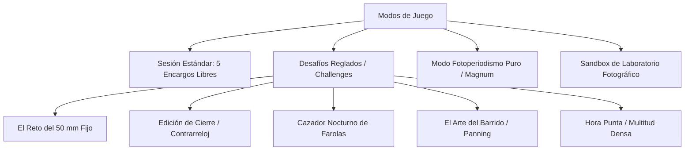

# Especificación Futura: Desafíos Específicos y Modos de Juego

Este documento especifica un conjunto de modos de juego reglados y desafíos fotográficos temáticos diseñados para poner a prueba las habilidades técnicas del jugador.

---

## 1. Modos de Juego Especializados

```mermaid
graph TD
    A[Modos de Juego] --> B[Sesión Estándar: 5 Encargos Libres]
    A --> C[Desafíos Reglados / Challenges]
    A --> D[Modo Fotoperiodismo Puro / Magnum]
    A --> E[Sandbox de Laboratorio Fotográfico]
    
    C --> C1[El Reto del 50 mm Fijo]
    C --> C2[Edición de Cierre / Contrarreloj]
    C --> C3[Cazador Nocturno de Farolas]
    C --> C4[El Arte del Barrido / Panning]
    C --> C5[Hora Punta / Multitud Densa]
```

---

## 2. Detalle de Desafíos Fotográficos

### 2.1 El Reto del 50 mm (*La Disciplina Clásica de Cartier-Bresson*)
- **Regla Estricta**:
  - Objetivo bloqueado a **$50\text{ mm}$ fijo** sin posibilidad de zoom ni cambio de lente.
  - Apertura máxima disponible $f/1.8$.
- **Objetivo Pedagógico**:
  - Forzar al jugador a interiorizar la perspectiva natural y esperar pacientemente a que los viandantes alcancen la distancia adecuada para llenar el encuadre ($r = 4.0\text{ m}$).
- **Bonificación**:
  - Multiplicador de créditos $\times 1.5$ si se logra una composición que cumpla estrictamente la regla de los tercios.

### 2.2 Edición de Cierre (*Paparazzi Contrarreloj*)
- **Regla Estricta**:
  - **Temporizador de 25 segundos** por encargo.
  - La rotativa del periódico cierra edición: si el tiempo expira sin disparar, el encargo cuenta como 0 créditos.
- **Tensión Mecánica**:
  - Obliga a utilizar modos semiautomáticos (AF rápido, prioridad a la apertura) o dominar el enfoque manual por zonas a hiperfocal.

- **Requisito previo en móvil**: con el HUD actual, 25 s no bastan para enfocar en una pantalla táctil ([13 §1](13_INTERFAZ_MOVIL_UTILIZABLE.md)); el contrarreloj solo es justo en móvil tras la interfaz de [13](13_INTERFAZ_MOVIL_UTILIZABLE.md).

### 2.3 Cazador Nocturno (*Luz en la Oscuridad*)
- **Regla Estricta**:
  - Parque en plena noche ($EV \le 4.0$).
  - El sujeto solo es fotografiable cuando atraviesa el haz de luz de una de las 12 farolas del parque ($r = 0.8\text{ m}$ o $r = 8.6\text{ m}$).
  - Disparar fuera del cono de luz resulta en subexposición severa (menos de 20 puntos).

### 2.4 El Arte del Barrido (*Panning de Velocidad*)

> [!IMPORTANT]
> **Depende de [11](11_MECANICAS_BARRIDO_Y_DOF_REALTIME.md)**: hoy el motor no simula el movimiento de la cámara durante la exposición (`take_photo()` anula `pan_velocity` y `Photography.evaluate()` solo considera la velocidad del sujeto), así que este desafío no se puede implementar todavía.
- **Regla Estricta**:
  - Tiempo de obturación forzado a **$1/30\text{ s}$** o **$1/60\text{ s}$**.
  - El objetivo asignado es un **corredor rápido ($v \ge 2.6\text{ m/s}$)**.
- **Criterio de Evaluación Especial**:
  - El shader de revelado penaliza el desenfoque del sujeto pero premia el desenfoque direccional del fondo.
  - El jugador debe rotar la cámara a la misma velocidad angular que el corredor ($\omega = v/r$) durante la exposición para que la persona quede nítida y el fondo aparezca estriado.

### 2.5 Regla de Magnum (*Un Solo Disparo por Encargo*)
- **Regla Estricta**:
  - Se eliminan los reintentos (`shots = 1`).
  - No hay segundas oportunidades: el primer fotograma disparado es el que se revela y envía al cliente.
  - Fomenta el análisis minucioso de la escena antes de pulsar el disparador.

---

## 3. Sistema de Insignias y Medallas de Maestría

> **Estado (02-10-2026): ✅ insignias implementadas** (`scripts/badges.gd`), adaptadas al juego actual, en el que los desafíos de este documento se convirtieron en los niveles del arcade:
>
> | Insignia | Se gana con | Dónde se comprueba |
> |---|---|---|
> | **Ojo de halcón** | 5 fotos con desenfoque ≤ 0,020 mm, el pecho sobre una línea de tercios y 75 puntos o más | `Badges.credits()` |
> | **Instantánea decisiva** | 5 encargos resueltos con su primer disparo y 85 puntos o más | `first_shot` (primera foto de la sesión) |
> | **Maestro de la noche** | 5 fotos nocturnas con error ≤ 0,3 EV y 75 puntos o más | `night` |
> | **Velocidad pura** | Un barrido ([11 §1](11_MECANICAS_BARRIDO_Y_DOF_REALTIME.md)): corredor nítido con el fondo arrastrado ≥ 40 px de 1.280 | `result.panning`, `result.background` |
> | **Graduado de la Academia** | Los cinco exámenes de la Academia ([06 §6.1](06_MODO_TUTOR_ACADEMIA.md)) | `academy.gd`, `Badges.grant()` |
>
> - Cuentan las fotos de encargos del arcade, del tutorial y de la Academia; **no** las del sandbox, las rechazadas ni las de las demostraciones. Contadores y insignias se guardan en `user://insignias.cfg`.
> - Al ganar una suena un aviso y se anuncia en pantalla; **Opciones → Insignias** (`main.gd::show_badges()`) muestra las cinco con su progreso.
> - Solo el juego real las concede (`main.gd::badges_count()`): las suites de prueba y las herramientas de captura, que ejecutan la misma escena, no tocan el fichero del jugador.
> - Deterministas: `Badges.credits(resultado, contexto)` solo lee el resultado y su evidencia. Pruebas en `tests/test_badges.gd` (headless, 24 comprobaciones).
> - Pendiente: los desafíos del §2 como modos propios (hoy los cubren los niveles del arcade) y la condición original de «sin quemar altas luces» de la insignia nocturna.

Al completar los desafíos con puntuación sobresaliente ($\ge 90$ créditos), el jugador desbloquea galardones permanentes:

| Insignia | Desafío Requerido | Condición Técnica |
|---|---|---|
| **Ojo de Halcón** | El Reto del 50 mm | 5 fotos con $CoC \le 0.020\text{ mm}$ y encuadre en puntos áureos. |
| **Instantánea Decisiva** | Regla de Magnum | Superar los 5 encargos con un único disparo cada uno y media $\ge 85$. |
| **Maestro de la Noche** | Cazador Nocturno | 5 fotos nocturnas con error $|\Delta EV| \le 0.3$ sin quemar altas luces. |
| **Velocidad Pura** | El Arte del Barrido | Corredor nítido a $1/30\text{ s}$ con fondo estriado en más de $40\text{ px}$. |

---

## 4. Orden y Criterios de Aceptación

- **Orden**: 2.1 (50 mm fijo), 2.5 (Magnum) y 2.3 (nocturno) primero, porque solo restringen parámetros que ya existen. 2.2 (contrarreloj) va tras [13](13_INTERFAZ_MOVIL_UTILIZABLE.md) y 2.4 (barrido) tras [11](11_MECANICAS_BARRIDO_Y_DOF_REALTIME.md).
- **Criterios de aceptación** (nueva suite `tests/test_challenges.gd`, headless salvo la parte de sesión):
  1. Cada desafío aplica sus restricciones: con el 50 mm, `equipment.zoom() == false` y no se puede cambiar de objetivo; en Magnum, `shots == 1`; en el nocturno, el modo es `night`; en el contrarreloj, el encargo vale 0 si el tiempo expira.
  2. Las insignias se conceden con las condiciones exactas de la tabla §3 y de forma determinista: la misma secuencia de evidencias da las mismas insignias.
  3. Los textos de desafíos e insignias están en `data/textos.es.json`.

### Diez insignias (06-10-2026)

Replanteadas desde cero a petición del usuario: **una por cada cosa que el juego enseña**, ganada haciendo la foto, y dos de recorrido (`scripts/badges.gd`, `tests/test_badges.gd`; pantalla en dos columnas, `main.gd::show_badges()`).

| Insignia (`id`) | Cómo se gana |
|---|---|
| Ojo de halcón (`halcon`) | 5 fotos con los ojos nítidos (0,020 mm o menos), 75 puntos o más. Antes exigía además los tercios; quien ya la tenía la conserva |
| Regla de tercios (`tercios`) | 5 fotos con la persona sobre una línea de tercios y ocupando al menos el 40 % del alto |
| Fotómetro humano (`fotometro`) | 5 fotos en modo manual con 0,3 EV de error o menos |
| Fondo cremoso (`cremoso`) | 5 fotos con la persona nítida y el fondo desenfocado (0,07 mm o más diez metros detrás, como la condición `fondo`) |
| Tiempo detenido (`detenido`) | 3 corredores congelados, sin barrer |
| Barriendo para casa (`velocidad`) | 1 barrido con el fondo arrastrado 40 px o más |
| Maestro de la noche (`noche`) | 5 fotos nocturnas con 0,3 EV de error o menos |
| Instante decisivo (`decisiva`) | 5 encargos resueltos al primer disparo con 85 o más |
| Graduado de la Academia (`graduado`) | Los diez exámenes |
| Fotógrafo de calle (`calle`) | Los 30 niveles del arcade (`main.gd`, al superar el último que faltaba) |

## Pendiente: sacarle partido a lo que la foto enseña ahora (usuario, 07-10-2026)

Con el obturador virtual y el cristal ([SIMULACION §9](../SIMULACION_FOTOGRAFICA.md)) la foto muestra efectos que antes no existían y que **ningún nivel, lección ni insignia pide todavía**. Ideas, de más a menos jugosas (falta decidir si van como niveles nuevos del arcade, como prácticas de las lecciones que ya hay o como un modo de desafíos):

| Idea | Qué pediría | Dónde encaja | Coste |
|---|---|---|---|
| **Estrellas en las farolas** | De noche, cerrar a f/16–22 con una farola en el encuadre: obliga a subir ISO o alargar el tiempo, y aparecen el ruido y la trepidación | Nivel de «La luz» o Maestría; página en la lección de exposición | Bajo (los datos ya están en `evidence.lights`) |
| **El sol dentro o fuera** | El mismo sujeto dos veces: con el sol en el encuadre (velo, poco contraste) y tapándolo o girando un poco | Práctica de la lección de medición; refuerza los niveles 18 y 19 | Bajo |
| **Diafragma dulce** | Máxima nitidez: ni abierto del todo ni a f/22 (difracción). Hoy cerrar nunca tiene coste en nitidez para la nota | Lección de profundidad de campo; condición «nitidez máxima» | Bajo |
| **Larga exposición a pulso** | De noche, aguantar 1/15 con angular frente a subir ISO: ruido contra trepidación, dos fotos comparadas | Práctica en movimiento o exposición | Bajo |
| **Fantasmas** | Estela de gente caminando con el sujeto quieto y nítido (sentado) a 1/8 | Maestría; combina con «Lo que hace» | Medio |
| **Barrido con aire** | Barrido con el corredor en un punto de enfoque lateral (el seguimiento con teclas ya lo permite) | Variante del nivel 26 | Bajo |
| **Película contra sensor** | La misma escena de noche con la TLR a ISO 1600 y con la réflex: grano y halación frente a ruido de color | Lección de cámaras | Bajo |
| **Líneas rectas** | El quiosco sin que se curve: alejarse y usar 50 mm en vez de 24 mm pegado | Lección de objetivos | Medio |
| **Bokeh con forma** | Luces desenfocadas redondas (abierto) o poligonales (cerrado) | Curiosidad en profundidad de campo | Bajo |

Insignias que salen solas: «Cazador de estrellas», «A pulso» (1/15 o más lento sin trepidar), «Contra el sol». Recomendación: empezar por las cuatro primeras filas.
