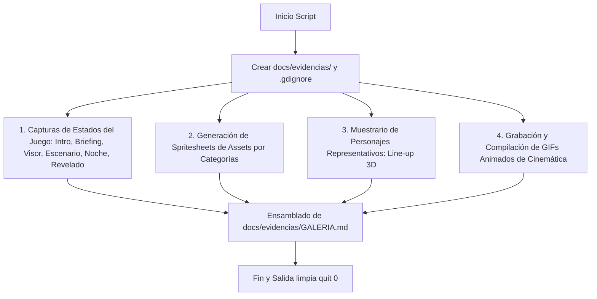
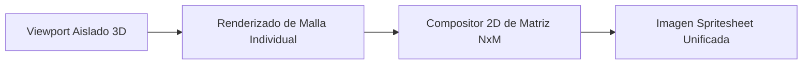
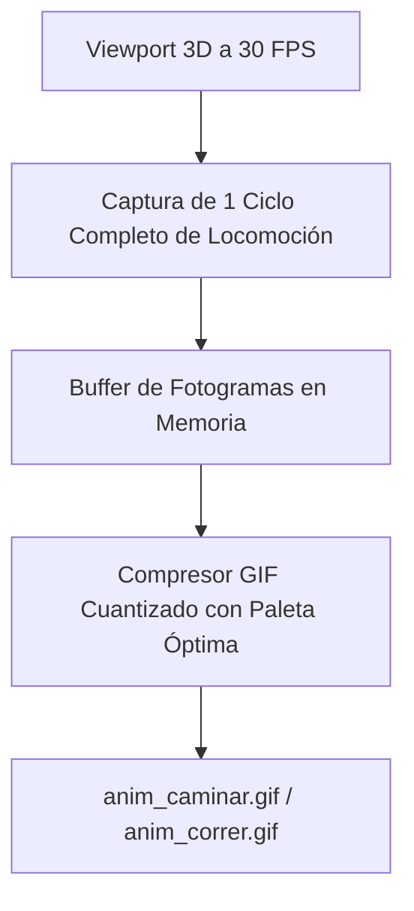

# Especificación Futura: Captura Automática de Evidencias Gráficas

Este documento especifica el diseño y la arquitectura de un script automatizado para la generación de documentación visual actualizada en cada versión de **Proyecto Paparazzi**.

---

## 1. Justificación y Problemática de las Imágenes en Godot

### 1.1 ¿Por qué se generan archivos `.png.import` en `docs/`?
En Godot 4, cualquier archivo de imagen (`.png`, `.jpg`, `.webp`) situado dentro de la carpeta del proyecto (`res://`) es detectado automáticamente por el escáner del motor. Godot:
1. Genera un archivo descriptor de metadatos (`.png.import`).
2. Procesa y recompila la imagen en texturas de GPU comprimidas (`.ctex`) dentro de `.godot/imported/`.
3. Carga e indexa estos archivos en memoria durante el inicio del editor o en compilaciones de exportación.

> **Diagnóstico**: Las imágenes actuales en `docs/` (`inicio.png`, `personajes.png`, `revelado.png`, `visor.png`, `personajes_antes.png` y el gif de 10 MB `marcha-carrera.gif`) **no son necesarias para la lógica del juego** (el juego utiliza colores de vértice `Mesh.ARRAY_COLOR` y UI vectorial procedural sin texturas). Al no tener un archivo de exclusión, Godot malgasta ciclos de importación y ensucia el repositorio con pares `.import`.

### 1.2 Solución con `.gdignore`
Godot dispone de una directiva oficial: cualquier carpeta que contenga un archivo vacío denominado **`.gdignore`** queda completamente excluida del escáner de recursos del motor.
- **Efecto**: Se pueden almacenar cientos de capturas PNG de documentación sin que Godot cree un solo archivo `.import` ni consuma VRAM.

---

## 2. Arquitectura del Script de Evidencias (`tools/capture_evidence.gd`)

Se propone un script automatizado que, con un único comando, recorre el juego, los maniquíes y las piezas procedurales de forma determinista para generar la suite visual completa:

```bash
godot-4 --path . --script tools/capture_evidence.gd
```



---

## 3. Catálogo Completo de Evidencias

### 3.1 Capturas de Estados del Juego (Momentos Clave)

| Archivo Generado | Momento / Estado | Qué Demuestra |
|---|---|---|
| `01_inicio.png` | `mode == "INTRO"` | Pantalla de título, menú principal y tipografías vectoriales. |
| `02_briefing.png` | `mode == "BRIEFING"` | Retrato 3D del objetivo, descripción gramatical y ropa. |
| `03_visor_reflex.png` | `mode == "SEARCH"` | Visor óptico: 9 colimadores AF, cuadrícula áurea, exposímetro y prisma. |
| `04_parque_dia.png` | Cámara a $28\text{ mm}$ | Plaza central, 21 viandantes paseando y telón vegetal denso de fondo. |
| `05_nubes_ev.png` | `weather_time = 7.3` | Nube ocultando el sol, atenuación lumínica de 3 EV y aguja compensada. |
| `06_parque_noche.png` | `is_night = true` | Iluminación de farolas cálidas, conos de luz y sombras dinámicas. |
| `07_revelado.png` | `mode == "RESULT"` | Fotografía procesada con grano, bokeh CoC, trepidación y desglose de puntos. |

---

### 3.2 Hojas de Contacto de Assets en Spritesheet (`sheets/`)

En lugar de dispersar cientos de archivos PNG individuales en el disco, el script monta **hojas de contacto estructuradas** agrupadas por tipo de componente en una cuadrícula con fondo de estudio neutro e iluminación cenital uniforme:



| Archivo de Spritesheet | Categoría de Assets | Elementos Incluidos en la Cuadrícula |
|---|---|---|
| `sheet_mobiliario.png` | Mobiliario Urbano y Parque | Bancos de listones de madera, farolas de forja clásica, papeleras, fuentes de agua, tramos de verja de forja perimetral y bordillos de calzada. |
| `sheet_vegetacion.png` | Flora y Elementos Naturales | Troncos y copas de árboles procedurales (diferentes escalas y follajes), setos densos perimetrales, arbustos de sotobosque y matas florales. |
| `sheet_prendas.png` | Catálogo de Vestimenta | Todas las piezas JSON de `data/piezas/`: torsos (camisetas, camisas, chaquetas), piernas (pantalones, faldas, shorts), prendas deportivas (`sport: true`) y calzado. |
| `sheet_accesorios.png` | Complementos y Atrezo | Gafas de sol, gorras deportivas, sombreros, bolsos cruzados, mochilas y accesorios de mano. |
| `sheet_equipamiento.png` | Cámaras y Ópticas | Cuerpos de cámara (compacta, telemétrica, réflex, futura TLR), catálogo de lentes ($28\text{ mm}$, $50\text{ mm}$, $85\text{ mm}$, $135\text{ mm}$) y colimadores HUD. |

---

### 3.3 Muestrario de Personajes Representativos (`personajes_lineup.png`)

Generación de una imagen panorámica de alta resolución con una selección representativa de personajes del casting del juego, demostrando la consistencia del rig universal de 20 huesos, el coloreado por vértice (`ARRAY_COLOR`) y las reglas de combinación:

1. **Los 4 Perfiles Anatómicos Base**: Maniquíes de referencia (Estándar, Delgado, Robusto e Infantil) con atuendos neutros para verificar proporciones y pesaje rígido.
2. **Diversidad de Vestimentas y Estilos**:
   - Viandante informal de paseo (vaqueros, polo y calzado de calle).
   - Viandante de negocios/formal (chaqueta, pantalón largo y complementos sobrios).
   - Estudiante / Joven (ropa holgada, zapatillas y mochila).
   - Turista (gorra, gafas de sol y bolso en bandolera).
3. **Corredores Deportivos (`sport: true`)**: Demostración de vestimenta atlética ceñida exclusiva (pantalón corto, camiseta técnica transpirable, zapatillas de running), sin prendas pesadas ni accesorios inadecuados.
4. **Vistas Simultáneas**: Cada modelo se muestra en pose frontal natural y con rotación de $45^\circ$ en escorzo.

---

### 3.4 GIFs Animados de Cinemática y Locomoción

Para verificar y documentar las animaciones cinemáticas sin necesidad de reproducir vídeo externo ni abrir el motor, el script exporta animaciones en bucle GIF optimizadas:



| Archivo GIF | Animación Representada | Detalles Técnicos Demostrados |
|---|---|---|
| `anim_caminar.gif` | Ciclo de marcha pausada ($v \approx 0.70\text{ m/s}$) | Demuestra el **deslizamiento nulo** (`drift == 0.000000 m/frame`), la planta del pie horizontal ($y = 0$) durante el apoyo y la suave basculación de cadera/hombros calculada en [scripts/gait.gd](file:///home/ganso/codigo/proyecto-paparazzi/scripts/gait.gd). |
| `anim_correr.gif` | Ciclo de carrera atlética ($v \approx 2.80\text{ m/s}$) | Demuestra la **fase aérea balística** (ambos pies en el aire), la inclinación aerodinámica del torso hacia delante y la flexión pronunciada de rodillas y tobillos. |
| `anim_clima_luz.gif` | Paso de nubes y ciclo de luz diurno/nocturno | Demuestra la atenuación progresiva de 3 EV, la adaptación de la aguja del exposímetro analógico y el encendido crepuscular de farolas con sombras dinámicas. |

---

## 4. Estructura de Salida Recomendada en `docs/evidencias/`

```
docs/
├── evidencias/                  # Carpeta excluida del motor Godot mediante .gdignore
│   ├── .gdignore                # <- Impide que Godot cree archivos .png.import o .gif.import
│   ├── GALERIA.md               # Documento visual con todas las capturas, tablas y GIFs
│   │
│   ├── estados/                 # 1. Estados del juego
│   │   ├── 01_inicio.png
│   │   ├── 02_briefing.png
│   │   ├── 03_visor_reflex.png
│   │   ├── 04_parque_dia.png
│   │   ├── 05_nubes_ev.png
│   │   ├── 06_parque_noche.png
│   │   └── 07_revelado.png
│   │
│   ├── sheets/                  # 2. Hojas de contacto (Spritesheets) por categorías
│   │   ├── sheet_mobiliario.png
│   │   ├── sheet_vegetacion.png
│   │   ├── sheet_prendas.png
│   │   ├── sheet_accesorios.png
│   │   └── sheet_equipamiento.png
│   │
│   ├── personajes/              # 3. Elenco representativo
│   │   └── personajes_lineup.png
│   │
│   └── animaciones/             # 4. GIFs animados de cinemática
│       ├── anim_caminar.gif
│       ├── anim_correr.gif
│       └── anim_clima_luz.gif
```

---

## 5. Implementación Técnica y Generación Autónoma

1. **SubViewports Aislados**: El script levanta un `SubViewport` fuera de pantalla con su propio entorno `World3D`, luz de estudio y cámara ortogonal o en perspectiva de focal larga ($85\text{ mm}$) para evitar distorsiones de perspectiva en las hojas de contacto.
2. **Generación del Spritesheet**:
   - Se procesa secuencialmente cada asset, se obtiene su `Image` desde el viewport mediante `get_texture().get_image()`.
   - Se crea una `Image` destino unificada del tamaño de la cuadrícula (p.ej. $2048 \times 1024$) y se pegan los recortes usando `Image.blit_rect()`.
3. **Exportación de GIFs sin Dependencias Externas**:
   - Se graban los fotogramas del ciclo exacto (p.ej. 30 frames para 1 segundo a 30 FPS).
   - Se compila el GIF animado utilizando el estándar GIF89a (o mediante una llamada ligera por `OS.execute` a herramientas nativas del sistema si estuvieran disponibles, manteniendo fallback de guardado de secuencia limpia).
4. **Actualización Automática de `GALERIA.md`**:
   - El script reescribe `docs/evidencias/GALERIA.md` con enlaces markdown relativos y comentarios explicativos de cada imagen generada.
5. **Cero Polución en el Motor**:
   - Al estar todo alojado bajo `docs/evidencias/` con su correspondiente `.gdignore`, Godot jamás genera `.import` ni consume memoria de GPU por estos archivos.
