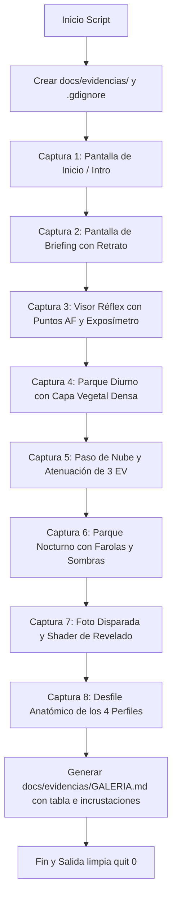

# Especificación Futura: Captura Automática de Evidencias Gráficas

Este documento especifica el diseño y la arquitectura de un script automatizado para la generación de documentación visual actualizada en cada versión de **Proyecto Paparazzi**.

---

## 1. Justificación y Problemática de las Imágenes en Godot

### 1.1 ¿Por qué se generan archivos `.png.import` en `docs/`?
En Godot 4, cualquier archivo de imagen (`.png`, `.jpg`, `.webp`) situado dentro de la carpeta del proyecto (`res://`) es detectado automáticamente por el escáner del motor. Godot:
1. Genera un archivo descriptor de metadatos (`.png.import`).
2. Procesa y recompila la imagen en texturas de GPU comprimidas (`.ctex`) dentro de `.godot/imported/`.
3. Carga e indexa estos archivos en memoria durante el inicio del editor o en compilaciones de exportación.

> **Diagnóstico**: Las imágenes actuales en `docs/` (`inicio.png`, `personajes.png`, `revelado.png`, `visor.png`, `personajes_antes.png` y el gif de 10 MB `marcha-carrera.gif`) **no son necesarias para la lógica del juego** (el juego utiliza colores de vértice `Mesh.ARRAY_COLOR` y UI vectorial procedural sin texturas). Al no tener un archivo de exclusión, Godot malgasta ciclos de importación y ensucia el repositorio con pares `.import`.

### 1.2 Solución con `.gdignore`
Godot dispone de una directiva oficial: cualquier carpeta que contenga un archivo vacío denominado **`.gdignore`** queda completamente excluida del escáner de recursos del motor.
- **Efecto**: Se pueden almacenar cientos de capturas PNG de documentación sin que Godot cree un solo archivo `.import` ni consuma VRAM.

---

## 2. Especificación del Script de Evidencias (`tools/capture_evidence.gd`)

Se propone un script automatizado que, con un único comando, recorre el juego de forma determinista y genera una galería fotográfica completa del estado actual del proyecto:

```bash
godot-4 --path . --script tools/capture_evidence.gd
```



---

## 3. Catálogo de Capturas de la Suite

| Archivo Generado | Momento / Estado | Qué Demuestra |
|---|---|---|
| `01_inicio.png` | `mode == "INTRO"` | Pantalla de título, menú principal y tipografías. |
| `02_briefing.png` | `mode == "BRIEFING"` | Retrato 3D del objetivo, descripción gramatical y ropa. |
| `03_visor_reflex.png` | `mode == "SEARCH"` | Visor óptico: 9 colimadores AF, cuadrícula áurea, exposímetro y prisma. |
| `04_parque_dia.png` | Cámara abierta a $28\text{ mm}$ | Plaza central, 21 viandantes paseando y telón vegetal denso de fondo. |
| `05_nubes_ev.png` | `weather_time = 7.3` | Nube ocultando el sol, atenuación lumínica y aguja de EV compensada. |
| `06_parque_noche.png` | `is_night = true` | Iluminación de farolas cálidas, conos de luz y sombras dinámicas en el suelo. |
| `07_revelado.png` | `mode == "RESULT"` | Fotografía procesada con grano, bokeh CoC, trepidación y desglose de puntuación. |
| `08_perfiles_arte.png` | Alineación de catálogo | Los 4 perfiles anatómicos (estándar, delgado, robusto, niño) con vestimentas. |

---

## 4. Estructura de Salida Recomendada

```
docs/
├── evidencias/                  # Carpeta protegida contra importaciones de Godot
│   ├── .gdignore                # <- Impide que Godot genere archivos .import
│   ├── GALERIA.md               # Documento markdown que visualiza las capturas
│   ├── 01_inicio.png
│   ├── 02_briefing.png
│   ├── 03_visor_reflex.png
│   ├── 04_parque_dia.png
│   ├── 05_nubes_ev.png
│   ├── 06_parque_noche.png
│   ├── 07_revelado.png
│   └── 08_perfiles_arte.png
```

---

## 5. Beneficios para el Ciclo de Desarrollo

1. **Documentación Gráfica Siempre al Día**: Tras cualquier cambio en la paleta de colores, la vegetación, la iluminación o los personajes, un único comando regenera toda la evidencia visual en 10 segundos.
2. **Cero Impacto en el Motor**: Gracias a `.gdignore`, el motor Godot no genera archivos `.png.import` ni gasta tiempo en indexar texturas que solo están destinadas a la lectura humana o de IA.
3. **Control Visual de Regresiones**: Permite comparar visualmente las capturas de una versión frente a la anterior para detectar fallos estéticos antes de cerrar una tarea.
