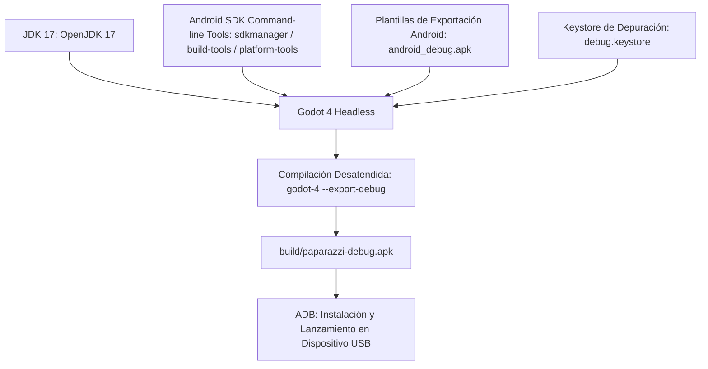

# Especificación Futura: Exportación Automatizada a Android (.apk) para Pruebas en Móviles

Este documento detalla la arquitectura, el toolchain y los scripts necesarios para la compilación, empaquetado y despliegue automatizado de archivos APK de prueba en terminales Android para **Proyecto Paparazzi**.

---

## 1. Justificación y Objetivos de la Plataforma Móvil

Probar el juego en hardware móvil real es esencial para validar varios pilares interactivos que no pueden evaluarse fidedignamente en un entorno de escritorio:

1. **Ergonomía Táctil**: Validar el control a dos pulgares especificado en [docs/futuro/07_VISORES_REALISTAS_Y_MOVIL.md](file:///home/ganso/codigo/afotando/docs/futuro/07_VISORES_REALISTAS_Y_MOVIL.md) (rueda de enfoque, diafragma y botón de dos fases *half-press*).
2. **Respuesta Háptica del Obturador**: Confirmar la sensación física de vibración corta del teléfono al enfocar (*lock*) y al disparar el obturador.
3. **Apuntado Opcional por Giroscopio (*Motion Aiming*)**: Evaluar si la rotación del móvil usando los sensores de acelerómetro y giroscopio proporciona una experiencia inmersiva para encuadrar y seguir a los sujetos.
4. **Rendimiento en GPUs Móviles**: Medir tasa de cuadros (60 FPS sostenidos), consumo de batería y temperaturas bajo el backend `gl_compatibility` (OpenGL ES 3.0 / ANGLE).

---

## 2. Requisitos de Entorno y Toolchain

Para permitir la exportación desatendida desde línea de comandos (CLI) o pipelines de integración continua (CI/CD):



### 2.1 Paquetes Requeridos en el Sistema Host
- **Java**: `openjdk-17-jdk` (requerido por `gradle` y las herramientas de Android SDK).
- **Android SDK**:
  - `cmdline-tools;latest`
  - `platform-tools` (incluye el binario `adb` para comunicación con el dispositivo).
  - `build-tools;34.0.0` (incluye `apksigner` y `zipalign`).
  - `platforms;android-34` (Android 14 API level 34).
- **Godot Export Templates**: Plantillas oficiales de Godot 4.4+ situadas en `~/.local/share/godot/export_templates/<versión>/`.

---

## 3. Configuración del Preset de Exportación (`export_presets.cfg`)

Se incorporará un perfil de exportación `Android Debug` optimizado para pruebas rápidas sin firma de producción:

```ini
[preset.0]
name="Android"
platform="Android"
runnable=true
dedicated_server=false
custom_features=""
export_filter="all_resources"
include_filter=""
exclude_filter=""
export_path="build/paparazzi-debug.apk"

[preset.0.options]
custom_template/debug=""
custom_template/release=""
binary_format/embed_pck=false
package/unique_name="org.ganso.proyectopaparazzi"
package/name="Proyecto Paparazzi"
package/signed=true
package/architecture/arm64_v8a=true
package/architecture/armeabi_v7a=false
package/architecture/x86_64=false
package/architecture/x86=false
package/screen_orientation=sensor_landscape
screen/keep_screen_on=true
graphics/opengl_es3=true
permissions/vibrate=true
permissions/camera=false
permissions/record_audio=false
permissions/access_fine_location=false
keystore/debug="~/.android/debug.keystore"
keystore/debug_user="androiddebugkey"
keystore/debug_password="android"
```

### Invariantes de Configuración Móvil
- **Arquitectura de 64 bits (`arm64-v8a`)**: Maximiza el rendimiento de la cinemática de `gait.gd` y cálculos de oclusión física vectorial.
- **Orientación Bloqueada a Horizontal (`sensor_landscape`)**: Mantiene la proporción cinemática **16:9** nativa del proyecto (`1280x720`) sin distorsión visual.
- **Permisos Estrictamente Mínimos**:
  - `permissions/vibrate = true`: Necesario para el feedback háptico del disparador.
  - Cero permisos intrusivos: no requiere acceso a cámara física, micrófonos ni geolocalización.

---

## 4. Script de Automatización CLI (`tools/export_android.sh`)

Se diseñará un script bash ejecutable que automatiza de principio a fin la compilación, comprobación de dependencias y despliegue inmediato:

```bash
#!/usr/bin/env bash
set -euo pipefail

echo "==> [Paparazzi] Comprobando entorno de exportación Android..."

# 1. Comprobar Android SDK y Java
if [ -z "${ANDROID_HOME:-}" ]; then
    export ANDROID_HOME="$HOME/Android/Sdk"
fi

if [ ! -d "$ANDROID_HOME" ]; then
    echo "ERROR: ANDROID_HOME no encontrado en $ANDROID_HOME"
    exit 1
fi

# 2. Asegurar keystore de depuración
KEYSTORE_PATH="$HOME/.android/debug.keystore"
if [ ! -f "$KEYSTORE_PATH" ]; then
    echo "==> Generando debug.keystore local..."
    mkdir -p "$(dirname "$KEYSTORE_PATH")"
    keytool -genkey -v -keystore "$KEYSTORE_PATH" -storepass android \
        -alias androiddebugkey -keypass android -keyalg RSA -keysize 2048 \
        -validity 10000 -dname "CN=Android Debug,O=Android,C=US"
fi

# 3. Crear directorio de salida
mkdir -p build

# 4. Compilar APK en modo headless
echo "==> Exportando APK con Godot..."
godot-4 --headless --path . --export-debug "Android" build/paparazzi-debug.apk

echo "==> Compilación finalizada con éxito: build/paparazzi-debug.apk"

# 5. Si hay un dispositivo conectado por ADB, desplegar y arrancar
if command -v adb >/dev/null 2>&1; then
    DEVICE_COUNT=$(adb devices | grep -v "List of devices" | grep "device$" | wc -l || true)
    if [ "$DEVICE_COUNT" -gt 0 ]; then
        echo "==> Dispositivo Android detectado. Instalando y ejecutando..."
        adb install -r build/paparazzi-debug.apk
        adb shell am start -n org.ganso.proyectopaparazzi/com.godot.game.GodotApp
        echo "==> ¡Juego lanzado en el terminal móvil!"
    else
        echo "==> No se detectó dispositivo conectado por ADB (conecta tu teléfono por USB para instalación directa)."
    fi
fi
```

---

## 5. Rendimiento y Viabilidad en Dispositivos Móviles

Las decisiones arquitectónicas del proyecto benefician directamente la ejecución móvil:

| Factor de Rendimiento | Parámetro en Proyecto Paparazzi | Impacto en Dispositivo Móvil |
|---|---|---|
| **Carga de Geometría** | 57.532 triángulos en escena | **Excelente**: Cualquier SoC moderno (Snapdragon 7/8, Dimensity, Tensor) renderiza $>1.000.000$ polígonos/frame a 60 FPS sin sobrecalentamiento. |
| **Draw Calls** | 22 draw calls totales (1 parque estático + 21 personajes) | **Óptimo**: Las APIs móviles sufren con draw calls elevados ($>100$). Con 22 draw calls, la sobrecarga del driver es insignificante. |
| **Consumo de Memoria (VRAM)** | $\approx 42.68\text{ MiB}$ | **Mínimo**: Deja libre más del 95% de la memoria gráfica compartida para el sistema operativo. |
| **Renderizado de Sombras** | Atlas de 2048 con filtrado suave | Posibilidad de ajustar a atlas de 1024 en móviles de gama baja para ahorro térmico. |
| **Shaders de Revelado (`develop.gdshader`)** | Bokeh CoC y grano fotográfico | El procesado se realiza **solo en el instante de disparar** (en `RESULT`), por lo que durante la búsqueda activa a $60\text{ FPS}$ no hay coste de fragment shader. |

---

## 6. Hoja de Ruta de Implementación

1. **Fase 1: Configuración de Plantillas y Preset**: Registrar `export_presets.cfg` con el identificador `org.ganso.proyectopaparazzi`.
2. **Fase 2: Script `export_android.sh`**: Implementar y validar el script con comprobación automática de `debug.keystore`.
3. **Fase 3: Controles Táctiles en Pantalla**: Integrar la capa de UI táctil descrita en [docs/futuro/07_VISORES_REALISTAS_Y_MOVIL.md](file:///home/ganso/codigo/afotando/docs/futuro/07_VISORES_REALISTAS_Y_MOVIL.md) condicionada a `OS.has_feature("mobile")`.
4. **Fase 4: Integración CI/CD (GitHub Actions)**: Flujo de trabajo automatizado que genera el APK firmado con clave de debug en cada commit etiquetado y lo adjunta como artefacto descargable.
