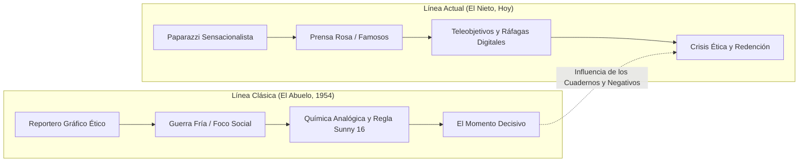

# Especificación Futura: Modo Historia Dual «El Legado del Paparazzi»

Este documento formaliza la visión narrativa fundacional de 2012 ([PROYECTO_PAPARAZZI_2012.md](../origen/PROYECTO_PAPARAZZI_2012.md)), estructurando una campaña narrativa completa en dos líneas temporales entrelazadas: **La Época Dorada del Fotorreportaje (1950)** y **La Selva de los Paparazzi Modernos (Actualidad)**.

---

## 1. Núcleo Dramático y Filosófico

### Premisa Argumental
El protagonista contemporáneo trabaja para agencias de corazón persiguiendo celebridades y personalidades públicas con cámaras de alta velocidad. Su motivación es meramente económica y su relación con los sujetos es hostil y voyeurista.

Tras heredar el viejo maletín fotográfico, notas de campo y negativos de su abuelo —un legendario fotógrafo de calle y fotorreportero de la posguerra—, la campaña alterna capítulos entre ambos fotógrafos. A través de la disciplina visual y el respeto por el sujeto que su abuelo practicaba con película química, el nieto redescubre el alma de la fotografía, culminando en su renuncia al sensacionalismo para abrazar el fotoperiodismo honesto.

---

## 2. Diferencias Mecánicas y Técnicas entre Épocas

| Dimensión Técnica | Línea del Abuelo (1950-1960) | Línea del Nieto (Actualidad) |
|---|---|---|
| **Cámaras disponibles** | Telemétrica mecánica (Meica L9) y TLR (Rolleiflex 6×6). | Réflex digital profesional (DSLR / Mirrorless). |
| **Enfoque** | Exclusivamente manual por coincidencia de imágenes o visor de cintura invertido. | Autofocus de punto único o matriz de 9 colimadores. |
| **Sensibilidad / Película** | Carrete químico B&W (ISO 100 o 400 fijo durante todo el rollo). | Sensor digital con ISO dinámico (100 a 6400). |
| **Capacidad de disparo** | Rollo limitado a **12 exposiciones** (120) o **36 exposiciones** (35 mm). Sin reintentos infinitos. | Tarjeta de memoria virtualmente ilimitada; penalización solo por tiempo. |
| **Medición de luz** | Sin fotómetro incorporado: regla *Sunny 16* o fotómetro de mano (tabla fija de EV). | Exposímetro TTL matricial con aguja digital en visor. |
| **Estética de revelado** | Escala de grises con alto contraste argentífero, grano químico simulado y viñeteo natural. | Color digital calibrado, neutral y nítido. |

---

## 3. Estructura de la Campaña (Capítulos Alternos)

### Acto I: Inicios y Fundamentos
- **Capítulo 1A (El Nieto)**: *El Parque de los Rumores.*
  - Misión: Fotografiar a una actriz de incógnito en el parque usando teleobjetivo zoom ($70\text{--}135\text{ mm}$) en modo totalmente automático.
  - Aprendizaje: Mecánicas básicas de encuadre, localización y zoom.
- **Capítulo 1B (El Abuelo, 1952)**: *El Encuentro en el Bulevar.*
  - Misión: Documentar a un diplomático extranjero saliendo de una embajada con un $50\text{ mm}$ fijo y carrete de 12 fotos.
  - Aprendizaje: Enfoque manual por zonas, anticipación de movimiento y disciplina de encuadre.

### Acto II: La Presión del Entorno y la Técnica
- **Capítulo 2A (El Nieto)**: *Cazando en la Noche.*
  - Misión: Retrato robado en la terraza del parque con poca luz. Forzar ISO alto y lidiar con el ruido del sensor.
- **Capítulo 2B (El Abuelo, 1956)**: *Bajo la Lluvia y Niebla.*
  - Misión: Capturar el paso de una manifestación pacífica. Poca luz y película ISO 100. Obligación de usar trípode o velocidades lentas ($1/15\text{ s}$) arriesgando trepidación.

### Acto III: El Límite Ético y el Barrido
- **Capítulo 3A (El Nieto)**: *Persecución en el Parque.*
  - Misión: Fotografiar a una figura pública corriendo para evadir a la prensa.
  - Tensión: Si se le acorrala o se dispara a quemarropa, el sujeto huye o se tapa la cara (fallo de misión). Se exige un **barrido (*panning*) limpio a $1/30\text{ s}$** desde la distancia.
- **Capítulo 3B (El Abuelo, 1958)**: *El Atleta en la Pista.*
  - Misión: Capturar el instante del salto de longitud en unos juegos obreros con cámara TLR de cintura (visor invertido).

### Acto IV: La Redención
- **Capítulo 4A (El Abuelo, 1965)**: *El Momento Decisivo.*
  - Misión: La última gran fotografía del abuelo: una imagen poética de reconciliación social en el centro de la plaza. Un solo fotograma restante en el rollo.
- **Capítulo 4B (El Nieto, Desenlace)**: *La Foto que No se Publicó.*
  - Situación: El nieto tiene la oportunidad de tomar una foto íntima y degradante de una celebridad en crisis o documentar su labor social genuina.
  - Elección de encuadre: La foto honesta y respetuosa otorga la máxima puntuación moral, cerrando el álbum familiar con orgullo.

---

## 4. Requisitos de Implementación Técnica en Godot

1. **Estado de Campaña (`campaign.gd`)**:
   - Gestor de misiones lineales con desbloqueo de cartas/diarios entre niveles.
   - Restricción estricta de equipamiento según el personaje activo (`grandpa` vs `grandson`).
2. **Shader Monocromo de Emulsión Clásica (`classic_film.gdshader`)**:
   - Conversión de luminancia espectral a blanco y negro químico (sensibilidad ortocromática/pancromática).
   - Generación de grano procedural perlin/ruido analógico acoplado a la densidad de negros.
3. **Contador de Disparos Restantes de Carrete**:
   - Visualización mecánica de película restante (`shots_left`) en el HUD del visor analógico.
