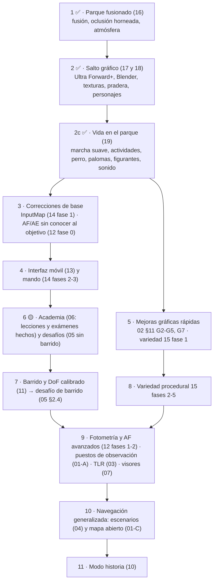

# Banco de Funcionalidades Futuras — Proyecto Paparazzi

Este directorio contiene las especificaciones de diseño, análisis de viabilidad técnica y propuestas arquitectónicas para futuras expansiones de **Proyecto Paparazzi**.

> [!IMPORTANT]
> **Paso 1 completado: [16 · Parque fusionado, oclusión horneada y atmósfera](16_PARQUE_ILUSTRADO_QUICK_WIN.md).** **Paso 2 completado (salvo optimización): [17 · Salto gráfico](17_SALTO_GRAFICO_ULTRA.md)**: Ultra en Forward+ a 1440p nativos, objetos de Blender en `hd` y `lo`, suelo texturizado, pradera con quiosco y estanque, maniquíes con texturas de madera y tela y hierba al viento. **Paso 2c completado: [19 · Vida en el parque](19_VIDA_EN_EL_PARQUE.md)**: marcha suave sin temblequeo, bancos, actividades con objetos de mano, perro, palomas, figurantes y sonido ambiente. **Paso 6 adelantado y en curso: [06 · Academia](06_MODO_TUTOR_ACADEMIA.md)**, con teoría, demostración, práctica y examen de cinco lecciones. **Siguiente: paso 3**, la migración a `InputMap` ([14](14_SOPORTE_GAMEPAD.md) fase 1) y el AF/AE que no conoce al objetivo ([12](12_MODOS_FOTOMETRIA_Y_AUTOFOCUS.md) fase 0). El orden completo está en la [hoja de ruta (§4)](#4-hoja-de-ruta-recomendada).

> **Al final de los pendientes (decisión del usuario, 02-10-2026):** el **modo Historia** y la **versión OpenGL y de móviles** (`gl_compatibility`, Android, interfaz táctil de [13](13_INTERFAZ_MOVIL_UTILIZABLE.md), iOS) quedan para el futuro, después de todo lo demás. Mientras tanto no se les dedica trabajo nuevo: basta con que el parque clásico siga arrancando en `gl_compatibility` (prueba de humo) para no romper lo que ya hay.

---

## 1. Matriz de Estado de Funcionalidades Solicitadas

Evaluación del estado actual de la lista de ideas y requisitos frente al código base implementado:

| Propuesta | Estado | Documento de Especificación / Dónde vive |
|---|:---:|---|
| **Parque Fusionado, Oclusión Horneada y Atmósfera** | ✅ **Completado** | [16_PARQUE_ILUSTRADO_QUICK_WIN.md](16_PARQUE_ILUSTRADO_QUICK_WIN.md): `park.gd::merge_static_meshes()`, `vertex_color_material()`, `ground_occlusion()` y `update_lamp_shadows()`; comprobado en `tests/test_game.gd`; comparativas en `docs/evidencias/comparativas/parque_ilustrado_*.png`. El toon y el contorno en el parque se probaron y se descartaron. |
| **Salto Gráfico: Ultra en Forward+, Blender y Parque del Mockup** | ✅ **Completado** (queda la optimización de su §6) | [17_SALTO_GRAFICO_ULTRA.md](17_SALTO_GRAFICO_ULTRA.md): `tools/blender/build_park_assets.py`, `tools/texturas/build_textures.py`, `scripts/park_assets.gd`, shaders `park_ground`, `park_water`, `park_spray`, `park_windows` y `park_grass`, `data/piezas_hd/`; capturas en `docs/evidencias/ultra/`. |
| **Personajes y Ropa en Blender** | ✅ **Completado** | [18_PERSONAJES_BLENDER.md](18_PERSONAJES_BLENDER.md): `tools/blender/build_characters.py`, formas `skinned` con pesos suaves, `hides`, huesos secundarios con `SpringBoneSimulator3D`, falda simulada, pelucas; evidencias con `tools/capture_characters.gd`. |
| **Vida en el Parque** (actividades, bancos, perro, palomas, figurantes, sonido, marcha sin temblequeo) | ✅ **Completado** | [19_VIDA_EN_EL_PARQUE.md](19_VIDA_EN_EL_PARQUE.md): `main.gd::walk_step()`, `plan_stop()`, `approach_bench()`, `gait.gd::sit()` y `activity()`, `person.gd::make_prop()`, `scripts/dog.gd`, `scripts/pigeons.gd`, `scripts/extras.gd`, `scripts/ambience.gd`, `tools/audio/build_ambience.py`; pruebas `tests/test_crowd.gd` y `tests/test_park_life.gd`; hoja `10_actividades`. |
| **Barrido (*panning*)** | ✅ **Completado** (mecánica, nota y revelado; falta el desafío) | [11 §1](11_MECANICAS_BARRIDO_Y_DOF_REALTIME.md): `main.gd::track_camera_turn()`, `camera_omega` en la evidencia, `Photography.evaluate()` (`panning`, `background`), `develop.gdshader` (`pan`, `subject_box`); `tests/test_photography.gd`. |
| **Sesión del 02-10-2026** (arranque, cielo, pradera y vida) | ✅ **Completado** | Arranque de 7,7 s a 3,4 s ([ESCENARIO §4](../ESCENARIO_Y_RENDIMIENTO.md), `-- --timing`); cielo propio `shaders/park_sky.gdshader` ([ESCENARIO §3.3](../ESCENARIO_Y_RENDIMIENTO.md)); palomas en la verja, perro pequeño, patos (`scripts/ducks.gd`), mesas de pícnic y fuente de beber con dos figurantes sentados ([19 §9](19_VIDA_EN_EL_PARQUE.md)); estilo de paso por persona ([15 P4](15_VARIEDAD_PROCEDURAL.md)); filtrado anisótropo ([23](23_GRAFICOS_PERSONALIZADOS.md)); pantalla de carga e icono ([20](20_INTERFAZ_CLARA.md)); vibración del mando ([22](22_MENU_TUTORIAL_MANDO.md)); falda sentada sin tiras y ruido del LCD sin trama. |
| **Efectos de sonido reales** | ⏳ **Pendiente de recibir los sonidos del usuario** (lista enviada el 03-10-2026) | [24_SONIDOS_NECESARIOS.md](24_SONIDOS_NECESARIOS.md): 54 sonidos con duración, bucle, canales y variaciones. |
| **Gráficos personalizados y opciones de pantalla** | ✅ **Completado** | [23_GRAFICOS_PERSONALIZADOS.md](23_GRAFICOS_PERSONALIZADOS.md): `scripts/graphics.gd`, pantalla de gráficos de `main.gd`. |
| **Menú de modos, tutorial, mando y ayudas por dispositivo** | ✅ **Completado** | [22_MENU_TUTORIAL_MANDO.md](22_MENU_TUTORIAL_MANDO.md): `scripts/main_menu.gd`, `scripts/tutorial.gd`, `scripts/input_glyphs.gd`, `scripts/glyph_label.gd`, `scripts/pad_diagram.gd`, `scripts/keyboard_diagram.gd`. |
| **Modo arcade, condiciones por nivel y TLR** | ✅ **Completado** | [21_ARCADE_CONDICIONES_TLR.md](21_ARCADE_CONDICIONES_TLR.md): sustituye a la sesión de 5 encargos; menú Arcade / Sandbox / Academia; enfoque juzgado en los ojos. |
| **Interfaz clara** (menú sobre el parque tras cristal esmerilado, estilo claro en todo el juego) | ✅ **Completado** | [20_INTERFAZ_CLARA.md](20_INTERFAZ_CLARA.md): `scripts/main_menu.gd`, `scripts/ui_style.gd`, `shaders/frosted_glass.gdshader`, fuentes Quicksand y Roboto. |
| **Protagonista Controlable y Mapa Abierto** | 🟡 **Parque grande hecho** (Alternativa C como escenario adicional) | [01_MAPA_ABIERTO_Y_PROTAGONISTA.md](01_MAPA_ABIERTO_Y_PROTAGONISTA.md) §6: `scripts/park_grande.gd`, `scripts/crowd_graph.gd`, paseo libre con WASD y cámara al ojo como interruptor; `tests/test_big_park.gd`. |
| **Mejora Gráfica Canónica (Toon), Perfiles Gráficos y Modo Diorama (Ultra)** | 🟡 **Parcialmente hecho** | Personajes con anatomía de maniquí de madera, rótulas visibles, sombreado toon y contorno de tinta (`shaders/cel_shading.gdshader`, `shaders/cel_outline.gdshader`) y menú de perfiles (Bajo, Medio, Alto, Ultra) en `scripts/main.gd` y `scripts/park.gd`, todos en `gl_compatibility`. Pendiente: toon en el parque ([16](16_PARQUE_ILUSTRADO_QUICK_WIN.md)), perfiles con presupuestos propios y Ultra en Forward+ (§10), banco ampliado de mejoras (§11), animaciones Quaternius y 7 capas. Doc: [02_ESTILO_VISUAL_Y_POLIGONOS.md](02_ESTILO_VISUAL_Y_POLIGONOS.md). |
| **Variedad Procedural de Vegetación y Personajes** | 📝 *Propuesta futura* | [15_VARIEDAD_PROCEDURAL.md](15_VARIEDAD_PROCEDURAL.md) |
| **Nuevas Cámaras: TLR (Visor invertido), Móvil, Gran Formato** | 🟡 **TLR hecha** (móvil y gran formato pendientes) | [03_NUEVAS_CAMARAS_Y_TLR.md](03_NUEVAS_CAMARAS_Y_TLR.md); TLR en [21 §3](21_ARCADE_CONDICIONES_TLR.md): cuerpo 3 de `equipment.gd`, `viewfinder_lens.gdshader` (`mirror`, `square`, `loupe`), `camera_body.gd::draw_tlr()`. |
| **Mayor Diversidad de Escenarios Urbanos** | 📝 *Propuesta futura* (aplazada) | [04_DIVERSIDAD_ESCENARIOS.md](04_DIVERSIDAD_ESCENARIOS.md) |
| **Desafíos Específicos y Modos de Juego** | 🟡 **Arcade y condiciones hechos** (faltan insignias y barrido) | [05_DESAFIOS_Y_MODOS_JUEGO.md](05_DESAFIOS_Y_MODOS_JUEGO.md); arcade de 20 niveles con tiempo, disparos, equipo fijo y condiciones en [21](21_ARCADE_CONDICIONES_TLR.md): `scripts/arcade.gd`, `scripts/conditions.gd`, `tests/test_arcade.gd`, `tools/arcade_solver.gd`. |
| **Modo "Tutor de Fotografía" y Academia** | ✅ **Completado** (exámenes el 02-10-2026, §6.1) | [06_MODO_TUTOR_ACADEMIA.md](06_MODO_TUTOR_ACADEMIA.md) §6: `scripts/academy.gd` y `academy_diagram.gd`; cinco lecciones con teoría sobre el visor, demostración guiada con subtítulos y práctica con tareas; examen visible como «no disponible»; `tests/test_academy.gd`; evidencias en `docs/evidencias/academia/`. |
| **Visores Realistas de Carcasa y Efectos de Cielo** | 🟡 **Visores hechos** (falta el cielo) | [07_VISORES_REALISTAS_Y_MOVIL.md](07_VISORES_REALISTAS_Y_MOVIL.md) §5: `scripts/camera_body.gd`, interfaz de cámara con barras plegables, réflex con LED rojos, telemétrica con marco y paralaje, compacta con LCD; `tests/test_finders.gd`. El §2 queda sustituido por [13](13_INTERFAZ_MOVIL_UTILIZABLE.md) y el §3 (sol, sombras de nubes) sigue pendiente. |
| **Cámaras de Carrete con ISO Fijo** | ✅ **Ya implementado** | Activo en `scripts/equipment.gd:15` (`film`), bloquea ISO manual. Documentado en [docs/EQUIPAMIENTO_Y_OPTICAS.md](../EQUIPAMIENTO_Y_OPTICAS.md). |
| **Ropa Deportiva Exclusiva para Corredores** | ✅ **Ya implementado** | Validado en `scripts/casting.gd:18` y `tests/test_expansion.gd:38` (sin accesorios sueltos). Documentado en [docs/PERSONAJES_Y_CINEMATICA.md](../PERSONAJES_Y_CINEMATICA.md). |
| **Nubes y Sol Visibles con Atenuación Lumínica** | 🟡 **Parcialmente hecho** | Mallas de nubes dinámicas y reducción de ~3,5 EV en la luz solar directa activas (`park.gd:301` `build_clouds()`, `park.gd:325` `update_weather()`). Mejoras visuales en sol y cielo en [07_VISORES_REALISTAS_Y_MOVIL.md](07_VISORES_REALISTAS_Y_MOVIL.md) §3. |
| **Variedad de Árboles y Elementos en el Escenario** | ✅ **Completado** (primera fase) | 4 especies botánicas estilizadas (roble, ciprés, tilo, arce dorado) con variación procedural individual (rotación 360°, inclinación, jitter 3D, cuello radicular, escala y micro-modulación cromática) y arbustos facetados en `park.gd`. La ampliación a unas 10 especies por gramática y estaciones está en [15 §3](15_VARIEDAD_PROCEDURAL.md). |
| **Ampliación de Accesorios de Vestimenta** | 🟡 **Parcialmente hecho** | Objetos de mano ligados a actividades (teléfono, periódico, cámara, café, bolsa de pan) en [19](19_VIDA_EN_EL_PARQUE.md); siguen pendientes los de vestir (paraguas, mochilas, gafas) de [02 §7](02_ESTILO_VISUAL_Y_POLIGONOS.md) y [15 §4 P4](15_VARIEDAD_PROCEDURAL.md). |
| **Captura Automática de Evidencias Gráficas** | ✅ **Ya implementado** | Suite completa en `tools/run_evidence.sh` y `tools/capture_evidence.gd`. Galería viva en [docs/evidencias/GALERIA.md](../evidencias/GALERIA.md). Doc: [08_CAPTURA_AUTOMATICA_DE_EVIDENCIAS.md](08_CAPTURA_AUTOMATICA_DE_EVIDENCIAS.md). |
| **Exportación Automatizada a Android (.apk)** | 🟡 **Parcialmente hecho** | Fases 1 y 2 completadas: preset `Android` en `export_presets.cfg`, script `tools/export_android.sh` y APK versionado en `build/paparazzi-debug.apk`, validado por `tests/test_export.gd`. La fase 3 (controles táctiles) pasa a [13](13_INTERFAZ_MOVIL_UTILIZABLE.md); queda la CI. Doc: [09_EXPORTACION_AUTOMATIZADA_ANDROID_APK.md](09_EXPORTACION_AUTOMATIZADA_ANDROID_APK.md). |
| **Modo Historia Dual: El Legado del Paparazzi** | 📝 *Propuesta futura* (aplazada; reglas de tono en §5) | [10_MODO_HISTORIA_DUAL_LEGADO.md](10_MODO_HISTORIA_DUAL_LEGADO.md) |
| **Mecánicas de Barrido (Panning) y Previsualización DoF** | 📝 *Propuesta futura* | [11_MECANICAS_BARRIDO_Y_DOF_REALTIME.md](11_MECANICAS_BARRIDO_Y_DOF_REALTIME.md). Requiere simular el movimiento de cámara durante la exposición (§1.2.1). |
| **Modos de Fotometría Avanzada y Autofoco (AF-C / AF-S)** | 🟡 **Parcialmente hecho** | Compensación de exposición $\pm\text{EV}$ activa en `main.gd` y `equipment.gd`. Fase 0 hecha (30-09-2026): el AF matricial y la exposición automática ya no conocen al objetivo ([12 §2.1](12_MODOS_FOTOMETRIA_Y_AUTOFOCUS.md), `tests/test_automatisms.gd`). §4.4 descartado. Doc: [12_MODOS_FOTOMETRIA_Y_AUTOFOCUS.md](12_MODOS_FOTOMETRIA_Y_AUTOFOCUS.md). |
| **Interfaz Móvil Utilizable (enfoque manual táctil, controles a dos pulgares)** | 📝 *Propuesta futura* · **prioritaria** | [13_INTERFAZ_MOVIL_UTILIZABLE.md](13_INTERFAZ_MOVIL_UTILIZABLE.md) |
| **Soporte de Gamepad (InputMap, gatillo de dos fases, menús navegables)** | 🟡 **Mando jugable** (falta migrar todo a `InputMap` y vibración) — [22 §3](22_MENU_TUTORIAL_MANDO.md) | [14_SOPORTE_GAMEPAD.md](14_SOPORTE_GAMEPAD.md) |

---

## 2. Estimación Comparativa de Complejidad y Esfuerzo

Estimaciones revisadas contra el código. Las dependencias son las reales: una especificación no puede empezarse antes que las que cita.

| Especificación / Futurible | Complejidad | Factores Clave de Esfuerzo | Impacto Arquitectónico | Dependencias |
|---|:---:|---|---|---|
| [16. Parque Fusionado y Oclusión](16_PARQUE_ILUSTRADO_QUICK_WIN.md) | ✅ **Completado** | Parque fusionado en 38 superficies con colores de vértice y sombreado suave, oclusión horneada (pie, copas y contacto en el suelo), niebla moderada, sombras nítidas, luna, FXAA y farolas por hora y perfil. | `park.gd`, `main.gd`, `cel_outline.gdshader` (grosor mínimo). | Ninguna |
| [17. Salto Gráfico Ultra](17_SALTO_GRAFICO_ULTRA.md) | ✅ **Completado** | Perfiles con renderizador y reinicio, Forward+ en Ultra, proceso de Blender con niveles `hd`/`lo`, texturas procedurales, pradera, agua, maniquíes `hd` y hierba instanciada. Pendiente: VRAM de `gl_compatibility` | `park.gd`, `main.gd`, `person.gd`, shaders, `tools/` | [16](16_PARQUE_ILUSTRADO_QUICK_WIN.md) |
| [01. Mapa Abierto y Protagonista Controlable](01_MAPA_ABIERTO_Y_PROTAGONISTA.md) | A: **S** · B: **M** · C: **XL** | A: 6 puestos fijos con transición. C: `CharacterBody3D`, navegación por grafo y reacciones sociales. | A: cámara. C: modificación nuclear de `main.gd` y de la navegación. | [13](13_INTERFAZ_MOVIL_UTILIZABLE.md), [14](14_SOPORTE_GAMEPAD.md). C comparte la navegación de 04 |
| [02. Estilo Toon, Perfiles Gráficos y Diorama](02_ESTILO_VISUAL_Y_POLIGONOS.md) | Toon: **M** · Perfiles/Ultra: **M** · Diorama: **XL** | Presupuestos por perfil, Ultra en Forward+ con reinicio, reglas para que ningún perfil altere la puntuación, banco de 16 mejoras (§11), multi-LOD y Diorama PBR. | Shaders, `park.gd`, `build_catalog.py`, `override.cfg`. | [16](16_PARQUE_ILUSTRADO_QUICK_WIN.md) antes del resto del toon; [15](15_VARIEDAD_PROCEDURAL.md) fase 3 para el multi-LOD |
| [03. Nuevas Cámaras y TLR](03_NUEVAS_CAMARAS_Y_TLR.md) | **Media (M)** | Inversión especular de imagen y controles, evaluación en formato 1:1, rollo de 12 y ampliación del catálogo. | Cámara, `photography.gd` (máscara 1:1) y revelado. | [14](14_SOPORTE_GAMEPAD.md) fase 1 (inversión de controles) |
| [04. Diversidad de Escenarios Urbanos](04_DIVERSIDAD_ESCENARIOS.md) | **Muy Alta (XL)** | Recorridos lineales, sala y elipse en lugar de carriles circulares; distancias de zona por escenario; presupuestos por perfil. | Sustituye `LANES`/`LANE_BOUNDS` y el steering cilíndrico. | Navegación por grafo de [01 §3 C](01_MAPA_ABIERTO_Y_PROTAGONISTA.md) |
| [05. Desafíos y Modos de Juego](05_DESAFIOS_Y_MODOS_JUEGO.md) | **Baja-Media (S-M)** | Temporizadores, restricciones de equipo, condiciones de puntuación e insignias deterministas. | Capa de juego aislada. | 2.2 → [13](13_INTERFAZ_MOVIL_UTILIZABLE.md) en móvil; 2.4 → [11](11_MECANICAS_BARRIDO_Y_DOF_REALTIME.md) |
| [06. Academia y Tutor de Fotografía](06_MODO_TUTOR_ACADEMIA.md) | **Baja-Media (S-M)** | Reutiliza los diagnósticos `lines` de `Photography.evaluate()` y el sandbox; añade lecciones, umbrales y textos. | Interfaz y máquina de estados. | Ninguna |
| [07. Visores Realistas y Efectos de Cielo](07_VISORES_REALISTAS_Y_MOVIL.md) | **Media (M)** | Ocular, cristal esmerilado, LCD de 7 segmentos, marcos de paralaje, disco solar, sombras de nube y hora dorada continua. | Capa de visor (`viewfinder.gd`) y `park.gd`. | Ninguna |
| [08. Captura Automática de Evidencias](08_CAPTURA_AUTOMATICA_DE_EVIDENCIAS.md) | ✅ **Completado** | Implementado en `tools/capture_evidence.gd`, `tools/build_sheets.py` y orquestador `tools/run_evidence.sh`. Galería activa en `docs/evidencias/`. | Aislado en `tools/`. | Ninguna |
| [09. Exportación Automatizada a Android](09_EXPORTACION_AUTOMATIZADA_ANDROID_APK.md) | 🟡 **Fases 1-2 completadas** | Queda la CI (fase 4), con caché de plantillas de 1,2 GB y, preferiblemente, publicación del APK como artefacto o *release*. | Infraestructura de build. | SDK de Android |
| [10. Modo Historia Dual: El Legado](10_MODO_HISTORIA_DUAL_LEGADO.md) | **Alta (L)** | Campaña por actos, restricciones de época, shader de emulsión B&W y reglas de tono que impiden premiar el acoso. | Máquina de estados (`campaign.gd`) y shaders. | [03](03_NUEVAS_CAMARAS_Y_TLR.md), [04](04_DIVERSIDAD_ESCENARIOS.md), [11](11_MECANICAS_BARRIDO_Y_DOF_REALTIME.md) |
| [11. Barrido (Panning) y Previsualización DoF](11_MECANICAS_BARRIDO_Y_DOF_REALTIME.md) | **Media-Alta (M-L)** | Historial de velocidad angular de cámara en la evidencia, evaluación diferencial, estriado sintetizado en el revelado y DoF en vivo calibrado por perfil. | `take_photo()`, `photography.gd`, `develop.gdshader`. | [14](14_SOPORTE_GAMEPAD.md) fase 1 (acción `previsualizar_dof`) |
| [12. Modos de Fotometría Avanzada y Autofoco](12_MODOS_FOTOMETRIA_Y_AUTOFOCUS.md) | **Media (M)** | Fase 0: AF/AE sin conocer al objetivo. Después: medición puntual, ponderada y matricial, AF-S con bloqueo y AF-C opcional. | `select_matrix_point()`, `update_meter()`, `auto_expose()`. | Fase 1 → [13](13_INTERFAZ_MOVIL_UTILIZABLE.md)/[14](14_SOPORTE_GAMEPAD.md) (disparador de dos fases) |
| [13. Interfaz Móvil Utilizable](13_INTERFAZ_MOVIL_UTILIZABLE.md) | **Media (M)** | Visor fijo 16:9 con carriles laterales, controles ≥ 84 px, rueda de foco relativa a la profundidad de campo, enfoque por zonas, pellizco solo para zoom y disparador táctil de dos fases. | HUD (`build_ui()`), gestos y `SubViewportContainer`. | Recomendable [14](14_SOPORTE_GAMEPAD.md) fase 1 |
| [14. Soporte de Gamepad](14_SOPORTE_GAMEPAD.md) | **Media (M)** | Migración a `InputMap`, sticks con curva y escala por focal, gatillo analógico de dos fases, menús navegables e iconos por dispositivo. | Toda la capa de entrada de `main.gd`. | Ninguna |
| [15. Variedad Procedural](15_VARIEDAD_PROCEDURAL.md) | **Media-Alta (M-L)** en 5 fases | Paleta ampliada y rayas por anillos, árboles por gramática con estaciones, morfología continua, prendas paramétricas y hierba instanciada. | `park.gd`, `casting.gd`, generador de piezas en GDScript. | [16](16_PARQUE_ILUSTRADO_QUICK_WIN.md) |

### Criterios de Calificación de Complejidad
- **Baja (S)**: Tarea autocontenida de 1 a 2 días de desarrollo; sin riesgo de regresión en la física, óptica o navegación existente.
- **Media (M)**: Requiere modificaciones en módulos específicos (visores, shaders, lógica de reglas de juego), con pruebas unitarias focalizadas.
- **Alta (L)**: Demanda remodelado masivo de mallas o rediseño estructural de escenarios y carriles; requiere rebalanceo de presupuestos de GPU y VRAM.
- **Muy Alta (XL)**: Cambio de paradigma arquitectónico fundamental (del modelo paparazzi estático/raíles a un juego de acción y exploración libre con controles simultáneos de personaje y óptica).

---

## 3. Índice de Especificaciones Técnicas

1. [01_MAPA_ABIERTO_Y_PROTAGONISTA.md](01_MAPA_ABIERTO_Y_PROTAGONISTA.md) — Protagonista controlable, navegación libre, alternativas de raíles/bancos, esquema de controles alineado con `InputMap` y criterios de aceptación de la Alternativa A.
2. [02_ESTILO_VISUAL_Y_POLIGONOS.md](02_ESTILO_VISUAL_Y_POLIGONOS.md) — Estilo visual canónico Toon, **perfiles gráficos con presupuestos por perfil** (Ultra en Forward+ para GPUs potentes, con límites justificados), reglas de coherencia para que ningún perfil altere la puntuación, **banco ampliado de mejoras gráficas** (§11) y Modo Diorama PBR como estilo alternativo de Ultra.
3. [03_NUEVAS_CAMARAS_Y_TLR.md](03_NUEVAS_CAMARAS_Y_TLR.md) — Cámaras de formato medio TLR con visor de cintura invertido horizontalmente, smartphones computacionales y banco óptico 4×5.
4. [04_DIVERSIDAD_ESCENARIOS.md](04_DIVERSIDAD_ESCENARIOS.md) — Nuevas localizaciones (Bulevar comercial, Estación de tren, Museo, Pista deportiva) y su dependencia de una navegación generalizada.
5. [05_DESAFIOS_Y_MODOS_JUEGO.md](05_DESAFIOS_Y_MODOS_JUEGO.md) — Modos de juego reglados (Reto de focal fija, Paparazzi contrarreloj, Cazador nocturno, Barrido, Regla de Magnum) e insignias.
6. [06_MODO_TUTOR_ACADEMIA.md](06_MODO_TUTOR_ACADEMIA.md) — Academia interactiva de fotografía: **lecciones con teoría, demostración y práctica implementadas** (01-10-2026); la evaluación por examen queda pendiente.
7. [07_VISORES_REALISTAS_Y_MOVIL.md](07_VISORES_REALISTAS_Y_MOVIL.md) — **Visores realistas implementados** (01-10-2026: ocular, LED, LCD, paralaje de la telemétrica); quedan las mejoras de cielo, sol y nubes.
8. [08_CAPTURA_AUTOMATICA_DE_EVIDENCIAS.md](08_CAPTURA_AUTOMATICA_DE_EVIDENCIAS.md) — Suite de capturas automáticas de hitos, spritesheets de assets por categoría, muestrario de personajes representativos, GIFs animados de cinemática y prevención de `.import` mediante `.gdignore`.
9. [09_EXPORTACION_AUTOMATIZADA_ANDROID_APK.md](09_EXPORTACION_AUTOMATIZADA_ANDROID_APK.md) — Pipeline de compilación y empaquetado desatendido a APK de depuración para pruebas en hardware móvil real vía CLI y ADB.
10. [10_MODO_HISTORIA_DUAL_LEGADO.md](10_MODO_HISTORIA_DUAL_LEGADO.md) — Campaña narrativa en dos líneas temporales alternas (el fotorreportero clásico de 1950 vs. el paparazzi moderno), dilemas éticos, reglas de tono y restricciones de época.
11. [11_MECANICAS_BARRIDO_Y_DOF_REALTIME.md](11_MECANICAS_BARRIDO_Y_DOF_REALTIME.md) — Algoritmo de arrastre angular y trepidación diferencial para barrido (*panning*), prerrequisito de simulación temporal de la exposición y previsualización de profundidad de campo calibrada.
12. [12_MODOS_FOTOMETRIA_Y_AUTOFOCUS.md](12_MODOS_FOTOMETRIA_Y_AUTOFOCUS.md) — Corrección de los automatismos que conocen al objetivo, modos de medición TTL (matricial, puntual, ponderada al centro), compensación de exposición $\pm\text{EV}$ y modos de autofoco (AF-S, AF-C, AF-A).
13. [13_INTERFAZ_MOVIL_UTILIZABLE.md](13_INTERFAZ_MOVIL_UTILIZABLE.md) — HUD a dos pulgares, rueda de foco relativa a la profundidad de campo, enfoque por zonas, gestos sin conflictos y disparador táctil de dos fases, con cifras medidas en un móvil de 6,1".
14. [14_SOPORTE_GAMEPAD.md](14_SOPORTE_GAMEPAD.md) — Mapa de acciones `InputMap` único, sticks con escala por focal, gatillo analógico de dos fases, menús navegables e iconos por dispositivo.
15. [15_VARIEDAD_PROCEDURAL.md](15_VARIEDAD_PROCEDURAL.md) — Árboles por gramática de especies y estaciones, arbustos, césped, paleta ampliada con estampados, morfología continua y prendas paramétricas nombrables.
16. [16_PARQUE_ILUSTRADO_QUICK_WIN.md](16_PARQUE_ILUSTRADO_QUICK_WIN.md) — **Paso 1 (completado)**: parque fusionado con colores de vértice y oclusión horneada, niebla moderada, sombras nítidas y luz nocturna corregida. Incluye el intento descartado de toon en todo el parque.
17. [17_SALTO_GRAFICO_ULTRA.md](17_SALTO_GRAFICO_ULTRA.md) — **Paso 2 (completado)**: Ultra en Forward+ a resolución nativa, objetos de Blender por script en dos niveles de detalle, texturas procedurales, pradera con quiosco y estanque, maniquíes `hd` texturizados y hierba al viento.
18. [18_PERSONAJES_BLENDER.md](18_PERSONAJES_BLENDER.md) — **Paso 2b (completado)**: maniquí, ropa, pelucas y accesorios modelados en Blender, pesos suaves en la ropa, tela y pelo con muelles y caída simulada.
19. [19_VIDA_EN_EL_PARQUE.md](19_VIDA_EN_EL_PARQUE.md) — **Paso 2c (completado)**: marcha suave sin temblequeo, bancos y paradas con actividades y objetos de mano, perro con correa, palomas, figurantes de la pradera y sonido ambiente sintetizado.

---

## 4. Hoja de Ruta Recomendada

Orden de trabajo derivado de la revisión del banco contra el código (29-09-2026), con el salto gráfico ([17](17_SALTO_GRAFICO_ULTRA.md)) adelantado a paso 2 y la vida en el parque ([19](19_VIDA_EN_EL_PARQUE.md)) intercalada como 2c por decisión del usuario (30-09-2026). Absorbe buena parte de los antiguos pasos 4 y 7 (02 §10–11 y 15 fases 2 y 5). Cada paso respeta las dependencias de §2.

| Paso | Contenido | Por qué en este orden |
|:---:|---|---|
| **1 ✅** | [16 · Parque fusionado y oclusión](16_PARQUE_ILUSTRADO_QUICK_WIN.md) | El mayor salto visual por coste. Además arregla el cuello de botella de draw calls que lastra a todos los perfiles, sobre todo en móvil. |
| **2 ✅** | [17 · Salto gráfico](17_SALTO_GRAFICO_ULTRA.md) y [18 · Personajes en Blender](18_PERSONAJES_BLENDER.md) | Prioridad del usuario: acabado profesional cercano al mockup, con Ultra aprovechando una GPU de escritorio. Absorbe los antiguos perfiles ampliados (02 §10). |
| **2c ✅** | [19 · Vida en el parque](19_VIDA_EN_EL_PARQUE.md) | Encargo del usuario (30-09-2026, «bloque 4»): un parque que parezca habitado antes de seguir con las mecánicas. |
| 3 | [14](14_SOPORTE_GAMEPAD.md) fase 1 y [12](12_MODOS_FOTOMETRIA_Y_AUTOFOCUS.md) fase 0 | El mapa único de controles evita que cada especificación invente teclas. El AF matricial que delata al objetivo es un atajo del juego actual. |
| 4 | [13](13_INTERFAZ_MOVIL_UTILIZABLE.md) y [14](14_SOPORTE_GAMEPAD.md) fases 2-3 | Hay un APK en el repositorio, pero el enfoque manual es inviable en móvil. Móvil y mando comparten el disparador de dos fases. |
| 5 | [02 §11](02_ESTILO_VISUAL_Y_POLIGONOS.md) G2–G5 y G7, y [15](15_VARIEDAD_PROCEDURAL.md) fase 1 | Mejoras de coste S que se apoyan en los colores de vértice del paso 1. |
| 6 🟡 | [06](06_MODO_TUTOR_ACADEMIA.md) y [05](05_DESAFIOS_Y_MODOS_JUEGO.md) (salvo 2.4) | Mucho valor de juego con bajo riesgo; la base (`lines`, sandbox) ya existe. **Adelantado por el usuario (30-09-2026)**: la Academia tiene ya teoría, demostración y práctica; faltan sus exámenes y los desafíos de 05. |
| 7 | [11](11_MECANICAS_BARRIDO_Y_DOF_REALTIME.md), después [05 §2.4](05_DESAFIOS_Y_MODOS_JUEGO.md) | El barrido necesita simular la exposición en el tiempo. |
| 8 | [15](15_VARIEDAD_PROCEDURAL.md) fases 2-5 | Variedad sobre la base de Blender ya asentada. |
| 9 | [12](12_MODOS_FOTOMETRIA_Y_AUTOFOCUS.md) fases 1-2, [01](01_MAPA_ABIERTO_Y_PROTAGONISTA.md)-A, [03](03_NUEVAS_CAMARAS_Y_TLR.md) (TLR) y [07](07_VISORES_REALISTAS_Y_MOVIL.md) | Profundizan en la fotografía sobre controles ya estables. |
| 10 | [04](04_DIVERSIDAD_ESCENARIOS.md) y [01](01_MAPA_ABIERTO_Y_PROTAGONISTA.md)-C | Comparten la sustitución de la navegación cilíndrica: se hacen juntos. |
| 11 | [10](10_MODO_HISTORIA_DUAL_LEGADO.md) | Depende de 03, 04 y 11, y de sus reglas de tono. |

La numeración se corrigió el 30-09-2026: la tabla repetía el 2 y el diagrama el 3 tras intercalar el salto gráfico.

### Reglas para toda especificación nueva
- Incluir una sección de **criterios de aceptación y pruebas**, porque AGENTS.md §3.4 obliga a ampliar `tests/`.
- Declarar sus controles como acciones del mapa único de [14 §2](14_SOPORTE_GAMEPAD.md).
- Indicar en qué perfiles gráficos se activa y cumplir las reglas de coherencia de [02 §10.3](02_ESTILO_VISUAL_Y_POLIGONOS.md).
- Las cifras medidas viven en [TESTS_Y_VERIFICACION.md §5](../TESTS_Y_VERIFICACION.md). Si una especificación las cita para justificarse, debe enlazar ahí y no mantener una copia propia como fuente.
