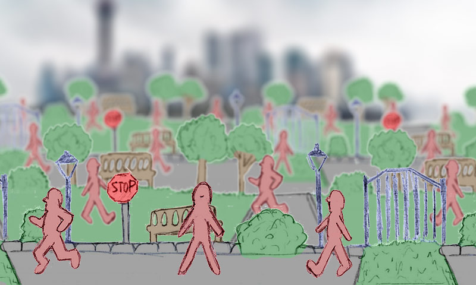
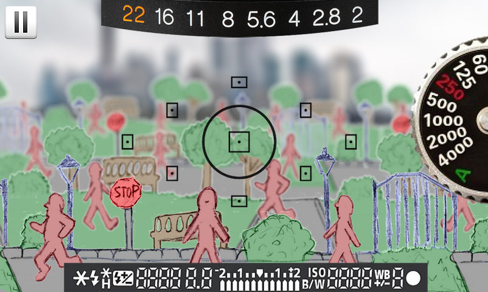
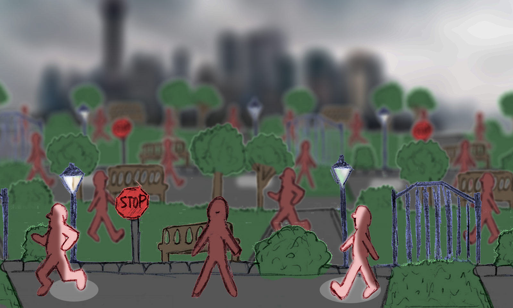
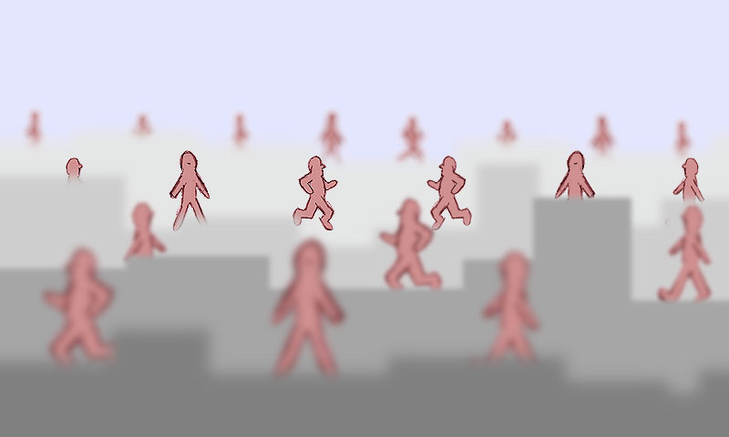
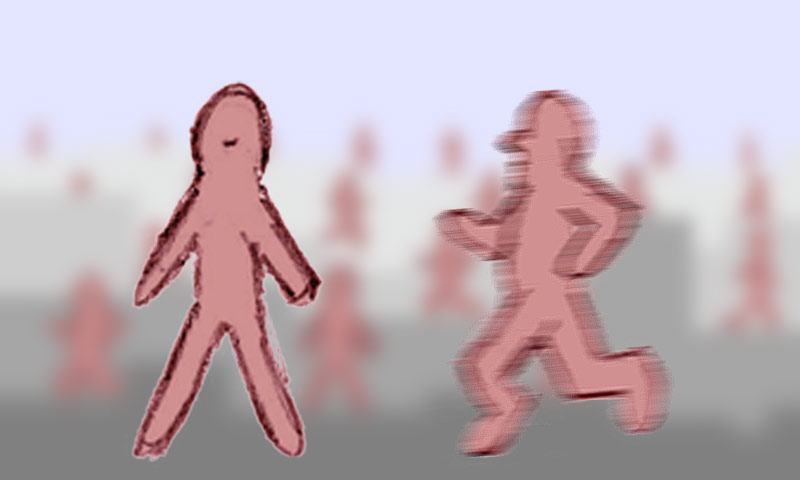

# Proyecto «Paparazzi» (Documento Original, Mayo 2012)

> **Origen**: Publicado originalmente en [el nido del ganso](https://blog.ganso.org/proyectos/proyecto-paparazzi.html) por Javi Prieto (7 de mayo de 2012).  
> **Licencia**: Creative Commons ([Reconocimiento – No Comercial – Compartir Igual 4.0](https://creativecommons.org/licenses/by-nc-sa/4.0/)).  
> **Propósito de importación**: Este documento constituye la visión fundacional y el documento de diseño conceptual original del proyecto. Se preserva íntegramente como referencia histórica y fuente de ideas para la evolución del motor.

---

---

## 1. Idea general

> Realizar un juego casual de **buscar y localizar personajes en un escenario**, utilizando una **cámara fotográfica**. Evolucionar la idea utilizando cada vez más técnicas fotográficas, hasta que la aplicación sirva como **tutorial de fotografía**.

Así, con este mismo motor se proponen **3 proyectos**:

1. **Un juego casual**, estilo «*Busca a Wally*», en el que eres un **fotógrafo** y tienes que hacerle una foto a tu objetivo, haciendo zoom sobre él y pulsando el obturador.  
   *Concepto*: Juegos de francotiradores / libros de buscar personajes.
2. **Un juego técnico de fotografía**, donde tienes que manejar todos los parámetros necesarios para hacer la foto perfecta.  
   *Evolución*: Puede ser parte del primer proyecto, una segunda parte, o un juego independiente.
3. **Un tutor interactivo** para **aprender técnica fotográfica**.  
   *Concepto*: Simuladores de cámaras (ej. *CameraSim*).

A día de hoy, excepto que alguien sea capaz de localizarlo e indicarme lo contrario, no existe ninguna implementación de estas ideas.

---

## 2. Conceptos clave

### Juegos
- **Público casual: Accesibilidad** — Esencialmente, sólo tenemos que hacer zoom sobre una imagen en movimiento hasta encontrar al sujeto buscado y pulsar un botón.
- **Público especializado: Técnica Fotográfica** — La fotografía es la metáfora detrás del juego arcade, pero en los modos técnicos es vital para entenderlo y jugarlo.
- **Evolución suave en dificultad y técnica**: Si el jugador quiere y está convenientemente motivado, pasará de ser casual a técnico sin darse cuenta.

### Tutor de Fotografía
- El motor del juego se utiliza para demostrar en la práctica los conceptos más técnicos: parámetros de exposición, tipos de cámara, funcionamiento de las mismas, métodos de enfoque, etc.
- Se trata de conseguir acercar a cualquier público la experiencia de trabajar con todo tipo de equipos fotográficos.
- Para conceptos sin aplicación práctica habría que desarrollar otro tipo de contenido interactivo (*inicialmente no contemplado, aunque podría añadirse a modo de «enciclopedia fotográfica» dentro de la aplicación*).

---

## 3. Plataformas de destino

- **Sistemas operativos**: Android / iOS
- **Dispositivos**: Móviles y tablets

---

## 4. Estilo gráfico

- Es muy importante que podamos jugar con **muchos planos simultáneamente**, para poder trabajar con profundidad de campo. Por eso, el punto de vista tiene que ser relativamente bajo.
- En cada momento sólo vemos una parte del decorado, que hará scroll en todas direcciones.
- Está pensado como un **2D con muchas capas** (*como un decorado de ópera con planos superpuestos y los personajes andando entre ellos*), aunque también se puede optar por un decorado **3D** (*la filosofía puede ser similar a los juegos de francotiradores*).
- Tienen que poder aparecer **muchos personajes en pantalla simultáneamente** (suficiente para que haga difícil aislar a alguno en el encuadre). Normalmente se desplazarán horizontalmente dentro de su plano (andando o corriendo), aunque de vez en cuando se pararán o tomarán otras posturas.
- **Los personajes se crean aleatoriamente** utilizando muchos trozos prediseñados (cabeza, piernas, ropa, etc.), dándole variedad al aspecto visual y haciendo más difícil localizar a nuestros objetivos reales (como un «*Busca a Wally*»).
- En modo historia, o en determinados ejercicios de la escuela, sí hay personajes prediseñados para darle continuidad a la narración.
- Es muy importante (porque es un concepto básico a desarrollar) tener un **motor de enfoque/desenfoque** de sprites y decorados que funcione muy rápido y que permita muchos niveles, diferenciándose claramente los objetos enfocados de los que no lo están. Debe soportar dos tipos de distorsión: **de desenfoque** y **de movimiento**.
- Si se llega a un diseño adecuado, sería bueno tener **distintas ambientaciones** (p.ej. escenarios urbanos y naturales). Esto permitiría tratar varios tipos de fotografía, pero también jugar más fácilmente con distintas velocidades y tipos de movimiento.
- En un momento dado podría haber **fases con animales**, para tratar la **fotografía de naturaleza**.

---

## 5. Mecanismo de juego

- Todo lo expuesto es válido tanto para los juegos como para los ejemplos de la escuela de fotografía.
- Tienes que realizar un número determinado de fotografías a un determinado objetivo en un tiempo limitado, con determinados condicionantes según el nivel:
  - *Número de fotos posibles limitado («tamaño del carrete»)...*
  - *Que aparezca sólo ese personaje en el encuadre (con un mínimo de nitidez)...*
  - *Que se haya tomado con el zoom al máximo...*
  - *Que le acompañen un número determinado de personas en el encuadre...*
  - *Otros conceptos fotográficos (desenfoque, nitidez, etc.)...*
  - *etc.*
- Dentro del mismo nivel, después de cada foto correcta se modifican algunos parámetros para la siguiente imagen (colocación de los personajes, iluminación de la escena, etc.).
- El **concepto** es el mismo de los juegos de **francotiradores**, aunque el manejo será más natural y más parecido a la filosofía normal de trabajo con móviles.
- Nos movemos **como si recorriésemos una imagen** en cualquier aplicación, desplazando con los dedos («moviendo la cámara») y ampliando y reduciendo con dos dedos («cambiando el nivel de zoom», dentro de las capacidades de nuestro equipo fotográfico).
  - *El manejo tiene que ser tan natural para cualquiera que tenga móvil que no requiera ningún tipo de aprendizaje.*
  - Se puede considerar, en niveles altos de ampliación, complementar con el acelerómetro del móvil para hacer un ajuste más fino.
- Hay un **modo normal** (sólo con los marcadores imprescindibles para la partida), y un **modo técnico**, con todos los parámetros ajustables de la cámara (el número de ajustes disponibles puede depender de la dificultad del nivel). En cualquier momento podemos pasar de uno a otro.

### Métodos de enfoque
Según el nivel, el enfoque se realizará por:
- **Autofocus**: habrá que anticipar los disparos y seguir al personaje con el movimiento hasta que la cámara haga el disparo. Habrá que estudiar cómo funciona mejor:
  - *Un click enfoca, y otro click hace la foto (o doble click para hacerla sin esperar, si confiamos en que sea válida)*
  - *Un click enfoca, y un botón hace la foto*
- **Enfoque manual**: se podría implementar con un *slider*, o quizá con un gesto con varios dedos.

### Desafíos basados en conceptos fotográficos
En cada nivel, se puede pedir utilizar conceptos fotográficos, bien por exigencia o porque ayuden a realizar la tarea:
- *Bajar la profundidad de campo para difuminar al resto.*
- *Usar un tiempo de exposición lento y seguir al personaje para que el resto salga movido (barrido).*
- *Colocar al personaje en un punto de interés de la composición (regla de los tercios, áurea, etc.).*
- *Calcular a mano los parámetros de la exposición.*
- *Etc.*

---

## 6. Iluminación

- Al principio no aparece, y paulatinamente va tomando importancia hasta que tengamos que controlarla perfectamente en cada disparo (en los niveles más difíciles, donde trabajaremos en modo manual).
- En los puntos mal iluminados, los **tiempos de exposición serán altos**, por lo que habrá que tener mucho pulso para hacer las fotos, y además tendremos que abrir mucho la lente, lo cual nos puede generar más problemas de enfoque.
- La **iluminación** puede ser general, pero sería ideal que haya elementos que iluminen a los sujetos, como en el ejemplo superior (farolas, focos, fuentes de luz direccionales).

---

## 7. Profundidad de campo

- En este ejemplo, hay un **plano enfocado** casi al fondo.
- Dependiendo de las exigencias de profundidad de campo del nivel, se podría reenfocar, o hacer la foto directamente confiando en que el nivel de enfoque del punto seleccionado sea suficiente.
- También se podría variar la apertura para controlar el rango de nitidez.

---

## 8. Movimiento y barrido

- Aquí hemos hecho zoom sobre un plano para hacer la foto, y tenemos un sujeto estático y otro en movimiento.
- Si hacemos la foto tal cual, el estático saldrá correctamente, pero el que corre tendrá **desenfoque de movimiento**.
- Según el tipo de juego, se nos pedirá:
  - *Seguir al personaje que corre con el dedo mientras hacemos la foto (barrido).*
  - *Elegir una velocidad de obturación más rápida, si la luz y el equipo lo permiten, abriendo la lente si es necesario (entrando a jugar la profundidad de campo).*

---

## 9. Modos de juego

### A. Arcade
- Cámara y objetivos estándar en modo automático.
- Niveles de dificultad creciente por:
  - *Número de planos y de elementos en pantalla.*
  - *Tiempo y número de fotos disponibles.*
  - *Trepidación (seguir el movimiento del personaje al disparar, mientras trabaja el autofocus y dura el tiempo de exposición).*
  - *Exigencia de composiciones concretas (marcar un punto de interés y que el personaje esté ubicado sobre él).*
  - *Etc. → aunque nunca se exige ningún conocimiento: tiene que poder disfrutarlo igualmente cualquiera que no tenga ningún interés en la fotografía.*

### B. Paparazzi (Modo Historia)
- Se podría desarrollar sobre un guion similar a éste:
  - Cuenta en paralelo la historia de un paparazzi de poca monta con dudas sobre la ética de su trabajo, en paralelo a la de su abuelo, uno de los primeros reporteros gráficos.
  - Con el tiempo, el protagonista va avanzando en trabajos más importantes (reportaje social, de guerra, etc.) hasta que al final llega a los mismos logros que su abuelo.
  - Las últimas fases de cada línea argumental serán cómo cada uno de ellos llega al culmen de su carrera.
  - Así, se pueden alternar conceptos de fotografía clásica y actual.
- A medida que avanzamos entran en juego parámetros técnicos que no están en el arcade:
  - *Otros tipos de cámara.*
  - *Otros objetivos.*
  - *Modos semiautomáticos y manuales.*
  - *Conceptos de trepidación, movimiento, etc.*

### C. Escuela (Tutor de Fotografía)
- Una aplicación para aprender fotografía, que puede ser independiente u ofrecerse como sistema de ayuda (*quizá se pueda ir desbloqueando a medida que aparezcan los términos en el juego*).

### D. Sandbox
- Permite configurar todos los parámetros técnicos y definir el nivel (densidad de personajes, tipo de escenario, objetivos, etc.).

---

## 10. Conceptos fotográficos en la progresión

- Nunca deben presuponerse, y deben aparecer muy paulatinamente para ir asimilándolos poco a poco.
- En el modo arcade no se exige ningún conocimiento, y no se mencionarán directamente palabras técnicas.
- En el modo paparazzi se introducen con más detalle, pero tratando de que estén dentro de la historia (*«Te han mandado a cubrir una guerra y se te ha estropeado tu cámara. Has conseguido que te presten una Meica L9 telemétrica con un 50mm, así que tendrás que esperar a que tu objetivo esté muy cerca para no fallar el encuadre»*).
- La idea es que al finalizar el modo paparazzi se hayan asimilado bastantes de ellos.
- Es básico manejar el **triángulo de exposición**, con los tres parámetros básicos a contemplar: **apertura, velocidad y sensibilidad**.

---

## 11. Ejemplos de tipos de cámara y su impacto en el juego

- **Réflex o CSC**: La más común, y la plataforma para desarrollar los conceptos básicos. Autofocus rápido, objetivos zoom con mucho recorrido, y modos muy automáticos para empezar, que pueden pasar a manuales con el tiempo.
- **Compacta desechable**: Sin zoom y sin enfoque → sólo hay un plano enfocado (no podemos cambiarlo), y hay que esperar a que el sujeto llegue al punto adecuado para hacer la foto.
- **Telemétrica**: Siempre vemos un punto de vista general, y según el objetivo tenemos distintas líneas de encuadre. Enfoque manual. La más difícil de usar. Podría ofrecerse como una ampliación descargable.
- **TLR (Twin-Lens Reflex)**: La imagen aparece espejada horizontalmente, y el desplazamiento se hace también al revés. Podría ofrecerse como una ampliación descargable.
